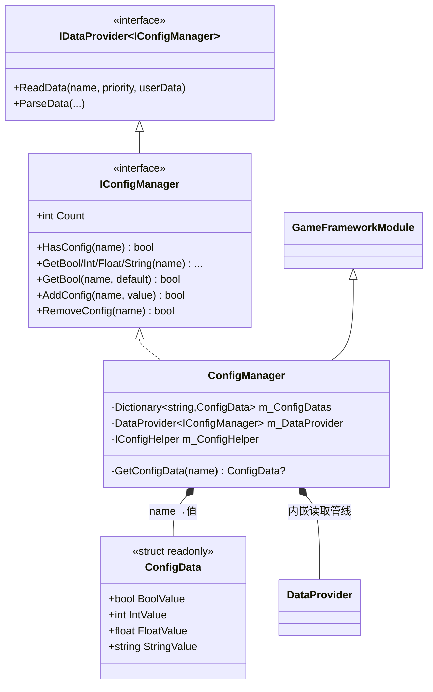
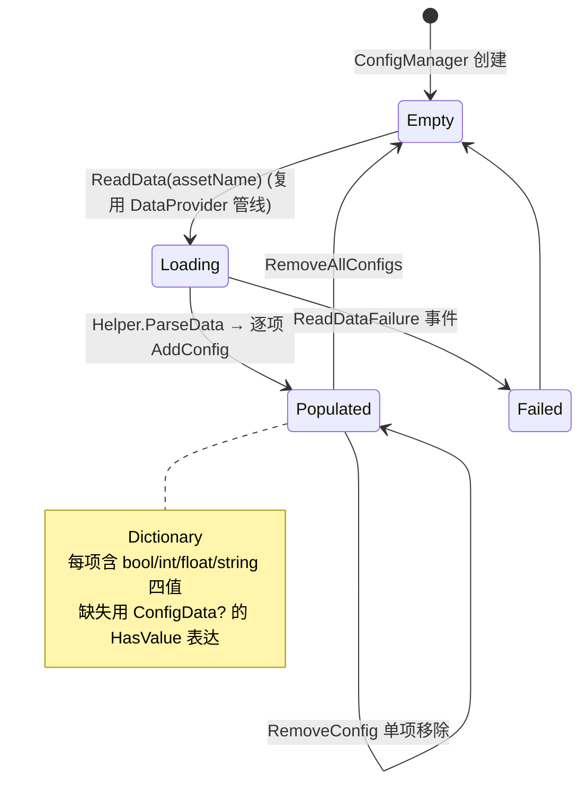

# Config 全局配置模块 · 架构解析报告

> 层级：纯 C# 核心层 `GameFramework.Config`
> 定位：全局**单值 KV 配置**（开关、阈值、版本号等）。与 DataTable 是"同父异形"——共用 `DataProvider` 读取管线，但存储退化为 `name → 四类型值` 的扁平字典。核心解决：一份配置同时承载 bool/int/float/string 四种解读、读取的严格/容错双模。

---

## 1. 契约定义 (Interface & Contract)

| 类型 | 文件 | 角色 | 可见性 |
|------|------|------|--------|
| `IConfigManager` | `IConfigManager.cs` | 管理器契约，`: IDataProvider<IConfigManager>` | public |
| `ConfigManager` | `ConfigManager.cs` | 实现，`GameFrameworkModule`，内嵌 DataProvider | internal sealed partial |
| `ConfigManager.ConfigData` | `ConfigManager.ConfigData.cs` | 配置项值结构体（四类型快照） | private struct |
| `IConfigHelper` | `IConfigHelper.cs` | 配置辅助器（空标记接口，预留扩展） | public |

### 设计要点（穿透语法）

- **一项四值**：每个配置项是一个 `ConfigData` 结构体，**同时存 bool/int/float/string 四个值**。`AddConfig(name, string)` 时用 `TryParse` 把字符串同步解析成三种数值（失败则取默认 0/false），原串存进 stringValue。读取时按需取对应类型——避免运行期反复 parse。
- **复用 DataTable 的 DataProvider 管线**：与 DataTable 完全相同的读取来源分支（磁盘/二进制/文件系统）、相同的四个 ReadData 事件、相同的静态 `s_CachedBytes`。Config 与 DataTable 的差异**只在存储与查询**，加载层 100% 共享。
- **存储是扁平字典**：`Dictionary<string, ConfigData>`（`StringComparer.Ordinal`），无树、无 id、无 Min/Max。比 DataTable 更轻。
- **可空结构体表达"缺失"**：`GetConfigData` 返回 `ConfigData?`（Nullable struct），`HasValue` 区分"存在"与"不存在"，避免给 struct 设计一个魔法无效值。

### Mermaid 类图



---

## 2. 内存与生命周期流转 (Lifecycle & Memory)

### 2.1 AddConfig 的一次性多解析

```csharp
public bool AddConfig(string configName, string configValue)
{
    bool boolValue = false;  bool.TryParse(configValue, out boolValue);
    int intValue = 0;        int.TryParse(configValue, out intValue);
    float floatValue = 0f;   float.TryParse(configValue, out floatValue);
    return AddConfig(configName, boolValue, intValue, floatValue, configValue);  // 四值一次性定型
}
```

**写入时一次性 parse 成四种类型并固化进结构体**，读取时零解析直接取字段。这是"写一次、读多次"的典型预计算优化。代价：每项多存三个字段（结构体值类型，开销可控）。

### 2.2 读取的严格 vs 容错双模

每个 Get 都有两个重载：

| 重载 | 配置缺失时 | 用途 |
|------|-----------|------|
| `GetInt(name)` | **抛 GameFrameworkException** | 必须存在的关键配置，缺失即 bug 应暴露 |
| `GetInt(name, defaultValue)` | **返回 defaultValue** | 可选配置，缺失走默认值 |

这与 DataNode 的"Get 严格"一脉相承，但 Config 多提供了带默认值的容错版，让调用方自行选择策略。

### 2.3 配置项生命周期状态机



### 2.4 内存关注点

- **AddConfig 重名返回 false**（不抛异常，不覆盖）——与 DataTable 重 id 抛异常不同。配置项重名是"温和拒绝"，可能是重复加载的容错。
- **ConfigData 不进 ReferencePool**：值类型结构体，存进字典即拷贝，无堆分配（除 string）。
- **Shutdown 空实现**：配置数据与进程同寿，不主动清理（依赖 GC 在管理器回收时一并回收字典）。
- 字典用 `StringComparer.Ordinal`：配置名按序数精确比较，避免文化相关比较的开销与歧义。

---

## 3. Unity 层的桥接映射 (Unity Layer Bridging)

> ⚠️ 本工作区不含 `UnityGameFramework`，以下为标准实现描述，**未在本仓库验证**。

- `ConfigComponent : GameFrameworkComponent` 转发 `IConfigManager`，初始化时注入 `SetResourceManager` + `SetDataProviderHelper`（解析格式）+ `SetConfigHelper`。
- `IDataProviderHelper<IConfigManager>` 的 Unity 实现负责把加载到的配置文本/字节按"name=value"逐项调 `AddConfig`。与 DataTable 的 Helper 结构完全对称，只是回调目标从"加行"变成"加配置项"。
- 典型用法：游戏启动流程加载全局配置（如 `IsDebugMode`、`MaxRetryCount`、`ServerUrl`），后续各模块用 `GetBool`/`GetString` 读取。配置常在 Procedure 启动流程里被首批加载。

---

## 4. 落地吸收建议 (Actionable Learning)

### 难点 ①：一份数据多类型解读的预计算
"写入时把字符串一次性 parse 成四种类型固化"，读取零解析。仿写时要权衡：如果配置项极多而大多只读一种类型，全量预 parse 会浪费内存；如果读取频繁、类型不定，预 parse 省 CPU。Config 选了后者（配置项通常不多、读取频繁）。这是空间换时间的具体场景判断。

### 难点 ②：可空结构体表达"缺失"
用 `ConfigData?`（Nullable<struct>）的 `HasValue` 干净地区分"有值"与"无此项"，避免给结构体硬塞一个"无效标记字段"（像 TaskInfo 那样用 IsValid）。两种做法都见于本框架——值类型表达缺失的两种范式，仿写时可按场景择一。

### 难点 ③：与 DataTable 的"同管线异存储"复用
Config 和 DataTable 共用 `DataProvider<T>` 泛型管线，仅存储层不同。这印证了 DataTable 那条"管线/策略/存储三层解耦"——正因解耦，加载逻辑才能被两个语义完全不同的模块复用。仿写时若已实现 DataTable 的分层，Config 几乎是免费的：换个存储结构 + 换个 Helper 即可。

---

## 附：坐标
- `ConfigManager` 是 Module（Update/Shutdown 均空实现）。
- 依赖：`DataProvider`(共享管线)、`Resource`、`ReferencePool`(EventArgs)。
- 与 DataTable 并列复用 DataProvider；与 DataNode/Setting 形成"全局只读 KV / 运行期可变树 / 持久化设置"的数据三角。
