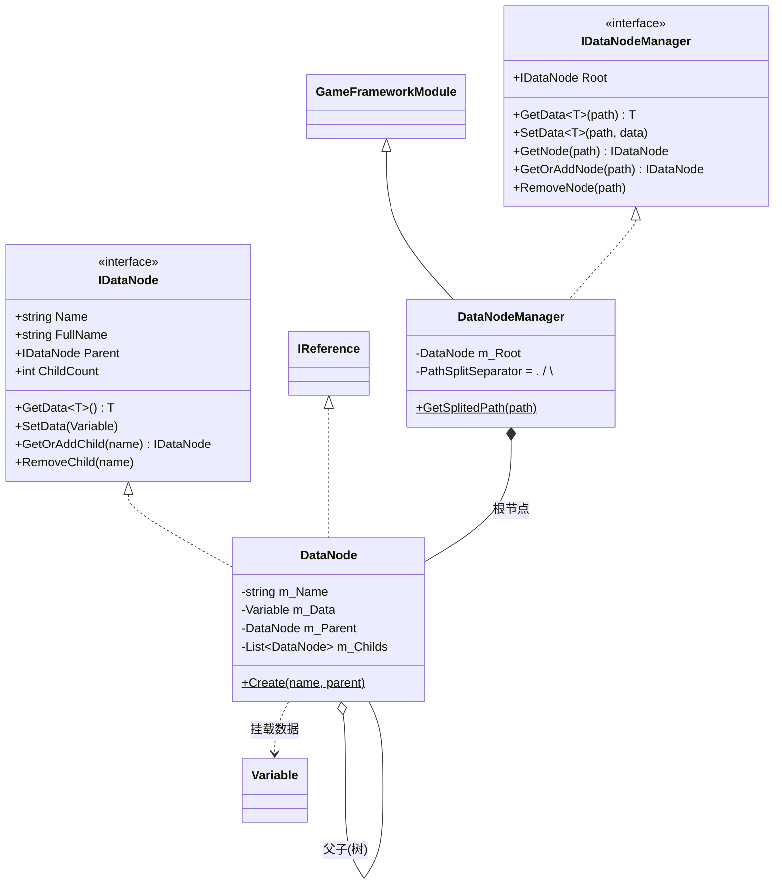
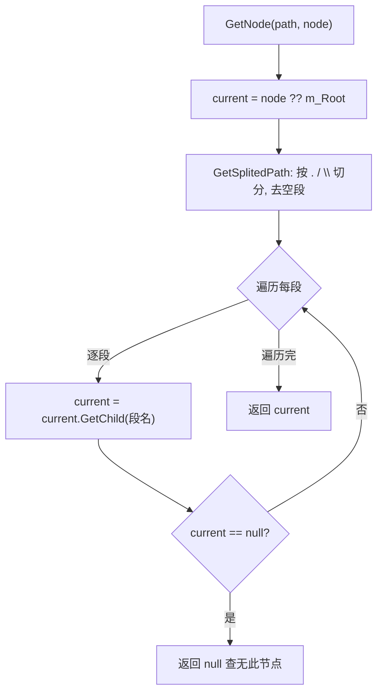
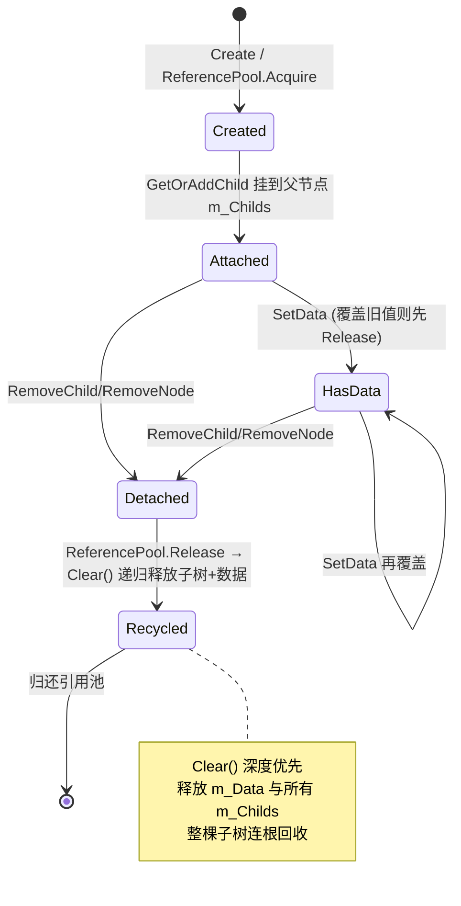

# DataNode 数据结点模块 · 架构解析报告

> 层级：纯 C# 核心层 `GameFramework.DataNode`
> 定位：框架的**全局树形黑板**。提供一棵以 `<Root>` 为根、路径寻址（`a.b.c` / `a/b/c` / `a\b\c`）的数据树，节点挂 `Variable` 数据。常用于跨模块共享全局状态。核心解决：路径解析、节点/数据的递归复用回收、懒分配子节点列表。

---

## 1. 契约定义 (Interface & Contract)

| 类型 | 文件 | 角色 | 可见性 |
|------|------|------|--------|
| `IDataNode` | `IDataNode.cs` | 单个节点契约：父子导航 + 数据存取 | public |
| `IDataNodeManager` | `IDataNodeManager.cs` | 管理器契约：路径式 GetNode/SetData | public |
| `DataNodeManager` | `DataNodeManager.cs` | 管理器实现，持根节点，`GameFrameworkModule` | internal sealed partial |
| `DataNodeManager.DataNode` | `DataNodeManager.DataNode.cs` | 节点实现，`IReference`(可复用) | private nested |

### 设计要点（穿透语法）

- **路径驱动的树**：管理器不直接存节点字典，而是持有一个根 `DataNode`，所有访问都从根（或指定起始节点）按路径段逐级 `GetChild` 下钻。分隔符支持 `.` `/` `\` 三种，`StringSplitOptions.RemoveEmptyEntries` 容错连续分隔符。
- **节点即 IReference**：`DataNode` 走 ReferencePool 复用。`Create` 时 Acquire，`RemoveChild`/Shutdown 时 Release。
- **子列表懒分配**：`m_Childs : List<DataNode>` 默认 null，首次 `GetOrAddChild` 才 new。无子节点的叶子不占列表内存（树通常很稀疏，省内存）。
- **名称合法性**：节点名不得含路径分隔符（否则破坏路径解析），`IsValidName` 在 Create/HasChild/GetChild 处校验。

### Mermaid 类图



---

## 2. 内存与生命周期流转 (Lifecycle & Memory)

### 2.1 路径解析与下钻



- `GetNode`：只读下钻，任一段缺失即返回 null。
- `GetOrAddNode`：下钻时缺失即 `GetOrAddChild` 创建，保证整条路径贯通（类似 `mkdir -p`）。
- `SetData(path, data)` = `GetOrAddNode(path)` + 节点 `SetData`，**路径不存在会自动建链**。
- `GetData(path)` = `GetNode(path)` + 节点 `GetData`，**路径不存在抛异常**（与 Set 的容错不对称，刻意设计）。

### 2.2 数据覆盖与回收

节点 `SetData` 覆盖旧值前先 Release 旧 Variable：

```csharp
public void SetData(Variable data)
{
    if (m_Data != null) ReferencePool.Release(m_Data);  // 旧值归还
    m_Data = data;
}
```

与 FSM 黑板的 SetData 同构——**Variable 是 IReference，覆盖即释放**，避免泄漏。

### 2.3 节点的递归复用回收（本模块核心）

`DataNode` 的 `IReference.Clear()` 会**递归释放整棵子树**：

```csharp
void IReference.Clear() { m_Name = null; m_Parent = null; Clear(); }

public void Clear()  // public Clear 兼做"清空数据+子节点"
{
    if (m_Data != null) { ReferencePool.Release(m_Data); m_Data = null; }
    if (m_Childs != null)
    {
        foreach (var child in m_Childs) ReferencePool.Release(child);  // 触发每个 child 的 Clear → 递归
        m_Childs.Clear();
    }
}
```

关键链路：`ReferencePool.Release(child)` → 触发 child 的 `IReference.Clear()` → 又 Release 它的 data 和孙节点 → **深度优先的整树归还**。一次 `RemoveChild` 或 `RemoveNode` 即可把整棵子树连同数据全部回收进 ReferencePool。

### 2.4 节点生命周期状态机



### 2.5 RemoveNode 的父指针技巧

`RemoveNode` 需要删除目标节点，但删除动作要由其**父节点**执行。它在下钻时同步维护 `parent` 游标：

```csharp
IDataNode current = node ?? m_Root, parent = current.Parent;
foreach (string i in splitedPath) { parent = current; current = current.GetChild(i); if (current == null) return; }
if (parent != null) parent.RemoveChild(current.Name);
```

下钻完成后 `current` 是目标、`parent` 是其父，由父 `RemoveChild` 完成移除+递归回收。

### 2.6 FullName 的递归构造

`FullName` 沿父指针向上递归拼接：`m_Parent == null ? m_Name : Parent.FullName + "." + m_Name`。根节点 `<Root>` 是终止条件。

---

## 3. Unity 层的桥接映射 (Unity Layer Bridging)

> ⚠️ 本工作区不含 `UnityGameFramework`，以下为标准实现描述，**未在本仓库验证**。

- `DataNodeComponent : GameFrameworkComponent` 转发 `GetModule<IDataNodeManager>()` 的路径式存取。
- Debugger 通常提供一棵**可视化数据树**：从 `Root` 递归 `GetAllChild()`，对每个节点显示 `ToString()`（= `FullName: [类型] 值`），便于运行时观察全局黑板。这正是 `ToDataString()` 输出 `[类型名] 值` 的用途——给调试面板看的人类可读串。
- 帧驱动：`Update` 是空实现（数据树是被动结构，不需要轮询），但仍作为 Module 注册以获得统一的 Shutdown 时机（释放整棵树）。

---

## 4. 落地吸收建议 (Actionable Learning)

### 难点 ①：递归复用回收的正确性
树形结构 + 对象池复用，最易泄漏的是"删父节点时漏删子孙"。本框架靠 `IReference.Clear()` 里递归 Release 子节点实现"一删全删"。仿写时务必让节点的清理方法**先递归处理子节点再处理自己**，且每一级都把 Variable 数据也释放。漏任一层都会让那部分对象永久脱离引用池。

### 难点 ②：Get 与 Set 的容错不对称
`SetData(path)` 路径不存在会自动建链（GetOrAddNode），`GetData(path)` 路径不存在则抛异常。这是刻意的：写入应宽容（建路径），读取应严格（明确报错而非静默返回 null 让 bug 潜伏）。仿写时要想清楚每个 API 的容错策略，不要无脑统一。

### 难点 ③：路径解析与名称约束的闭环
名称不能含分隔符，否则 `a.b` 会被误解析成两级。框架在 Create/GetChild 处校验 `IsValidName`，形成闭环。仿写时如果只在解析处切分却不约束名称，就会出现"存进去取不出来"的诡异 bug。约束与解析必须配套设计。

---

## 附：坐标
- `DataNodeManager` 是 Module（Update 空实现，仅为统一 Shutdown）。
- 依赖：`ReferencePool`、`Variable`、`Utility.Text`。
- 被依赖：需要全局共享数据树的业务层；与 Setting/Config 形成"运行期黑板 vs 持久化配置"的互补。
