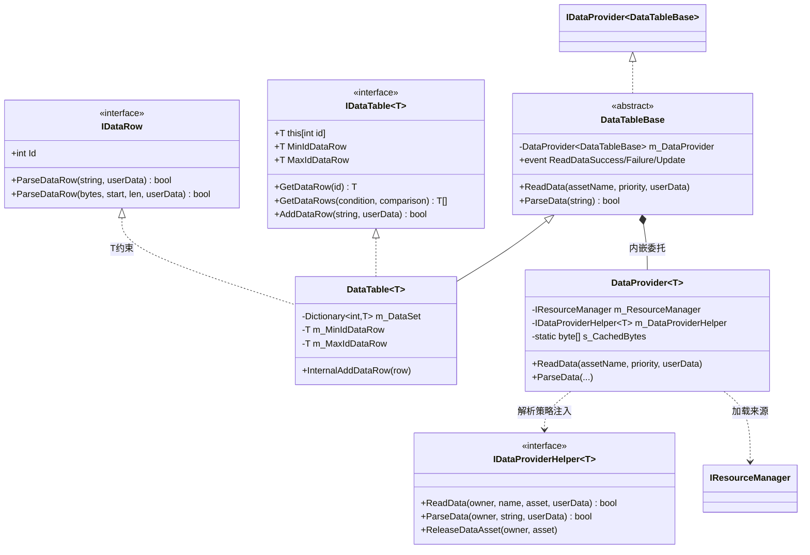
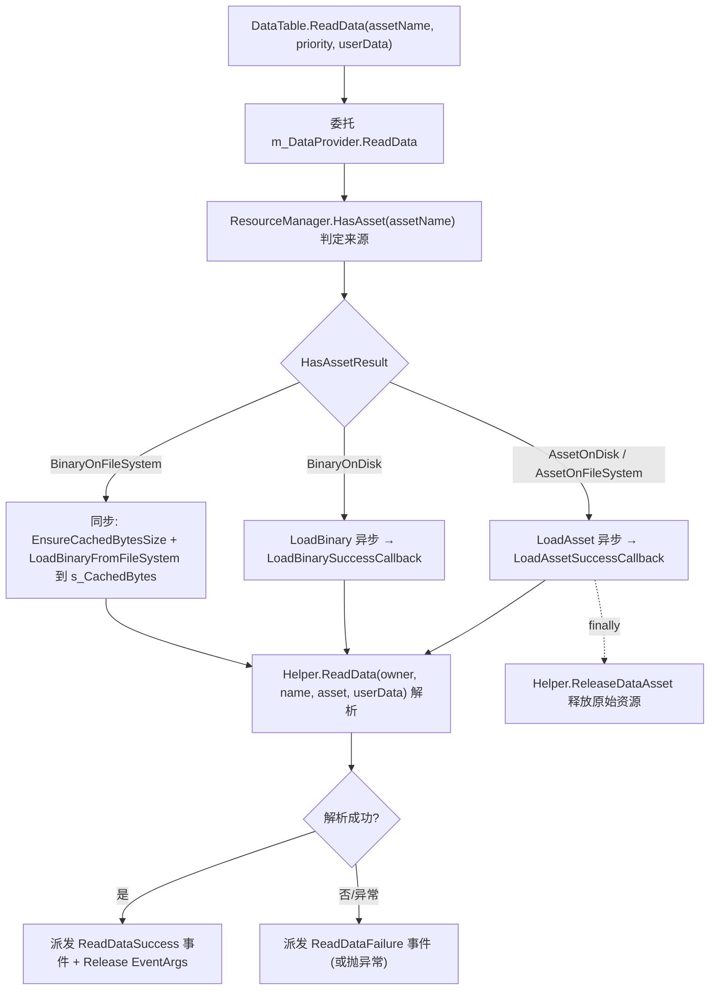
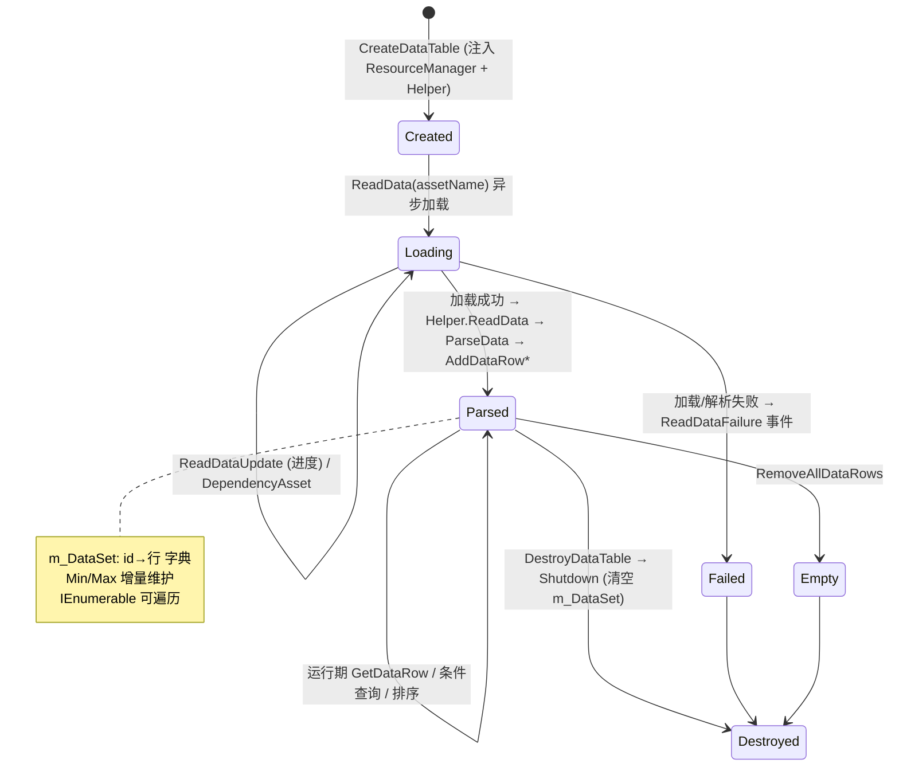

# DataTable 数据表模块 · 架构解析报告

> 层级：纯 C# 核心层 `GameFramework.DataTable`（+ 共享基础设施 `GameFramework.DataProvider`）
> 定位：游戏**配置表运行期容器**（角色表/道具表/关卡表等）。每张表是 `id → 行` 的字典，行类型业务自定义。核心解决：从 Resource 异步读表 → Helper 解析 → 按 id 索引；以及"加载管线与解析策略的解耦"。

---

## 1. 契约定义 (Interface & Contract)

| 类型 | 文件 | 角色 | 可见性 |
|------|------|------|--------|
| `IDataRow` | `IDataRow.cs` | 数据行契约：`Id` + `ParseDataRow`(string/bytes) | public |
| `IDataTable<T>` | `IDataTable.cs` | 单表契约，`: IEnumerable<T>`，按 id/条件/排序查询 | public |
| `DataTableBase` | `DataTableBase.cs` | 非泛型基类，`: IDataProvider<DataTableBase>`，内嵌 DataProvider | public abstract |
| `IDataTableManager` | `IDataTableManager.cs` | 管理器契约：创建/获取/销毁表 + 设辅助器 | public |
| `DataTableManager.DataTable<T>` | `DataTableManager.DataTable.cs` | 表实现，`Dictionary<int,T>` 存行 | private nested |
| `DataProvider<T>` | `DataProvider.cs` | **通用读取管线**（被 DataTable/Config 等共用） | internal sealed |
| `IDataProviderHelper<T>` | `IDataProviderHelper.cs` | 解析策略接口（依赖注入点） | public |
| `IDataTableHelper` | `IDataTableHelper.cs` | 数据表辅助器（空标记接口） | public |

### 设计要点（穿透语法）

- **加载管线 vs 解析策略分离**：`DataProvider<T>` 负责"从哪读、怎么读"（走 Resource：磁盘资源/二进制/文件系统三种来源），`IDataProviderHelper<T>` 负责"读到的字节/资源怎么变成行"（业务实现）。表自己只管"行存哪、怎么查"。三层职责正交。
- **行类型自描述解析**：`IDataRow.ParseDataRow` 让每行自己负责从 string/bytes 反序列化。表只在 `AddDataRow` 时 `new T()` 再调 `ParseDataRow`，**解析逻辑下沉到行**。
- **`DataTableBase` 委托内嵌 DataProvider**：基类持有 `DataProvider<DataTableBase>`，把所有 `ReadData`/`ParseData`/四个读取事件全部转发给它。这是"组合优于继承"——表不继承管线，而是持有它。
- **静态共享字节缓冲 `s_CachedBytes`**：`DataProvider<T>` 有个静态 4KB 对齐的字节缓存，从文件系统读二进制时复用，避免每次读表都分配大数组。

### Mermaid 类图



---

## 2. 内存与生命周期流转 (Lifecycle & Memory)

### 2.1 跨层读表管线（核心数据流）

`DataProvider.ReadData` 根据资源类型走三条不同路径：



三条路径的差异：
- **Asset/Binary OnDisk/FileSystem(异步)**：经 Resource 异步加载，回调里解析，带 Update（进度）/DependencyAsset（依赖）事件。
- **BinaryOnFileSystem(同步)**：直接读进静态缓存 `s_CachedBytes` 当场解析，无异步、无进度事件。这是"已在本地文件系统、可同步读"的快路径。

### 2.2 行的添加与 Min/Max 维护

`AddDataRow` → `new T()` → `ParseDataRow` → `InternalAddDataRow`：

```csharp
private void InternalAddDataRow(T dataRow)
{
    if (m_DataSet.ContainsKey(dataRow.Id)) throw ...;  // id 唯一
    m_DataSet.Add(dataRow.Id, dataRow);
    if (m_MinIdDataRow == null || m_MinIdDataRow.Id > dataRow.Id) m_MinIdDataRow = dataRow;
    if (m_MaxIdDataRow == null || m_MaxIdDataRow.Id < dataRow.Id) m_MaxIdDataRow = dataRow;
}
```

`MinIdDataRow`/`MaxIdDataRow` 增量维护（加行时 O(1) 更新）。但 `RemoveDataRow` 删的恰是 min 或 max 时，需**全表扫描重算**（O(n)）——这是"读多写少、加多删少"的权衡：常态加行 O(1)，罕见删边界行才 O(n)。

### 2.3 数据表生命周期状态机



### 2.4 内存关注点

- **行对象不进 ReferencePool**：`new T()` 直接创建，`Shutdown`/`RemoveAllDataRows` 直接 `m_DataSet.Clear()` 交给 GC。因为配置行是**只读长生命周期数据**（加载后整局常驻），复用无意义。这与 ObjectPool/EventArgs 的高频短命对象形成对比。
- **EventArgs 走 ReferencePool**：管线里每个 `ReadDataSuccessEventArgs` 等都 `Create` + 用完 `Release`，因为读表事件高频且短命。
- **`s_CachedBytes` 静态复用**：`EnsureCachedBytesSize` 按 4KB 块向上对齐分配，多张表共用一块缓冲（注意：**非线程安全，同步读路径假定单线程**）。

---

## 3. Unity 层的桥接映射 (Unity Layer Bridging)

> ⚠️ 本工作区不含 `UnityGameFramework`，以下为标准实现描述，**未在本仓库验证**。

- `DataTableComponent : GameFrameworkComponent` 转发 `IDataTableManager`，并在初始化时注入：`SetResourceManager`（绑定资源系统）、`SetDataProviderHelper`（如何把 TextAsset/bytes 解析成行）、`SetDataTableHelper`。
- `IDataProviderHelper<DataTableBase>` 的 Unity 实现（如 `DefaultDataTableHelper`）负责：把加载到的 `TextAsset` 取出文本/字节，按行切分，逐行调 `DataTableBase.AddDataRow`。**解析格式（TSV/二进制/自定义）完全由这个 Helper 决定，框架不关心**。
- 业务的行类（如 `DRHero : IDataRow`）通常由代码生成工具从 Excel 配置生成，实现 `ParseDataRow` 把一行字段读进强类型属性。
- `ReadDataSuccess/Failure` 事件常被转接到 EventPool，让加载流程（Procedure）能等待"所有表加载完成"再进入下一流程。

---

## 4. 落地吸收建议 (Actionable Learning)

### 难点 ①：加载管线、解析策略、存储查询的三层解耦
最值得吸收的是 `DataProvider`(管线) + `IDataProviderHelper`(策略) + `DataTable`(存储) 的正交分解。管线只懂"问 Resource 要数据"，策略只懂"字节怎么变行"，表只懂"行怎么存怎么查"。仿写时若把三者揉成一坨（表自己读文件自己解析），就无法支持"同一张表既能从磁盘 TextAsset 读、又能从二进制文件系统读"。先分层，再实现。

### 难点 ②：资源来源的多路分支与同步/异步混合
`HasAsset` 返回的四种 `HasAssetResult` 决定走异步 LoadAsset、异步 LoadBinary、还是同步读文件系统。同步路径用静态缓存当场解析，异步路径在回调里解析并派发进度事件。仿写时要意识到"加载可能同步也可能异步"，事件回调与同步返回要统一到同一套成功/失败处理（本框架用 try/catch + 事件 + finally 释放原始资源做到了统一）。

### 难点 ③：Min/Max 的增量维护与删除重算权衡
加行 O(1) 维护边界，删边界行 O(n) 重算。这是针对配置表"加载时批量加、运行期几乎不删"特征的精准权衡。仿写时不要为了"删除也 O(1)"上来就建有序结构（红黑树等），那会拖慢高频的加行和查询。先分析读写比例，再选数据结构。

---

## 附：坐标
- `DataTableManager` 是 Module；`DataProvider`/`DataProviderHelper` 是跨模块共享的 Base 基础设施（Config 等也用）。
- 依赖：`Resource`(IResourceManager)、`ReferencePool`(EventArgs)、`TypeNamePair`、四个 ReadDataXxxEventArgs。
- 被依赖：所有需要读配置表的业务层。
