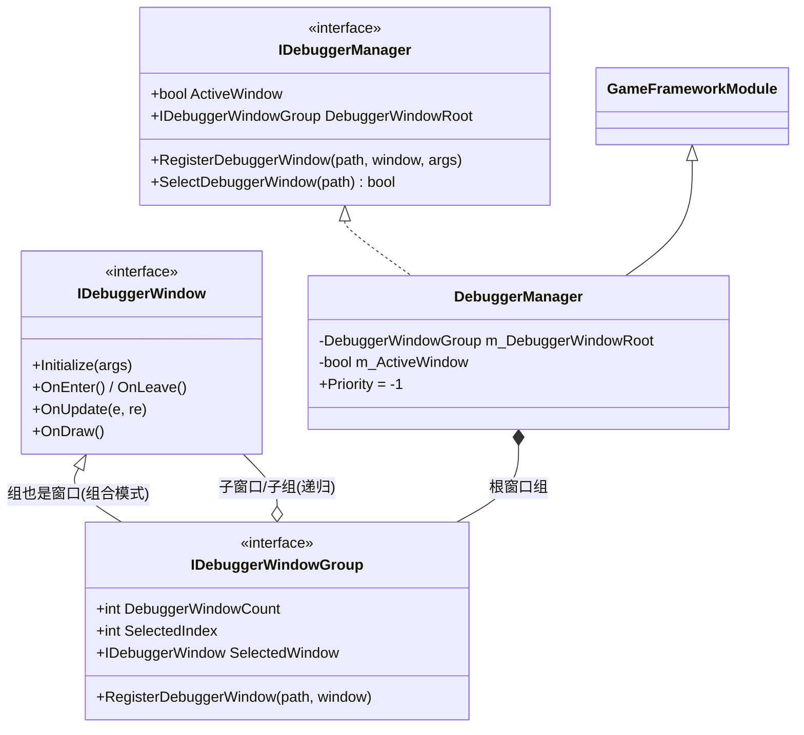
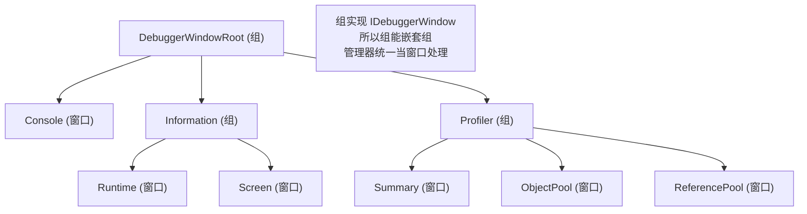
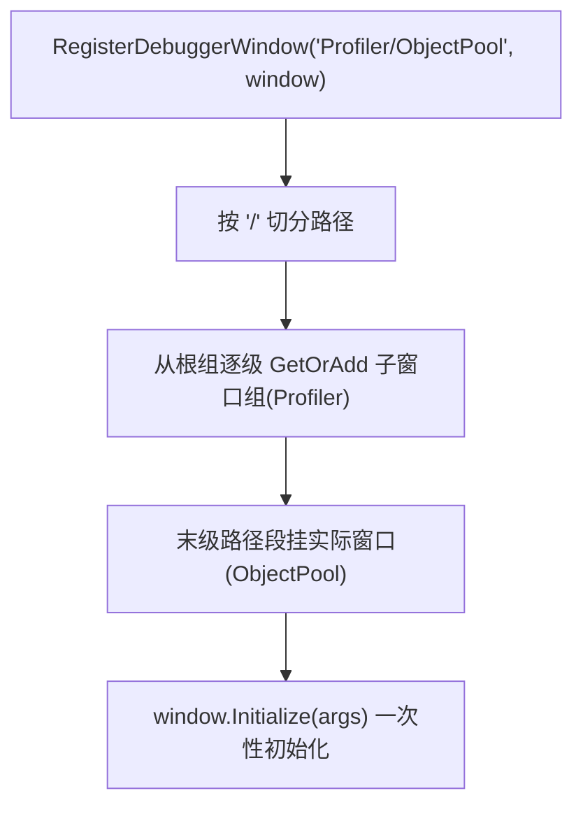
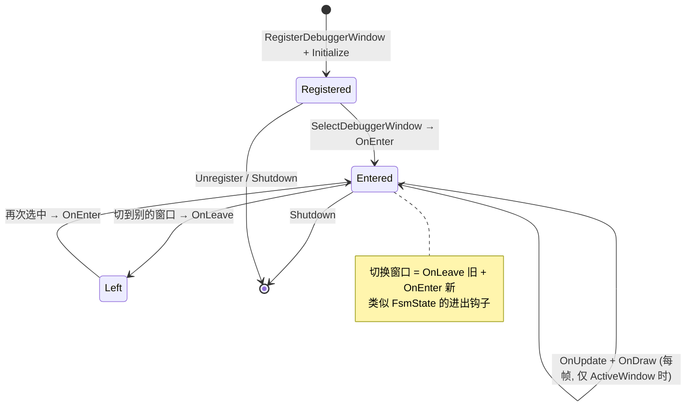

# Debugger 调试器模块 · 架构解析报告

> 层级：纯 C# 核心层 `GameFramework.Debugger`
> 定位：**运行期调试窗口的组织框架**。提供一棵可路径注册的调试窗口树（FPS/内存/对象池/引用池/各模块信息），由 Unity 层用 OnGUI 渲染。核心看点：**组合模式（窗口组也是窗口）+ 路径注册 + 激活才轮询**。是全框架最小、最纯粹的"组合模式"范例。

---

## 1. 契约定义 (Interface & Contract)

| 类型 | 文件 | 角色 | 可见性 |
|------|------|------|--------|
| `IDebuggerManager` | `IDebuggerManager.cs` | 管理器：注册/选中调试窗口 + 激活开关 | public |
| `IDebuggerWindow` | `IDebuggerWindow.cs` | 调试窗口契约：Init/Enter/Leave/Update/Draw | public |
| `IDebuggerWindowGroup` | `IDebuggerWindowGroup.cs` | 窗口组 = **同时是窗口**（`: IDebuggerWindow`） | public |
| `DebuggerManager` | `DebuggerManager.cs` | 实现，`GameFrameworkModule`，持根窗口组 | internal sealed partial |
| `DebuggerManager.DebuggerWindowGroup` | `.DebuggerWindowGroup.cs` | 窗口组实现（含子窗口集合 + 选中索引） | private nested |

### 设计要点（穿透语法）

- **组合模式（Composite）的教科书实现**：`IDebuggerWindowGroup : IDebuggerWindow`——**窗口组本身就是一个窗口**。这意味着组可以嵌套组（树形），且管理器对待"单个窗口"和"窗口组"完全一致（都当 IDebuggerWindow）。根节点 `DebuggerWindowRoot` 是一个组，下面挂窗口或子组。
- **路径注册**：`RegisterDebuggerWindow("Profiler/Memory/All", window)` 用斜杠路径注册，沿路径逐级 GetOrAdd 窗口组（类似 DataNode 的路径树），末级挂实际窗口。形成"标签页分组"的层级 UI。
- **激活才轮询**：`Update` 里 `if (!m_ActiveWindow) return;`——调试器关闭时零开销。只有打开调试面板才 OnUpdate/OnDraw。Priority=-1（很低，靠后轮询）。
- **窗口五钩子**：Init（注册时一次）/ Enter（切到该窗口）/ Leave（切走）/ Update（每帧）/ Draw（每帧 GUI）。与 FsmState 的钩子神似——选中窗口 = 进入状态。

### Mermaid 类图



---

## 2. 内存与生命周期流转 (Lifecycle & Memory)

### 2.1 组合模式：窗口组 = 窗口



组的 `OnUpdate`/`OnDraw` 转发给**当前选中的子窗口**（`SelectedWindow`），子窗口若又是组则继续向下转发——**递归的统一处理**。这就是组合模式的威力：客户端（管理器）无需区分"叶子窗口"与"组"。

### 2.2 路径注册（类似 DataNode 路径树）



与 DataNode 的 GetOrAddNode 同构——路径不存在则建链。这让调试窗口能自动组织成"分组标签页"层级。

### 2.3 窗口生命周期（选中即进入）



### 2.4 激活开关与零开销

```csharp
internal override void Update(float elapseSeconds, float realElapseSeconds)
{
    if (!m_ActiveWindow) return;   // 调试器关闭 → 零开销
    m_DebuggerWindowRoot.OnUpdate(elapseSeconds, realElapseSeconds);
}
```

调试器是开发工具，发布版通常关闭。`ActiveWindow=false` 时 Update 直接返回，不遍历任何窗口——**调试设施不拖累正式运行性能**。

### 2.5 内存关注点

- Debugger 本身极轻——一棵窗口树 + 一个 bool。窗口对象长生命周期（注册一次用到底）。
- 窗口内部展示的数据（如 ObjectPool 信息）通过各模块的 `GetXxxInfos()` 返回的快照 struct（ObjectInfo/ReferencePoolInfo/TaskInfo 等，前文各模块的 DTO）实时读取——**Debugger 是那些只读快照 DTO 的最终消费者**。

---

## 3. Unity 层的桥接映射 (Unity Layer Bridging)

> ⚠️ 本工作区不含 `UnityGameFramework`，以下为标准实现描述，**未在本仓库验证**。

- `DebuggerComponent : GameFrameworkComponent` 转发 `IDebuggerManager`，用 Unity 的 `OnGUI` 渲染一个可拖拽的悬浮调试窗口（IMGUI）。
- Unity 层提供一组内置调试窗口实现（`IDebuggerWindow`）：FPS、内存（各类托管/Unity 对象）、对象池（读 `GetAllObjectInfos`）、引用池（读 `GetAllReferencePoolInfos`）、运行环境、设置、日志等，启动时按路径注册成标签页树。
- `OnDraw` 用 `GUILayout` 画每个窗口的内容；窗口组的 OnDraw 画标签页栏 + 转发当前页。
- 这是**前面所有模块的 `GetXxxInfos()` 快照 DTO 的可视化终点**——ObjectInfo/ReferencePoolInfo/TaskInfo/FileInfo 等都在这里被渲染成调试面板。

---

## 4. 落地吸收建议 (Actionable Learning)

### 难点 ①：组合模式——让"组"和"元素"同型
`IDebuggerWindowGroup : IDebuggerWindow` 是组合模式的精髓：组本身是元素，于是组能嵌套组，客户端统一处理。仿写时要识别"树形 + 统一处理"的场景（菜单树、UI 层级、文件系统）——让容器实现元素接口，递归转发操作，避免到处 `if (是组) ... else ...`。这是消除类型判断分支的优雅手段。

### 难点 ②：调试设施的零开销原则
开发工具不能拖累正式运行。`ActiveWindow` 开关让关闭时 Update 直接 return，发布版零成本。仿写时凡是"开发期有用、运行期可关"的设施（日志、统计、调试 UI），都要有一个总开关短路掉，且默认关闭。别让调试代码在正式版里偷偷跑。

### 难点 ③：Debugger 是整个框架可观测性的汇聚点
前面每个模块都产出只读快照 DTO（ObjectInfo/ReferencePoolInfo/TaskInfo/FileInfo...），Debugger 是它们的统一消费者。这印证了一条架构原则：**核心层产出数据（DTO）、表现层负责呈现**。仿写时要让每个模块暴露"可观测快照"接口，再由统一的调试器消费——而非让每个模块各自画 UI。数据与呈现分离，可观测性才能集中管理。

---

## 附：坐标
- `DebuggerManager` 是 Module，Priority=-1（很低，靠后轮询）。
- 依赖：仅 `GameFrameworkException` + 自身窗口树。最轻量的模块之一。
- 消费：所有模块的 `GetXxxInfos()` 快照 DTO——是框架可观测性的终点。
