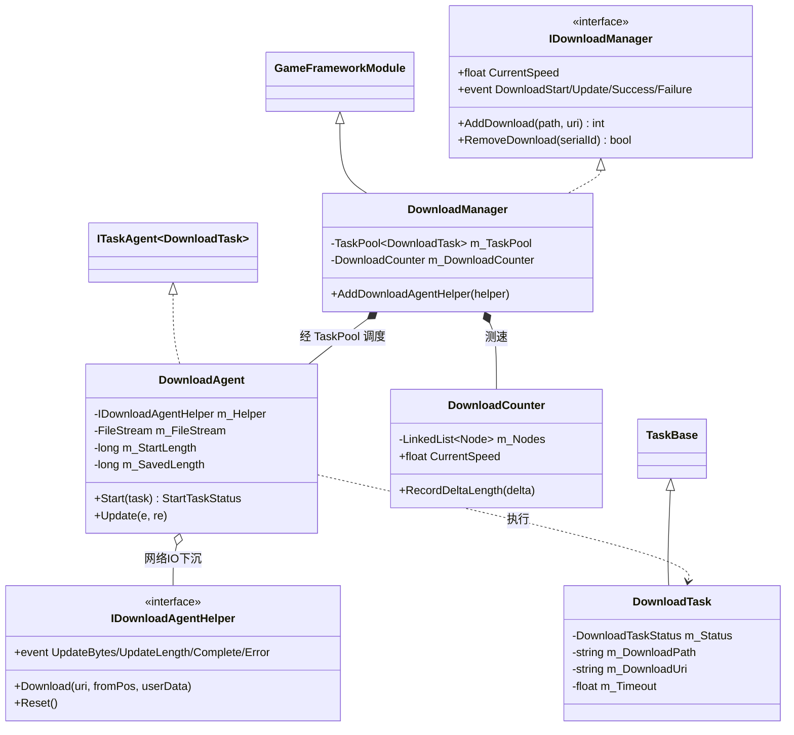
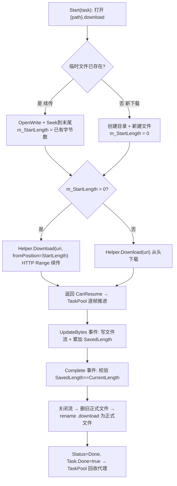
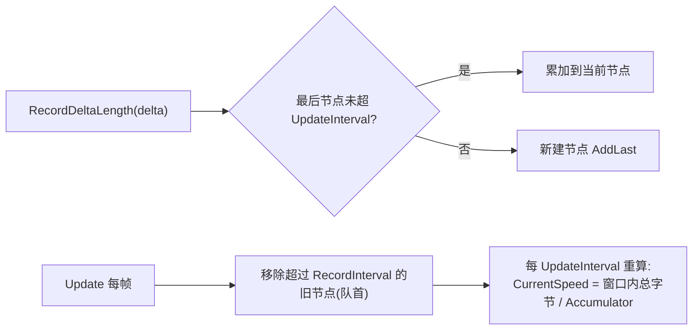
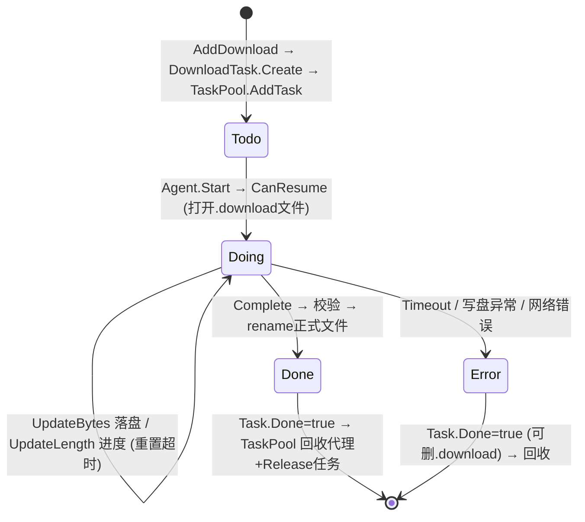

# Download 下载模块 · 架构解析报告

> 层级：纯 C# 核心层 `GameFramework.Download`
> 定位：**断点续传的多并发下载器**。建立在已解析的 `TaskPool` 之上——下载任务 = TaskPool 的 `TaskBase`，下载代理 = `ITaskAgent`。核心看点：`.download` 临时文件 + 断点续传、分块刷盘（FlushSize）、超时检测、滑动窗口测速。

---

## 1. 契约定义 (Interface & Contract)

| 类型 | 文件 | 角色 | 可见性 |
|------|------|------|--------|
| `IDownloadManager` | `IDownloadManager.cs` | 管理器契约：AddDownload/Remove + 4 个事件 + 速度/超时 | public |
| `IDownloadAgentHelper` | `IDownloadAgentHelper.cs` | **真正干网络 IO 的注入点**（4 事件 + Download/Reset） | public |
| `DownloadManager` | `DownloadManager.cs` | 实现，`GameFrameworkModule`，内嵌 `TaskPool<DownloadTask>` | internal sealed partial |
| `DownloadManager.DownloadAgent` | `.DownloadAgent.cs` | 下载代理，`: ITaskAgent<DownloadTask>, IDisposable`，管文件流 | private nested |
| `DownloadManager.DownloadTask` | `.DownloadTask.cs` | 下载任务，`: TaskBase`，持路径/URI/超时 | private nested |
| `DownloadManager.DownloadCounter` | `.DownloadCounter.cs` | 滑动窗口测速器 | private nested |
| `DownloadTaskStatus` | `.DownloadTaskStatus.cs` | Todo/Doing/Done/Error | private enum |

### 设计要点（穿透语法）

- **构建在 TaskPool 之上**：`DownloadManager` 内嵌 `TaskPool<DownloadTask>`，`AddDownload` = 创建 `DownloadTask`（TaskBase）→ `TaskPool.AddTask`。并发数 = `AddDownloadAgentHelper` 加入的代理数。**调度、优先级队列、续传全部复用 TaskPool**，Download 只贡献"下载这件具体的事"。
- **代理是 TaskPool 与网络 IO 的桥**：`DownloadAgent` 实现 `ITaskAgent<DownloadTask>`，其 `Start` 返回 `CanResume`（开始下载、转入续传），由 TaskPool 阶段1 逐帧 `Update` 推进直到 `m_Task.Done = true`。真正的网络请求又下沉给 `IDownloadAgentHelper`（UnityWebRequest/HttpWebRequest）。
- **三层下沉**：TaskPool（调度）→ DownloadAgent（文件流 + 断点 + 超时）→ IDownloadAgentHelper（纯网络字节流）。每层只管一件事。
- **回调式网络**：Helper 通过 4 个事件（UpdateBytes 收到字节 / UpdateLength 进度 / Complete 完成 / Error 出错）回吐数据，Agent 订阅这些事件做落盘与状态推进。

### Mermaid 类图



---

## 2. 内存与生命周期流转 (Lifecycle & Memory)

### 2.1 断点续传：`.download` 临时文件机制（核心）

下载先写到 `xxx.download` 临时文件，完成后才 rename 成正式文件：



关键：**`.download` 临时文件 + HTTP Range 请求 = 断点续传**。中断时已下载字节留在 `.download` 里，重启下载时 `m_StartLength` 取临时文件长度，从该偏移继续请求。只有完整下载并校验通过才 rename 成正式文件——**保证正式文件要么不存在要么完整**，不会出现半截文件。

### 2.2 分块刷盘 (FlushSize) 的内存/IO 权衡

```csharp
private void OnDownloadAgentHelperUpdateBytes(object sender, e)
{
    m_FileStream.Write(e.GetBytes(), e.Offset, e.Length);  // 先写入流缓冲
    m_WaitFlushSize += e.Length;
    m_SavedLength += e.Length;
    if (m_WaitFlushSize >= m_Task.FlushSize)   // 累积到阈值才真正刷盘
    {
        m_FileStream.Flush();
        m_WaitFlushSize = 0;
    }
}
```

不是每收到一段字节就 `Flush`（频繁磁盘 IO 慢），而是累积到 `FlushSize` 才一次性刷盘。这是**吞吐 vs 崩溃安全的权衡**：FlushSize 越大磁盘 IO 越少越快，但崩溃时丢失的未刷盘数据越多。

### 2.3 超时检测

```csharp
public void Update(float elapseSeconds, float realElapseSeconds)
{
    if (m_Task.Status == DownloadTaskStatus.Doing)
    {
        m_WaitTime += realElapseSeconds;
        if (m_WaitTime >= m_Task.Timeout) { /* 触发 Timeout 错误 */ }
    }
}
```

每帧累加"自上次收到数据以来的等待时间"，超过 `Timeout` 即判超时报错。**关键：每次 UpdateBytes/UpdateLength 回调里都把 `m_WaitTime = 0f`**——只要有数据流入就重置计时，所以 Timeout 检测的是"卡死无响应"而非"总下载时长"。

### 2.4 滑动窗口测速 (DownloadCounter)

`DownloadCounter` 用一串 `DownloadCounterNode`（每个记一小段时间内的字节增量）构成滑动窗口：



- **节点按时间分桶**：同一 `UpdateInterval` 内的增量累加到同一节点，新时段开新节点。
- **过期淘汰**：超过 `RecordInterval` 的旧节点从队首移除并归还 ReferencePool。
- **速度 = 滑动窗口内字节总和 / 时间**：平滑的瞬时速度，避免单帧抖动。节点走 ReferencePool 复用。

### 2.5 任务状态机



---

## 3. Unity 层的桥接映射 (Unity Layer Bridging)

> ⚠️ 本工作区不含 `UnityGameFramework`，以下为标准实现描述，**未在本仓库验证**。

- `DownloadComponent : GameFrameworkComponent` 转发 `IDownloadManager`，Inspector 暴露"下载器数量"（= 并发代理数）、FlushSize、Timeout。初始化时按数量 new 出 N 个 `DownloadAgentHelper` 并 `AddDownloadAgentHelper`。
- `IDownloadAgentHelper` 的 Unity 实现（`UnityWebRequestDownloadAgentHelper` 等）用 `UnityWebRequest` 发起带 Range 头的请求，把收到的字节通过 `DownloadAgentHelperUpdateBytes` 事件回吐给 Agent，由 Agent 落盘。**网络 API 的平台差异封装在 helper 里，核心层只见字节流**。
- 4 个下载事件（Start/Update/Success/Failure）通常转接到 EventPool，让热更新流程（Procedure）监听下载进度与完成。Download 是热更新（资源版本更新）的底层执行者。

---

## 4. 落地吸收建议 (Actionable Learning)

### 难点 ①：断点续传的临时文件 + Range 请求闭环
"先写 `.download`、完成才 rename" + "重启时 Seek 到已有长度、HTTP Range 续传" 是断点续传的标准范式。仿写时三个点缺一不可：① 临时文件隔离半成品；② 续传起点取临时文件实际长度；③ 完成校验后才原子 rename。漏掉 rename 校验会让中断的半截文件冒充完整文件，引发后续解压/加载错误。

### 难点 ②：分块刷盘与超时重置的两个计时器
FlushSize（按字节量刷盘）和 Timeout（按无响应时长报错）是两套独立机制。易错点：超时计时器必须在**每次收到数据时重置**（检测"卡死"而非"总时长"），刷盘计数器必须在**每次刷盘后清零**。仿写时要分清"按量触发"和"按时触发"两类阈值，别混用一个计数器。

### 难点 ③：复用 TaskPool 把"调度"与"下载"彻底分离
Download 几乎不写调度逻辑——并发控制、优先级、续传推进全交给 TaskPool，自己只实现 `ITaskAgent.Start/Update` 这两个"干活"方法。这是"组合底座"的典范：仿写时若已有 TaskPool，Download 只需实现一个会下载的 Agent + 一个携带 URL 的 Task。识别"哪些是通用调度（复用）、哪些是业务执行（自写）"是关键。

---

## 附：坐标
- `DownloadManager` 是 Module；内嵌 `TaskPool<DownloadTask>` + `DownloadCounter`。
- 依赖：`TaskPool`、`ReferencePool`(任务/计数节点/EventArgs)、`GameFrameworkLinkedList`、文件 IO。
- 被依赖：`Resource`（热更新下载资源包）；与 WebRequest 并列为 TaskPool 的两大应用。
