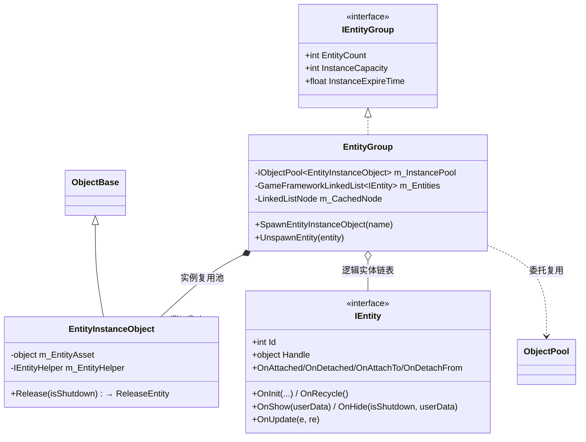
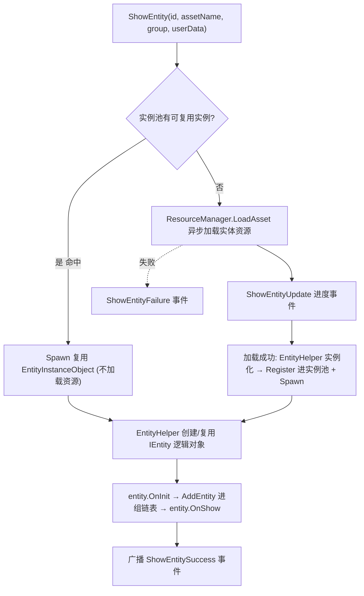
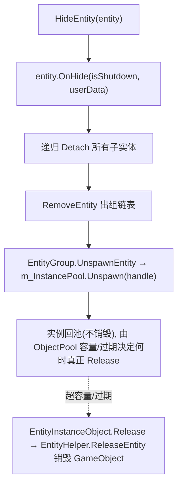

# Entity 实体模块 · 架构解析报告

> 层级：纯 C# 核心层 `GameFramework.Entity`
> 定位：**游戏实体（角色/怪物/特效/子弹）的显示与复用管理**。是 ObjectPool 最典型的消费者——每个实体组持一个 `IObjectPool<EntityInstanceObject>`，实体实例（GameObject）通过对象池 Spawn/Unspawn 复用。核心看点：实体生命周期七钩子、实例池复用、父子实体挂接、Show/Hide 与资源加载的异步衔接。

---

## 1. 契约定义 (Interface & Contract)

| 类型 | 文件 | 角色 | 可见性 |
|------|------|------|--------|
| `IEntityManager` | `IEntityManager.cs` | 管理器：ShowEntity/HideEntity/Attach + 组管理 | public |
| `IEntity` | `IEntity.cs` | 实体契约：7 个生命周期钩子 | public |
| `IEntityGroup` | `IEntityGroup.cs` | 实体组契约 | public |
| `IEntityHelper` | `IEntityHelper.cs` | 实体辅助器：Instantiate/Release 实例 | public |
| `IEntityGroupHelper` | `IEntityGroupHelper.cs` | 实体组辅助器 | public |
| `EntityManager.EntityGroup` | `.EntityGroup.cs` | 实体组实现，**持 ObjectPool** | private nested |
| `EntityManager.EntityInstanceObject` | `.EntityInstanceObject.cs` | 实例包装，`: ObjectBase` | private nested |
| `EntityManager.EntityInfo` | `.EntityInfo.cs` | 实体运行期信息（状态/父子） | private nested |
| `EntityManager.ShowEntityInfo` | `.ShowEntityInfo.cs` | 异步显示中转数据 | private nested |
| `EntityManager.EntityStatus` | `.EntityStatus.cs` | WillInit/Inited/WillShow/Showed/... | private enum |

### 设计要点（穿透语法）

- **实体组 = 一个对象池**：`EntityGroup` 内 `m_InstancePool : IObjectPool<EntityInstanceObject>`，通过 `objectPoolManager.CreateSingleSpawnObjectPool` 创建。同组实体共享一个池，复用同类型实例（同一预制体的怪物反复 Show/Hide 不重新实例化）。
- **`EntityInstanceObject : ObjectBase`**：实例包装器是 ObjectPool 的 `ObjectBase`，其 `Release(isShutdown)` 调 `m_EntityHelper.ReleaseEntity` 真正销毁 GameObject。这把"实体实例的复用"完全委托给 ObjectPool 的容量/过期机制。
- **两层对象**：`EntityInstanceObject`（池中的可复用实例，对应一个 GameObject）vs `IEntity`（业务逻辑实体，挂在实例上）。Show 时从池 Spawn 实例 + 创建/复用 IEntity 逻辑对象。
- **迭代安全的实体轮询**：`EntityGroup.Update` 用 `m_CachedNode` 缓存 Next（同 EventPool 套路），支持 OnUpdate 中 HideEntity 自己/他人不崩。

### Mermaid 类图



---

## 2. 内存与生命周期流转 (Lifecycle & Memory)

### 2.1 实体七钩子生命周期

| 钩子 | 触发 | 用途 |
|------|------|------|
| `OnInit` | 实体逻辑对象首次创建/复用 | 绑定 Id/资源名/组，`isNewInstance` 区分新建还是复用 |
| `OnShow` | 显示（实例就绪后） | 激活、播放出场、初始化业务状态 |
| `OnUpdate` | 每帧 | 实体逻辑 |
| `OnHide` | 隐藏 | 清场，`isShutdown` 区分正常隐藏与关闭 |
| `OnRecycle` | 回收到池后 | 重置逻辑对象 |
| `OnAttached`/`OnDetached` | 子实体挂接/解除（父视角） | 管理子实体 |
| `OnAttachTo`/`OnDetachFrom` | 挂到/脱离父实体（子视角） | 跟随父变换 |

### 2.2 ShowEntity 的异步流转（集成 Resource）



**复用关键**：同组同资源的实体，Hide 时 Unspawn 回池（实例不销毁），下次 Show 命中池则跳过资源加载与实例化——直接复用。这是怪物/子弹/特效高频生灭场景省性能的核心。

### 2.3 HideEntity 与实例回收



### 2.4 父子实体挂接（实体树）

实体可挂接成树（武器挂角色手上、特效挂武器上）。挂接时双向回调：父 `OnAttached(child)` + 子 `OnAttachTo(parent)`；解除时 `OnDetached` + `OnDetachFrom`。Hide 父实体会递归处理子实体。这是一棵运行期实体关系树（概念上类似 DataNode，但承载的是显示对象）。

### 2.5 状态机

```mermaid
stateDiagram-v2
    [*] --> WillInit : ShowEntity 发起
    WillInit --> Inited : 实例就绪 + OnInit
    Inited --> WillShow --> Showed : OnShow
    Showed --> Showed : OnUpdate 每帧
    Showed --> WillHide --> Hidden : HideEntity + OnHide
    Hidden --> Recycled : OnRecycle + Unspawn 回池
    Recycled --> WillShow : 命中池复用(跳过加载)
    Recycled --> [*] : 池超容量/过期 → Release 销毁

    note right of Recycled
        实例回池不销毁
        下次 Show 命中即复用
        (ObjectPool 容量/过期决定销毁)
    end note
```

---

## 3. Unity 层的桥接映射 (Unity Layer Bridging)

> ⚠️ 本工作区不含 `UnityGameFramework`，以下为标准实现描述，**未在本仓库验证**。

- `EntityComponent : GameFrameworkComponent` 转发 `IEntityManager`，注入 ObjectPool/Resource 管理器。Inspector 配置实体组（名称 + 实例池容量/过期/优先级）。
- `IEntityHelper` 的 Unity 实现：`InstantiateEntity` = `Object.Instantiate(prefab)`，`CreateEntity` 给 GameObject 挂 `EntityLogic`（Unity 层 IEntity 实现），`ReleaseEntity` = `Object.Destroy`。
- `IEntity` 的 Unity 实现 `Entity : MonoBehaviour` + `EntityLogic`，把七钩子映射到 GameObject 的激活/变换/动画。
- Show/Hide 通过 Resource 异步加载预制体，进度/成功/失败转接 EventPool。

---

## 4. 落地吸收建议 (Actionable Learning)

### 难点 ①：实例复用与逻辑对象分离
Entity 的精髓是"实例（GameObject）"与"逻辑（IEntity）"分离：实例走 ObjectPool 复用（贵，涉及 Instantiate/Destroy），逻辑对象相对轻。Hide 时实例回池、下次 Show 命中则跳过实例化。仿写时要分清"什么该池化（重的实例）、什么可轻量重建（逻辑状态）"。把整个实体一锅端进池或全不池化都不对。

### 难点 ②：Show 的异步与复用双路径
ShowEntity 有两条路径：池命中（同步复用，跳过加载）vs 池未命中（异步加载资源 + 实例化）。两条路径要汇合到同一套 OnInit/OnShow 后续逻辑。仿写时要处理好"异步加载期间的中间状态"（WillInit/加载中），以及加载失败的回滚。这是 Resource 异步与 ObjectPool 复用的衔接难点。

### 难点 ③：实体树的双向挂接 + 级联隐藏
父子挂接是双向回调（父子各收到通知），隐藏父实体要递归处理子实体（否则子实体悬空）。这与 DataNode 的递归回收同构，但更复杂（涉及显示对象的变换跟随）。仿写时要保证挂接/解除成对、隐藏级联完整，否则会出现"父没了子还在"的孤儿实体。

---

## 附：坐标
- `EntityManager` 是 Module；每个 EntityGroup 持一个 ObjectPool。
- 依赖：**ObjectPool**（实例复用，核心）、**Resource**（异步加载预制体）、EventPool（事件）、ReferencePool。
- 与 UI 模块结构几乎同构（都是"组 + 对象池 + 异步加载 + 生命周期钩子"）。
