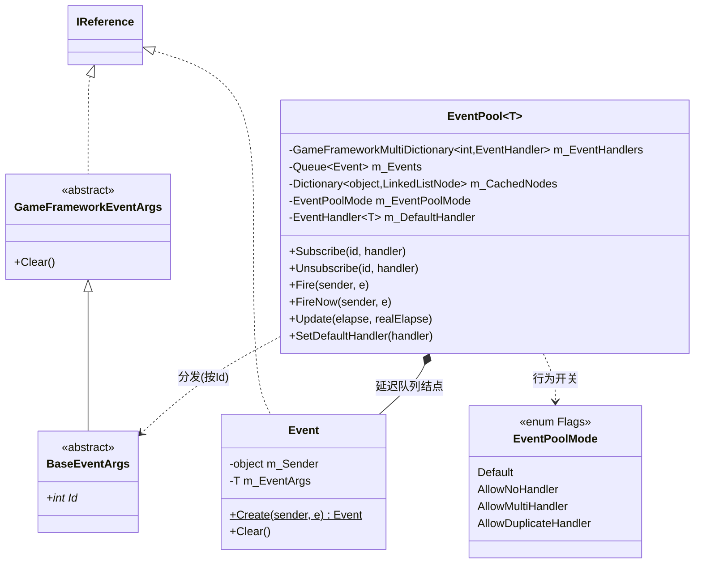
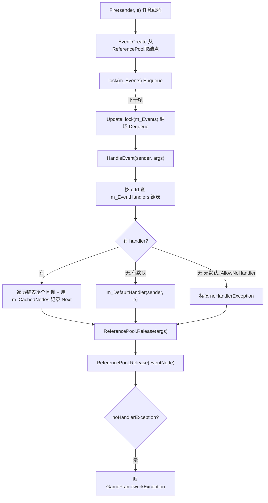
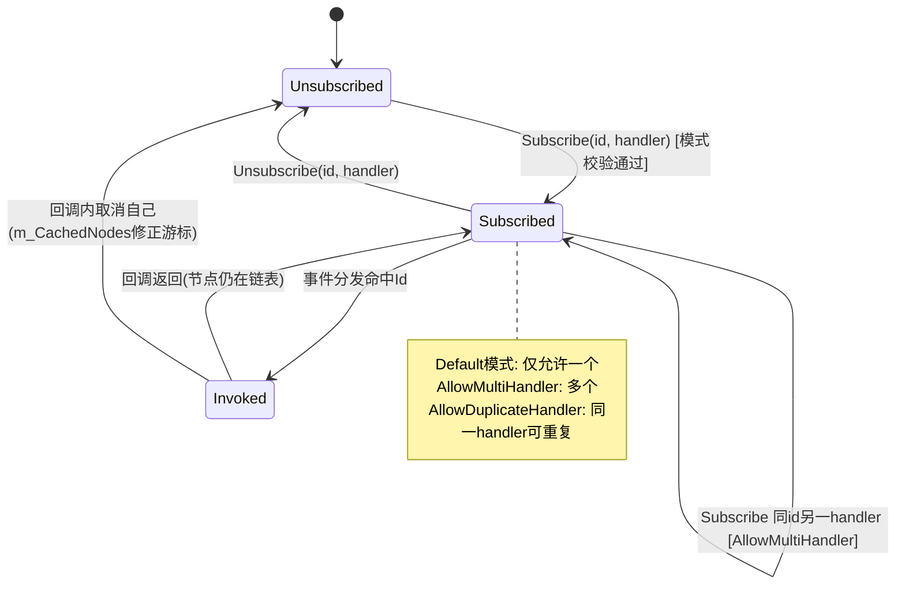

# EventPool 事件池模块 · 架构解析报告

> 层级：纯 C# 核心层 `GameFramework`
> 定位：框架**事件驱动的内核**。上层 `EventComponent`/`EventManager` 都是对 `EventPool<GameEventArgs>` 的封装。核心解决三件事：**线程安全的延迟分发**、**迭代中安全增删订阅者**、**事件参数的复用回收**。

---

## 1. 契约定义 (Interface & Contract)

| 类型 | 文件 | 角色 | 可见性 |
|------|------|------|--------|
| `BaseEventArgs` | `BaseEventArgs.cs` | 事件参数基类，继承 `GameFrameworkEventArgs(IReference)`，含抽象 `Id` | public abstract |
| `EventPool<T>` | `EventPool.cs` | 事件池本体，泛型约束 `T : BaseEventArgs` | internal sealed partial |
| `EventPool<T>.Event` | `EventPool.Event.cs` | 延迟队列里的事件结点(sender+args)，自身是 `IReference` | private nested |
| `EventPoolMode` | `EventPoolMode.cs` | `[Flags]` 模式位：NoHandler/MultiHandler/DuplicateHandler | internal enum |

### 设计要点（穿透语法）

- **事件用 `int Id` 而非 `Type` 路由**：`BaseEventArgs.Id` 是分发键，配合 `GameFrameworkMultiDictionary<int, EventHandler<T>>`（一 Id 多 handler 的链表）。比按类型 dictionary 更轻、可手动控制编号。
- **`Event` 结点也是 `IReference`**：每次 `Fire` 从 ReferencePool 取一个 `Event` 包装 (sender, args)，分发完归还。**与 args 本身的回收叠加**——又是两级复用。
- **三层 Flags 模式**：`Default=0`（必须有且仅一个 handler）、`AllowNoHandler`、`AllowMultiHandler`、`AllowDuplicateHandler`，按位组合决定 Subscribe 与无人处理时的容错策略。

### Mermaid 类图



---

## 2. 内存与生命周期流转 (Lifecycle & Memory)

### 2.1 两种分发模式

| 模式 | 方法 | 线程安全 | 时机 | 用途 |
|------|------|----------|------|------|
| **延迟** | `Fire` | ✅ 是 | 入队，**下一帧 Update** 在主线程分发 | 跨线程抛事件（网络/IO 回调） |
| **立即** | `FireNow` | ❌ 否 | 当场 `HandleEvent` 同步回调 | 主线程内确定时序的同步事件 |

### 2.2 延迟事件的完整流转



注意回收的**双重性**：`HandleEvent` 内 `ReferencePool.Release(e)` 归还 **EventArgs**；`Update` 循环里 `ReferencePool.Release(eventNode)` 归还 **Event 结点**。两者都回 ReferencePool。

### 2.3 迭代中安全增删（本模块最精妙处）

事件回调里经常会 `Subscribe`/`Unsubscribe` 别的 handler，甚至取消自己。直接遍历链表会因节点被删而崩。框架用 `m_CachedNodes` 解决：

```csharp
LinkedListNode<EventHandler<T>> current = range.First;
while (current != null && current != range.Terminal)
{
    m_CachedNodes[e] = current.Next != range.Terminal ? current.Next : null;  // 先存好下一个
    current.Value(sender, e);                                                 // 回调(可能改链表)
    current = m_CachedNodes[e];                                               // 从缓存读下一个
}
m_CachedNodes.Remove(e);
```

- **以事件实例 `e` 为 key** 缓存"下一个待处理节点"，回调即使删了 `current` 或 `current.Next`，迭代仍能正确推进。
- `Unsubscribe` 里反向配合：若被删的 handler 恰是某个缓存节点，就把缓存指针**前移到它的 `Next`**（用 `m_TempNodes` 暂存再回写，避免遍历中改字典）。
- 以 `e` 为 key 而非全局单变量 → 支持**重入**（handler 里又 FireNow 另一个事件，各自有独立游标）。

### 2.4 状态机（订阅者视角）



### 2.5 Shutdown / Clear

- `Clear()`：只清空 `m_Events` 延迟队列（丢弃未分发事件），handler 保留。
- `Shutdown()`：Clear + 清空 handler/缓存节点 + 置空默认处理器。

---

## 3. Unity 层的桥接映射 (Unity Layer Bridging)

> ⚠️ 本工作区不含 `UnityGameFramework`，以下为标准实现描述，**未在本仓库验证**。

- Unity 层 `EventComponent` 内部持有 `EventManager`（实现 `IEventManager`），后者包裹一个 `EventPool<GameEventArgs>`。
- `Component.Subscribe/Fire/FireNow` 全部转发给内部 EventPool；`EventComponent` 的 Inspector 通常暴露 `EnableEventPoolMode`（是否允许 NoHandler/Multi 等）。
- 帧驱动：`BaseComponent` 的 `Update` → `GameFrameworkEntry.Update` → 各 Module；EventManager 作为 Module 在其 `Update` 里调 `EventPool.Update` 完成"下一帧主线程分发"。这就是 `Fire` 能"跨线程抛、主线程收"的实现根。
- 业务自定义事件：继承 `GameEventArgs`（Unity 层的 `BaseEventArgs` 子类），用 `typeof(XxxEventArgs).GetHashCode()` 之类生成稳定 `Id`，并实现 `Clear()` 以支持复用。

---

## 4. 落地吸收建议 (Actionable Learning)

### 难点 ①：迭代中安全增删订阅者
这是事件系统的头号陷阱。回调里取消订阅会使正在遍历的链表节点失效。本框架"以事件实例为 key 预存 Next 指针 + Unsubscribe 时同步修正游标"的方案，比"复制一份 handler 列表再遍历"更省分配，但实现更绕。仿写若图省事可先用"遍历快照副本"，但要明白它每次分发都多一次分配。

### 难点 ②：延迟分发的线程边界
`Fire` 只在 `lock(m_Events)` 内入队，**真正回调发生在 Update（主线程）**。这把"线程安全"收窄到一个队列的进出，回调逻辑无需考虑并发。仿写时要守住"生产者多线程入队、单一消费者主线程出队"这条边界，绝不能让回调在工作线程执行。

### 难点 ③：事件参数与结点的双层复用 + 配平
EventArgs 和 Event 结点都来自 ReferencePool，分发后必须各自 Release。漏一个就泄漏，重复一个就串数据。尤其 `FireNow` 路径也会 `Release(e)`——意味着**Fire 之后业务不可再持有该 args 引用**（它已被回收，可能被复用给别的事件）。仿写时要把"Fire 即移交所有权"写进契约。

---

## 附：坐标
- `EventPool<T>` 自身不是 Module，由上层 EventManager(Module) 持有并驱动 Update。
- 依赖：`ReferencePool`、`GameFrameworkMultiDictionary`、`GameFrameworkLinkedListRange`、`BaseEventArgs`。
- 被依赖：几乎所有需要解耦通知的上层模块（资源加载完成、下载进度、网络消息等）。
