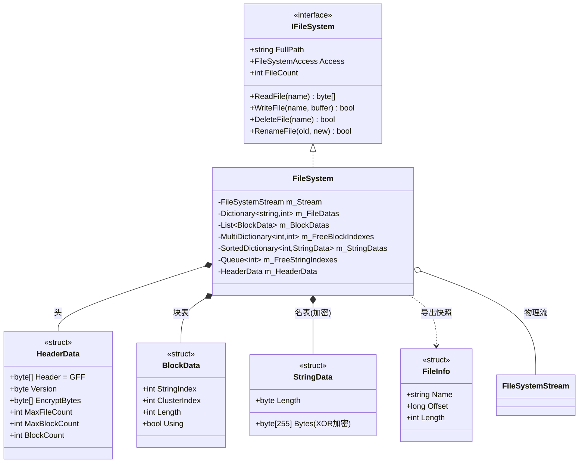
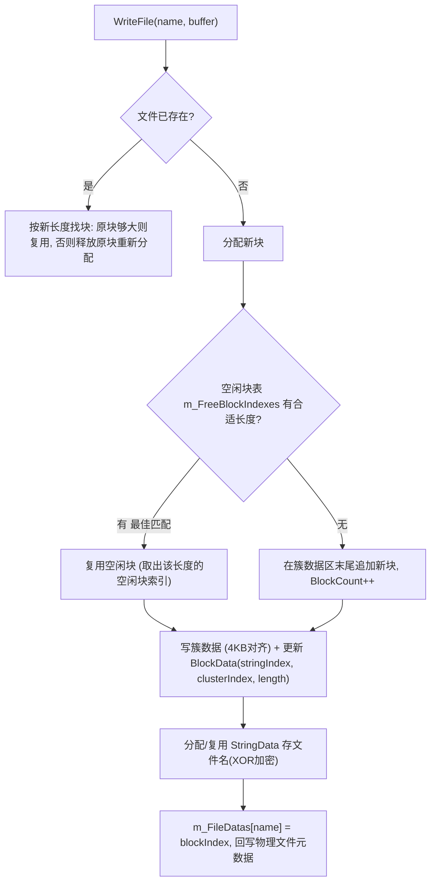
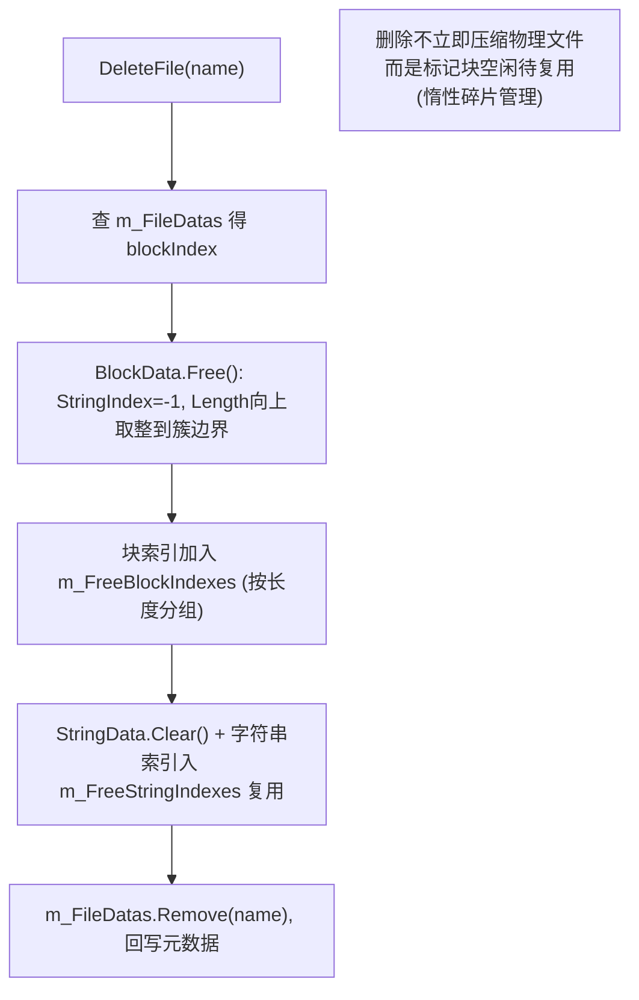
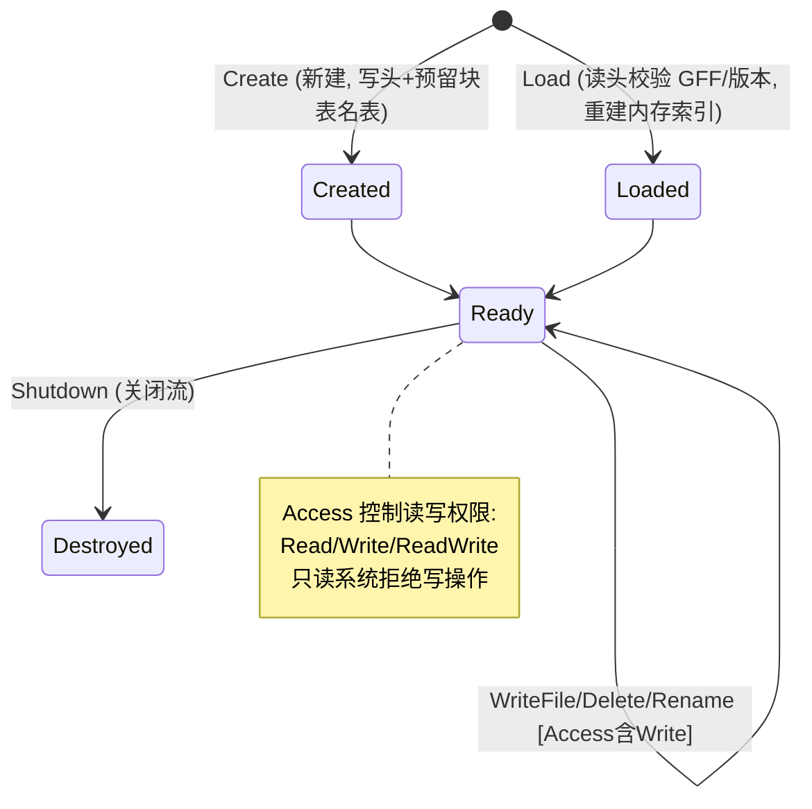

# FileSystem 虚拟文件系统模块 · 架构解析报告

> 层级：纯 C# 核心层 `GameFramework.FileSystem`
> 定位：**单物理文件内嵌多逻辑文件的自定义归档格式**（类似 .pak/.zip 的运行期可读写版本）。把成百上千个小资源打进一个大文件，按"簇/块"分配管理，支持读写删改名 + 文件名 XOR 加密。这是全框架最"系统编程"的模块——手写了一套微型文件系统的分配器。Resource 的资源包就存在这里。

---

## 1. 契约定义 (Interface & Contract)

| 类型 | 文件 | 角色 | 可见性 |
|------|------|------|--------|
| `IFileSystem` | `IFileSystem.cs` | 文件系统契约：Read/Write/Delete/Rename + Segment 读 | public |
| `IFileSystemManager` | `IFileSystemManager.cs` | 管理器：创建/加载/销毁多个文件系统 | public |
| `FileSystem` | `FileSystem.cs` | 实现，手写簇/块分配器 | internal sealed partial |
| `FileSystem.HeaderData` | `.HeaderData.cs` | 文件头：`GFF` 魔数 + 版本 + 加密字节 + 上限 | private struct |
| `FileSystem.BlockData` | `.BlockData.cs` | 块记录：stringIndex/clusterIndex/length | private struct |
| `FileSystem.StringData` | `.StringData.cs` | 文件名记录（XOR 加密，定长 255） | private struct |
| `FileInfo` | `FileInfo.cs` | 文件信息快照（name/offset/length） | public struct |
| `FileSystemStream` / `CommonFileSystemStream` | | 底层流抽象 + 默认实现 | public/abstract |
| `FileSystemAccess` | `FileSystemAccess.cs` | `[Flags]` Read/Write/ReadWrite | public enum |

### 设计要点（穿透语法）

- **三段式物理布局**：物理文件 = `HeaderData`（头）+ `BlockData[]`（块表）+ `StringData[]`（名表）+ 簇数据区。`CalcOffsets` 算出各段偏移。这是经典的"元数据区 + 数据区"归档结构。
- **簇 (Cluster) = 4KB 固定分配粒度**：文件按 4KB 簇对齐存储，避免外部碎片细化到字节。块的实际占用向上取整到簇边界（`GetUpBoundClusterOffset`）。
- **块的最佳匹配复用**：`m_FreeBlockIndexes : GameFrameworkMultiDictionary<int, int>` 按"块长度 → 空闲块索引"分组。删文件时块进空闲表，写新文件时按长度找最合适的空闲块复用——这是**碎片管理的核心**。
- **文件名 XOR 加密**：`StringData` 用头里的随机 `m_EncryptBytes` 对文件名做自异或加密，定长 255 字节。防止打包文件被轻易窥探资源名。
- **结构体直接序列化**：HeaderData/BlockData/StringData 都用 `[StructLayout(Sequential)]` + `Marshal.StructureToBytes` 直接二进制读写，零 JSON/反射开销。

### Mermaid 类图



---

## 2. 内存与生命周期流转 (Lifecycle & Memory)

### 2.1 物理文件布局

```
┌─────────────┬──────────────────┬───────────────────┬─────────────────────┐
│ HeaderData  │  BlockData[N]    │  StringData[N]    │   簇数据区 (4KB对齐)  │
│ GFF+版本+   │  块表(分配记录)   │  名表(XOR加密名)   │   实际文件字节         │
│ 加密+上限   │  m_BlockDataOffset│  m_StringDataOffset│  m_FileDataOffset    │
└─────────────┴──────────────────┴───────────────────┴─────────────────────┘
```

- 头固定大小，块表/名表按 MaxBlockCount/MaxFileCount 预留定长，簇数据区动态增长。
- 内存里维护三套索引镜像物理结构：`m_FileDatas`(名→块索引)、`m_BlockDatas`(块表)、`m_StringDatas`(名表)，加载时从物理文件重建。

### 2.2 写文件的块分配（核心算法）



关键：**写文件 = 找块（复用空闲 or 新增）+ 写簇数据 + 登记块/名表**。空闲块按长度索引，实现"最佳匹配"复用，减少碎片。

### 2.3 删文件与碎片管理



- **删除不收缩物理文件**：块标记为空闲（`StringIndex = -1`），进空闲表等待复用。物理文件大小不变，避免删一个文件就重排整个归档（代价巨大）。
- **空闲块/空闲字符串索引双复用**：`m_FreeBlockIndexes`(块) + `m_FreeStringIndexes`/`m_FreeStringDatas`(字符串) 都做空闲表复用，把"删除留下的空洞"重新利用。这是手写分配器的精髓——**空间复用而非释放**。
- `BlockData.Free()` 里 `Length` 向上取整到簇边界：空闲块按整簇管理，下次分配按簇匹配。

### 2.4 文件名加密

```csharp
// StringData.SetString: 文件名 → XOR 加密 → 定长字节
Utility.Encryption.GetSelfXorBytes(s_CachedBytes, encryptBytes);
// GetString: 读取时用同样的 encryptBytes 自异或还原
Utility.Encryption.GetSelfXorBytes(s_CachedBytes, 0, m_Length, encryptBytes);
```

`encryptBytes` 是创建文件系统时 `Utility.Random.GetRandomBytes` 生成的随机 4 字节，存在头里。自异或（XOR 两次还原）轻量加密文件名——**不是强加密，只是防止直接 strings 命令窥探资源清单**。

### 2.5 访问方式与生命周期



---

## 3. Unity 层的桥接映射 (Unity Layer Bridging)

> ⚠️ 本工作区不含 `UnityGameFramework`，以下为标准实现描述，**未在本仓库验证**。

- `FileSystemComponent : GameFrameworkComponent` 转发 `IFileSystemManager`，注入 `IFileSystemHelper`（创建 `FileSystemStream` 的工厂）。
- `FileSystemStream` 的 Unity 实现包裹 `System.IO.FileStream`（PC/移动端可写目录）或只读流（StreamingAssets 随包资源）。`CommonFileSystemStream` 是默认实现。
- 与 Resource 的关系：资源包（AssetBundle）打进文件系统归档，Resource 通过 `ReadFileSegment` 从大归档里**按偏移读取单个资源包片段**，无需把每个 AB 单独存为物理文件——减少海量小文件对移动端文件系统的压力（小文件多会拖慢 IO、浪费簇空间）。
- `IDataProvider`（DataTable/Config 等）的 `BinaryOnFileSystem` 分支正是从这里读：`LoadBinaryFromFileSystem` → `FileSystem.ReadFile`。

---

## 4. 落地吸收建议 (Actionable Learning)

### 难点 ①：簇对齐分配与最佳匹配空闲表
手写分配器的核心是"固定粒度（簇）+ 空闲表复用"。簇对齐用空间换管理简单（避免字节级碎片），空闲块按长度索引实现最佳匹配复用。仿写时要理解：删除不是"还给操作系统"，而是"标记空闲进表待复用"。这与 ObjectPool/ReferencePool 的"复用而非释放"是同一哲学，只是落在磁盘空间上。最难的是**分配与回收时三套索引（文件/块/字符串）的一致性维护**——任一处漏改即数据损坏。

### 难点 ②：元数据区与数据区的分离 + 结构体直接序列化
归档格式 = 定长元数据区（头/块表/名表）+ 动态数据区（簇）。用 `[StructLayout(Sequential)]` + Marshal 直接二进制读写，避免序列化框架开销。仿写时要先设计清楚物理布局（各段偏移如何计算），再实现读写。元数据定长预留是关键——它让"按索引随机定位块/名"成为 O(1) 偏移计算。

### 难点 ③：单大文件 vs 海量小文件的工程动机
为什么不直接用操作系统文件系统存每个资源？因为移动端海量小文件会：① 拖慢 IO（每次 open/close 系统调用开销）；② 浪费簇空间（每个小文件占至少一个 OS 簇）；③ 难加密/校验。把它们打进一个大文件自管理，换来 IO 批量化、空间紧凑、整包加密。仿写时要明白这是**针对"很多小文件"场景的优化**，单个大文件场景用不上。

---

## 附：坐标
- `FileSystem` 由 `FileSystemManager`(Module) 管理；底层依赖 `FileSystemStream`。
- 依赖：`GameFrameworkMultiDictionary`、`Utility.Marshal/Encryption/Converter/Random`、文件 IO。
- 被依赖：`Resource`（资源包归档存储）、`DataProvider` 的 `BinaryOnFileSystem` 读取路径。
