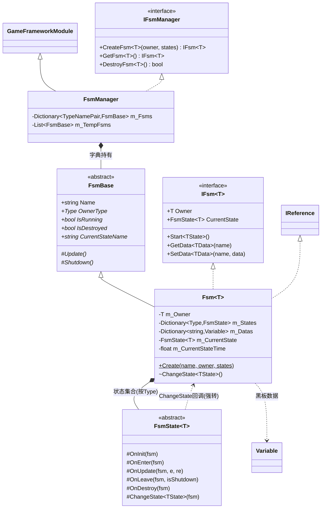
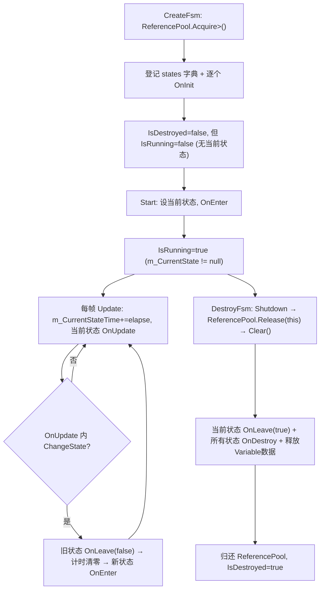
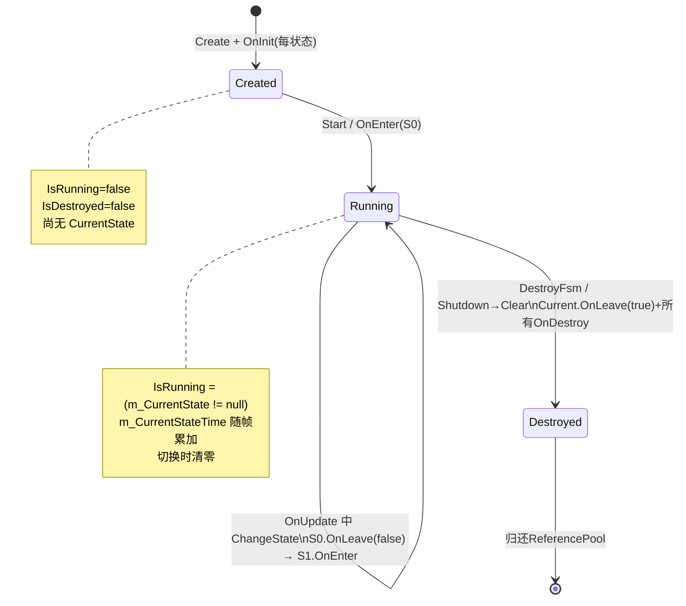

# Fsm 有限状态机模块 · 架构解析报告

> 层级：纯 C# 核心层 `GameFramework.Fsm`
> 定位：通用**状态机引擎**。上层 `Procedure`（流程）模块直接构建在它之上——游戏流程本身就是一台 FSM。核心解决：泛型持有者绑定、状态生命周期五钩子、状态间黑板数据（Variable）共享、以及 FSM 实例本身的复用。

---

## 1. 契约定义 (Interface & Contract)

| 类型 | 文件 | 角色 | 可见性 |
|------|------|------|--------|
| `IFsmManager` | `IFsmManager.cs` | 管理器契约：创建/获取/销毁 FSM | public |
| `IFsm<T>` | `IFsm.cs` | 单台状态机的泛型契约（T=持有者） | public |
| `FsmBase` | `FsmBase.cs` | 非泛型抽象基类，供管理器统一存储 | public abstract |
| `FsmState<T>` | `FsmState.cs` | 状态基类，定义五个生命周期钩子 | public abstract |
| `Fsm<T>` | `Fsm.cs` | 状态机实现，`IReference`(可复用) | internal sealed |
| `FsmManager` | `FsmManager.cs` | 管理器实现，`GameFrameworkModule` | internal sealed |

### 设计要点（穿透语法）

- **三套泛型对齐**：`Fsm<T>` 同时 `: FsmBase, IReference, IFsm<T>`。`FsmBase`(非泛型) 给管理器字典 `Dictionary<TypeNamePair, FsmBase>` 统一存储；`IFsm<T>`(泛型) 给业务强类型用；`IReference` 让整台 FSM 都能进 ReferencePool 复用。
- **状态按 `Type` 唯一**：`m_States : Dictionary<Type, FsmState<T>>`，一个状态类型在一台 FSM 内只能有一个实例。切换状态用类型寻址 `ChangeState<TState>()`。
- **状态切换权封闭在 `internal`**：`ChangeState` 是 `Fsm<T>` 的 internal 方法，业务状态只能通过 `FsmState<T>.ChangeState(fsm)`（protected）触发，且内部做了 `(Fsm<T>)fsm` 强转。**外部无法越过当前状态直接切换**，保证迁移必经状态自身。
- **黑板数据 `m_Datas` 懒初始化**：`Dictionary<string, Variable>` 仅在首次 SetData 时 new，且 Variable 也是 `IReference`（覆盖旧值/移除时 Release）。

### Mermaid 类图



---

## 2. 内存与生命周期流转 (Lifecycle & Memory)

### 2.1 状态的五个钩子

| 钩子 | 触发时机 | 典型用途 |
|------|----------|----------|
| `OnInit(fsm)` | Create 时，每个状态各调一次 | 一次性初始化，缓存引用 |
| `OnEnter(fsm)` | Start / ChangeState 进入该状态 | 重置状态局部数据、播放进入逻辑 |
| `OnUpdate(fsm, e, re)` | 每帧（当前状态） | 状态逻辑 + 条件判断触发 ChangeState |
| `OnLeave(fsm, isShutdown)` | ChangeState 离开 / Clear | 清场，`isShutdown` 区分正常切换与关闭 |
| `OnDestroy(fsm)` | Clear 时，每个状态各调一次 | 释放状态持有的资源 |

注意 **OnInit/OnDestroy 是"每状态一次"的生命周期端点**，OnEnter/OnLeave 是"每次进出"的成对钩子，OnUpdate 只打在当前状态上。

### 2.2 FSM 实例的完整流转（含复用）



关键：`Shutdown()` 只做一件事 `ReferencePool.Release(this)`，而 `Release` 会触发 `Clear()`（IReference 契约）。**Clear 才是真正的析构**——先 `OnLeave(true)` 当前状态，再遍历所有状态 `OnDestroy`，再释放所有 Variable 黑板数据回 ReferencePool，最后标记 `IsDestroyed=true`。整台 FSM 随后被复用。

### 2.3 状态切换状态机（运行时视角）



### 2.4 黑板数据 (Variable) 的内存管理

- `SetData(name, data)`：覆盖旧值前，对旧 `Variable` 调 `ReferencePool.Release`，避免泄漏。
- `RemoveData(name)`：移除前同样 Release 旧值。
- `Clear()`：遍历所有 Variable 逐个 Release。
- 数据字典用 `StringComparer.Ordinal`（精确序数比较，避免文化相关比较的开销）。
- Variable 是跨状态共享的"黑板"，让无直接引用的状态间能传递上下文（如 Procedure 之间传参）。

### 2.5 管理器轮询的"快照防并发修改"

`FsmManager.Update` 不直接遍历 `m_Fsms`，而是先拷到 `m_TempFsms` 再遍历，且跳过 `IsDestroyed` 的：

```csharp
foreach (var fsm in m_Fsms) m_TempFsms.Add(fsm.Value);
foreach (var fsm in m_TempFsms) { if (fsm.IsDestroyed) continue; fsm.Update(...); }
```

原因：状态的 `OnUpdate` 里可能 `CreateFsm`/`DestroyFsm`，直接遍历原字典会抛"集合被修改"。这与 EventPool 的迭代安全是同一类工程问题，FSM 选了更简单的"快照副本"方案。

---

## 3. Unity 层的桥接映射 (Unity Layer Bridging)

> ⚠️ 本工作区不含 `UnityGameFramework`，以下为标准实现描述，**未在本仓库验证**。

- Unity 层 `FsmComponent : GameFrameworkComponent` 在初始化时 `GetModule<IFsmManager>()`，转发 Create/Get/Destroy。
- 业务流程（`ProcedureComponent`）把每个 `ProcedureBase`（继承 `FsmState<IProcedureManager>`）作为状态，构建一台以流程管理器为 Owner 的 FSM；游戏启动流程→更新流程→进入主菜单流程等，就是状态迁移。
- Inspector/Debugger：通过 `FsmBase.CurrentStateName`/`CurrentStateTime`/`IsRunning` 等非泛型属性渲染当前状态、已持续时间，无需暴露泛型 `Fsm<T>`。这正是 `FsmBase` 把这些只读属性提到非泛型层的原因。
- 帧驱动：`BaseComponent.Update` → `GameFrameworkEntry.Update` → `FsmManager.Update`（Priority=1，较低，靠后轮询）。

---

## 4. 落地吸收建议 (Actionable Learning)

### 难点 ①：状态切换的封闭性（谁有权切换）
本框架把 `ChangeState` 设为 `Fsm<T>` 的 `internal`，业务只能从 `FsmState<T>` 内部经 protected 包装触发，且强转回具体 `Fsm<T>`。这保证"迁移必由当前状态发起"，杜绝外部乱切导致 OnLeave/OnEnter 不配对。仿写时若把 ChangeState 开放成 public，状态机的不变量（成对进出）就守不住了。

### 难点 ②：五钩子的语义边界与配对
OnInit/OnDestroy（每状态一次）vs OnEnter/OnLeave（每次进出成对）vs OnUpdate（仅当前状态）三组语义必须分清。最易错：把一次性初始化写进 OnEnter，导致每次进入重复初始化；或在 OnLeave 漏处理 `isShutdown=true` 的关闭路径。仿写时要把"成对"做成硬约束：切换 = 旧.OnLeave → 清零计时 → 换引用 → 新.OnEnter，顺序不可乱。

### 难点 ③：FSM 自身复用 + 黑板数据级联释放
整台 `Fsm<T>` 是 IReference，Shutdown→Release→Clear 三连。Clear 里必须级联释放所有 Variable 黑板数据（它们也是 IReference），否则数据泄漏。仿写时要意识到"容器复用必须负责其持有的可复用子对象的释放"，这是 ObjectPool/EventPool/FSM 共通的一条铁律。

---

## 附：坐标
- `FsmManager` Priority=1（很低，靠后轮询、靠前关闭）。
- 依赖：`ReferencePool`、`Variable`、`TypeNamePair`、`GameFrameworkModule`。
- 被依赖：`Procedure`（流程模块完全基于 FSM 构建）、以及任何需要状态管理的业务（角色 AI、UI 状态等）。
