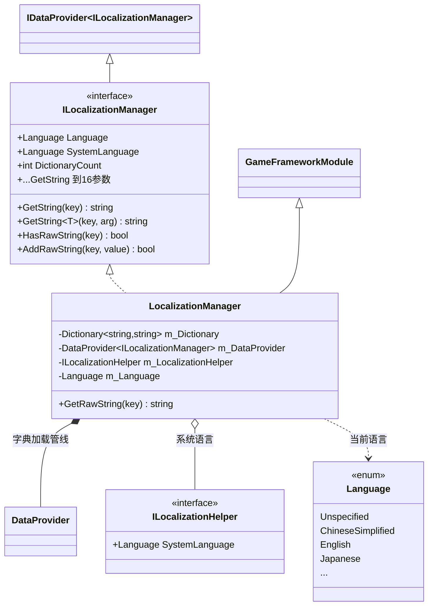
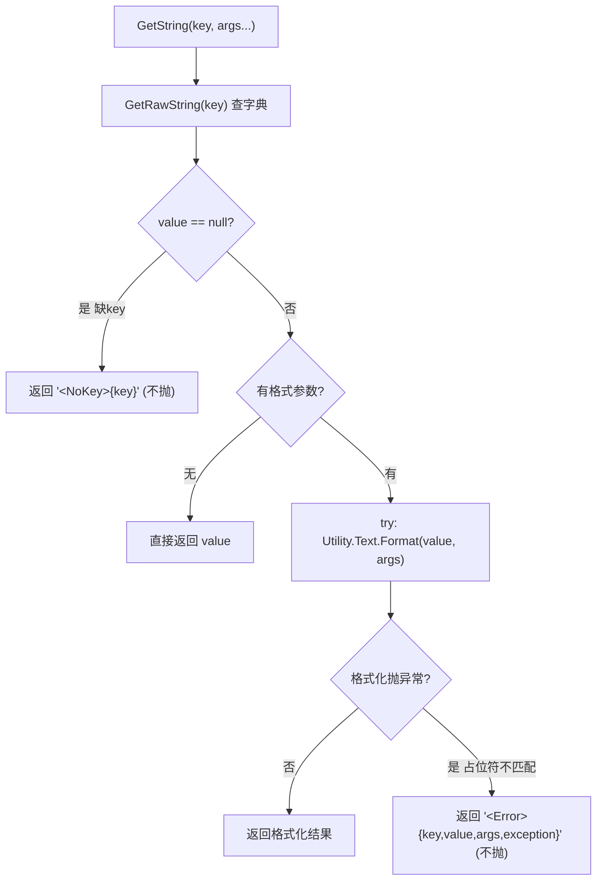
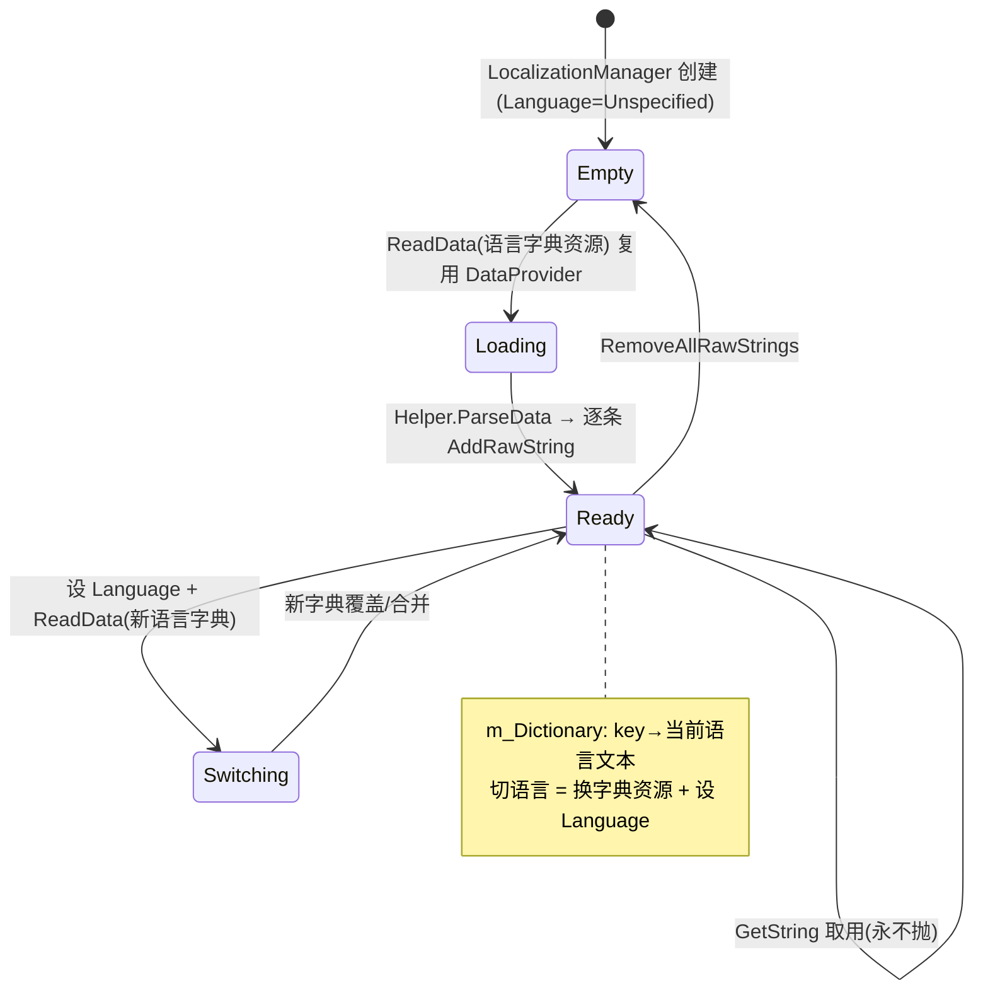

# Localization 本地化模块 · 架构解析报告

> 层级：纯 C# 核心层 `GameFramework.Localization`
> 定位：多语言**字典 + 文本格式化**。`key → 本地化文本` 的扁平字典，支持带参数的占位符替换。与 Config 同样复用 `DataProvider` 管线读取字典。核心看点：**GetString 永不抛异常的容错设计**、**16 个泛型重载避免装箱**、**字典加载与语言切换的解耦**。

---

## 1. 契约定义 (Interface & Contract)

| 类型 | 文件 | 角色 | 可见性 |
|------|------|------|--------|
| `ILocalizationManager` | `ILocalizationManager.cs` | 管理器契约，`: IDataProvider<ILocalizationManager>` | public |
| `ILocalizationHelper` | `ILocalizationHelper.cs` | 辅助器：仅提供 `SystemLanguage` | public |
| `LocalizationManager` | `LocalizationManager.cs` | 实现，`GameFrameworkModule`，持字典 + DataProvider | internal sealed partial |
| `Language` | (Base) | 语言枚举（中英日韩等） | public enum |

### 设计要点（穿透语法）

- **存储是 `Dictionary<string, string>`（Ordinal）**：与 Config 同构的扁平 KV，只是值固定为 string（本地化文本）。`AddRawString`/`GetRawString`/`HasRawString` 是底层增删查，`GetString` 是上层带格式化的取用。
- **GetString 永不抛异常**：这是本模块最重要的契约——UI 文本获取**绝不能因 key 缺失或格式错误而崩溃**。缺 key 返回 `<NoKey>{key}`，格式化异常返回 `<Error>{...}`。错误以**可见的占位文本**暴露给美术/策划，而非抛异常中断渲染。
- **16 个泛型重载（0~16 参数）**：`GetString<T1,...,T16>` 一路重载到 16 个泛型参数，目的是**避免 `params object[]` 的装箱与数组分配**。值类型参数（int/float）直接以泛型传入 `Utility.Text.Format`，零装箱。这是高频 UI 文本格式化的性能优化。
- **Language 与字典解耦**：`Language` 属性可读写（当前语言），`SystemLanguage` 从 helper 读（设备语言）。字典内容由 `ReadData` 加载——切语言通常是"加载对应语言的字典资源 + 设 Language"，字典本身只存当前语言的 KV。

### Mermaid 类图



---

## 2. 内存与生命周期流转 (Lifecycle & Memory)

### 2.1 GetString 的三态容错（核心）



三种返回都是**有效字符串**，调用方（UI）拿到的永远是可显示文本：
- 正常：`"你好，{0}"` + arg `"勇者"` → `"你好，勇者"`
- 缺 key：→ `"<NoKey>ui.greeting"`（美术一眼看出漏配）
- 格式错（如文本含 `{5}` 但只传了 1 个参数）：→ `"<Error>ui.greeting,你好{5},勇者,System.FormatException..."`

### 2.2 为什么 16 个重载而非 params object[]

```csharp
// 框架做法：泛型重载，值类型零装箱
public string GetString<T1, T2>(string key, T1 arg1, T2 arg2) { ... Utility.Text.Format(value, arg1, arg2); }

// 反例：params object[] 会把每个值类型装箱 + 分配数组
public string GetString(string key, params object[] args)  // int/float 入参即装箱
```

UI 每帧可能格式化大量文本（血量、金币、计时），`params object[]` 的装箱与数组分配会成为 GC 热点。用泛型重载把 0~16 参数全覆盖，**值类型以泛型传递不装箱**。代价是接口/实现各膨胀 17 个方法——空间换运行期零分配，对高频 UI 是划算的。

### 2.3 字典生命周期与语言切换



### 2.4 内存关注点

- **字典只存当前语言**：不同时加载多语言（省内存）。切语言重新 ReadData 对应字典。
- **AddRawString 重 key 行为**：返回 false（已存在则不覆盖），与 Config 一致的"温和拒绝"。
- **字典文本不进 ReferencePool**：长生命周期只读文本，与 DataTable 行同理，交 GC。
- **EventArgs 走 ReferencePool**：四个 ReadData 事件复用 DataProvider 的池化 EventArgs。

---

## 3. Unity 层的桥接映射 (Unity Layer Bridging)

> ⚠️ 本工作区不含 `UnityGameFramework`，以下为标准实现描述，**未在本仓库验证**。

- `LocalizationComponent : GameFrameworkComponent` 转发 `ILocalizationManager`，注入 `SetResourceManager` + `SetDataProviderHelper`（字典解析格式）+ `SetLocalizationHelper`。
- `ILocalizationHelper` 的 Unity 实现把 `Application.systemLanguage`（Unity 枚举）映射成框架的 `Language` 枚举，供"首次启动按设备语言初始化"。
- UI 组件（如本地化 Label）在语言切换事件后调 `GetString(key)` 刷新文本。配合 EventPool，语言切换可广播事件让所有 UI 重刷。
- 字典解析 Helper 把加载到的 XML/JSON/二进制字典逐条 `AddRawString(key, value)`。

---

## 4. 落地吸收建议 (Actionable Learning)

### 难点 ①：UI 取值"永不抛异常"的容错哲学
本地化是直面 UI 渲染的模块，一个缺失的 key 不该让整个界面崩。框架用"返回可见占位串"替代抛异常——既不中断渲染，又让缺漏在画面上显形（`<NoKey>`）。仿写时要建立这种"面向 UI 的防御性返回"意识：宁可显示难看的占位，也不让文本系统成为崩溃源。这与 DataNode/Config 的"读取严格抛异常"形成有趣对比——**取决于调用方能否承受异常**。

### 难点 ②：泛型重载消除装箱的工程取舍
为高频路径写 17 个几乎一样的重载，看着丑，但消除了值类型装箱与 params 数组分配。仿写时要识别"这是不是高频热路径"——UI 文本格式化是，那么膨胀的重载值得；若是低频调用，`params object[]` 的简洁更可取。性能优化要落在真正的热点上。

### 难点 ③：加载与语言状态的解耦
字典内容（ReadData）与当前语言（Language 属性）是两件事。切语言 = 重新加载对应字典 + 更新语言标记，而非在内存里存多语言查表。这让内存只承载当前语言，代价是切换需重新加载。仿写时要想清楚"多语言常驻 vs 按需加载"的取舍——本框架选了按需（省内存，切换有加载成本）。

---

## 附：坐标
- `LocalizationManager` 是 Module（Update/Shutdown 空实现）。
- 依赖：`DataProvider`(共享管线)、`Resource`、`ReferencePool`、`Language` 枚举、`Utility.Text`。
- 与 Config/Setting 同为"DataProvider 复用家族"；与 EventPool 配合实现语言切换广播。
