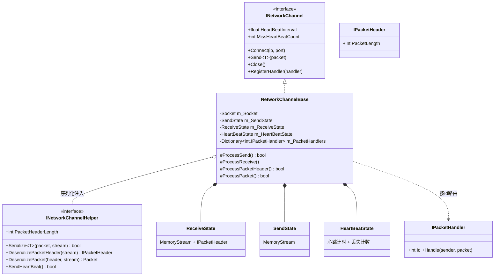
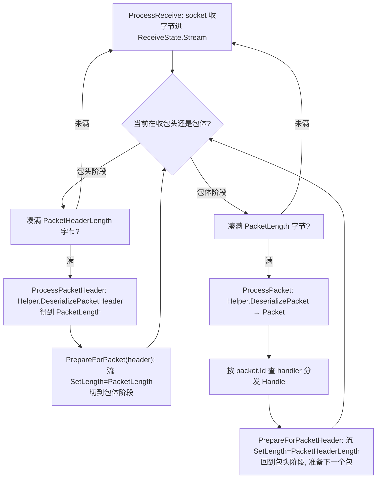
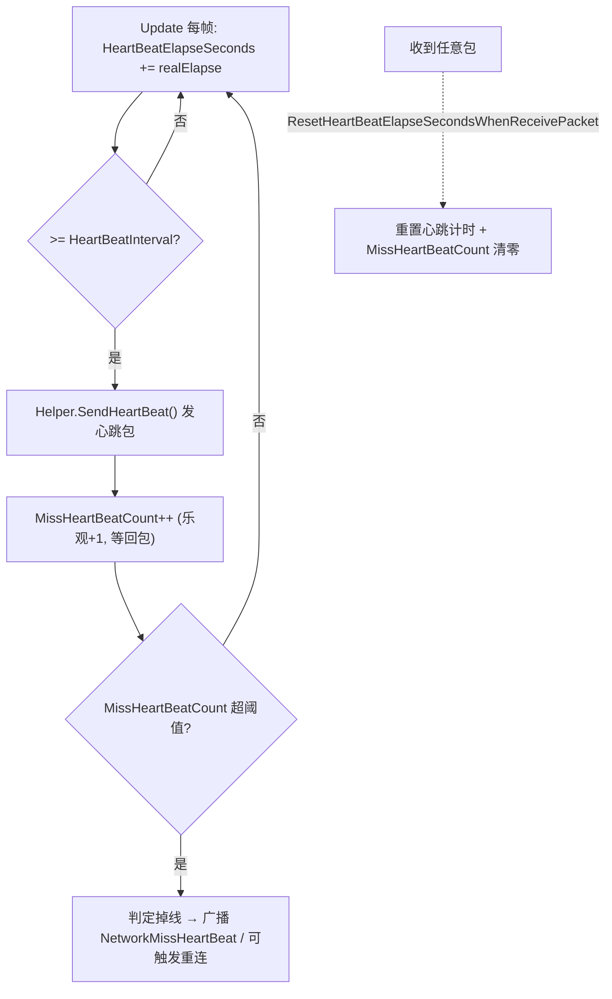
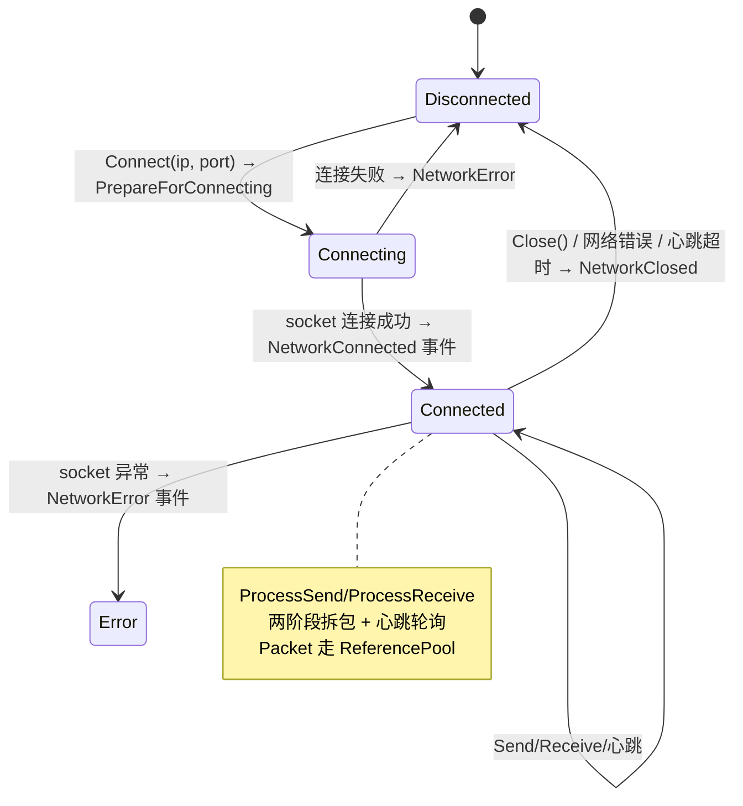

# Network 网络模块 · 架构解析报告

> 层级：纯 C# 核心层 `GameFramework.Network`
> 定位：**TCP 长连接通信**（socket、心跳、粘包拆包、消息路由）。是剩余模块里机制最独立的一个——不依赖 TaskPool/ObjectPool，自己管 socket 收发。核心看点：**"先读包头定长 → 按包头里的包体长度读包体"的两阶段拆包**、心跳保活、收发双缓冲。

---

## 1. 契约定义 (Interface & Contract)

| 类型 | 文件 | 角色 | 可见性 |
|------|------|------|--------|
| `INetworkManager` | `INetworkManager.cs` | 管理器：创建/获取/销毁网络频道 | public |
| `INetworkChannel` | `INetworkChannel.cs` | 单条连接契约：Connect/Send/Close + 心跳属性 | public |
| `INetworkChannelHelper` | `INetworkChannelHelper.cs` | **序列化/反序列化 + 心跳包**注入点 | public |
| `IPacketHeader` | `IPacketHeader.cs` | 包头契约：仅 `PacketLength`（包体长度） | public |
| `IPacketHandler` | `IPacketHandler.cs` | 消息处理器：`Id` + `Handle` | public |
| `Packet` | `Packet.cs` | 消息包基类（IReference） | public abstract |
| `NetworkChannelBase` | `.NetworkChannelBase.cs` | 频道基类，socket 收发核心 | private nested |
| `TcpNetworkChannel` / `TcpWithSyncReceiveNetworkChannel` | | 异步收 / 同步收两种实现 | private nested |
| `ReceiveState`/`SendState`/`HeartBeatState` | `.*State.cs` | 收/发缓冲 + 心跳计时 | private nested |
| `ServiceType`/`AddressFamily`/`NetworkErrorCode` | | 枚举 | public |

### 设计要点（穿透语法）

- **频道（Channel）= 一条连接**：一个 NetworkManager 可管多条频道（连不同服务器）。每条频道独立 socket、独立收发缓冲、独立心跳。
- **序列化完全外置给 Helper**：核心层不知道消息用 Protobuf/JSON/自定义二进制——`INetworkChannelHelper` 负责 `Serialize`/`DeserializePacketHeader`/`DeserializePacket`/`SendHeartBeat`。框架只管 socket 字节流的搬运。
- **包头定长、包体变长**：`IPacketHeader.PacketLength` 是包体长度。收包时先读固定 `PacketHeaderLength` 字节解析出包头，再按包头里的 PacketLength 读包体。这是解决 TCP **粘包/拆包**的标准方案。
- **消息路由用 Id**：`IPacketHandler.Id` 是协议号，`RegisterHandler` 按 Id 注册，收到包后按其协议号分发——与 EventPool 的 Id 路由同构。

### Mermaid 类图

---

## 2. 内存与生命周期流转 (Lifecycle & Memory)

### 2.1 两阶段拆包（解决 TCP 粘包，核心）

TCP 是字节流，一次 recv 可能收到半个包、一个半包、或多个包。框架用"包头定长 + 包体变长"两阶段状态机精确切包：

关键：`ReceiveState` 用 `MemoryStream` 的 `SetLength` 在"包头长度"和"包体长度"之间切换目标，`Position` 标记已收字节数。**收满目标长度才进入下一阶段**——无论 TCP 怎么切分字节流，都能精确还原一个个完整包。

### 2.2 收发双缓冲

- `SendState`：`Send<T>` 时 Helper 把 packet 序列化进 `SendState.Stream`，`ProcessSend` 把流里字节通过 socket 发出。发完 `Reset`（流清零）。
- `ReceiveState`：socket 收到的字节进 `ReceiveState.Stream`，按上述两阶段切包。
- 两个独立的 64KB `MemoryStream`，收发互不干扰。`Packet` 是 IReference，处理完归还 ReferencePool。

### 2.3 心跳保活 (HeartBeatState)

- 每隔 `HeartBeatInterval` 发一次心跳，`MissHeartBeatCount++`。
- 服务器回包（或任意包，若开 `ResetHeartBeatElapseSecondsWhenReceivePacket`）时 `Reset` 清零丢失计数。
- 连续丢失超阈值 → 判定连接失效。心跳是检测"对端是否还活着"的标准手段（TCP 自身的保活太慢）。

### 2.4 连接状态机

### 2.5 两种频道实现

- `TcpNetworkChannel`：异步接收（`BeginReceive`/回调），不阻塞主线程。
- `TcpWithSyncReceiveNetworkChannel`：同步接收（独立线程阻塞 recv），适合特定平台/需求。
- 两者共享 `NetworkChannelBase` 的拆包/心跳/分发逻辑，只在"如何从 socket 拿字节"上不同——又是模板方法 + 可替换实现的范式。

---

## 3. Unity 层的桥接映射 (Unity Layer Bridging)

> ⚠️ 本工作区不含 `UnityGameFramework`，以下为标准实现描述，**未在本仓库验证**。

- `NetworkComponent : GameFrameworkComponent` 转发 `INetworkManager`，提供创建频道 API。
- `INetworkChannelHelper` 的业务实现定义协议格式：`Serialize` 用 Protobuf/自定义二进制把 Packet 编码（含写包头），`DeserializePacketHeader`/`DeserializePacket` 解码。`SendHeartBeat` 发心跳协议包。**整套协议格式由业务通过 helper 决定，框架只搬字节**。
- 5 个网络事件（Connected/Closed/MissHeartBeat/Error/CustomError）转接 EventPool，让业务监听连接状态。
- `IPacketHandler` 由业务为每个协议号实现，注册到频道；收到包按协议号自动分发到对应 handler——类似 EventPool 的订阅分发，但用于网络消息。

---

## 4. 落地吸收建议 (Actionable Learning)

### 难点 ①：TCP 粘包/拆包的两阶段状态机
这是网络编程的头号难点，也是本模块的精华。TCP 是流不是包，必须靠"定长包头声明包体长度"来切包。两阶段状态机（收包头→解析长度→收包体→分发→回到收包头）用 MemoryStream 的 SetLength/Position 实现。仿写时最易错的是：① 没收满目标长度就尝试解析（解析到半个包）；② 一次 recv 收到多个包时只处理了第一个（要循环处理直到缓冲不足一个完整包）。**收满才前进、剩余留缓冲**是铁律。

### 难点 ②：心跳的"乐观计数 + 收包重置"
心跳设计的巧妙在于：发心跳就 `MissHeartBeatCount++`（先假设丢失），收到回包才清零。连续多次没清零（超阈值）即判掉线。仿写时要理解这是"主动探测 + 超时累计"——不能等 TCP 自己超时（可能几分钟），要用应用层心跳秒级感知断线。`ResetHeartBeatElapseSecondsWhenReceivePacket` 让任意业务包也能续命，减少不必要的心跳。

### 难点 ③：序列化与传输的彻底解耦
框架核心只管 socket 字节流的收发与切包，完全不碰"消息长什么样"——序列化/反序列化/协议号/心跳包格式全外置给 `INetworkChannelHelper`。这让同一套网络层能跑 Protobuf、FlatBuffers、JSON 或任意私有协议。仿写时要抵制"把协议写死在网络层"的诱惑——传输（字节搬运 + 切包）与编码（序列化）是两件事，必须分层。

---

## 附：坐标
- `NetworkManager` 是 Module；管理多条 `NetworkChannelBase`。
- 依赖：`ReferencePool`(Packet/EventArgs)、`System.Net.Sockets`、`INetworkChannelHelper`(注入)。
- 不依赖 TaskPool/ObjectPool——自管 socket，机制最独立。
- 被依赖：所有需要长连接的业务（战斗同步、聊天、实时对战）。
