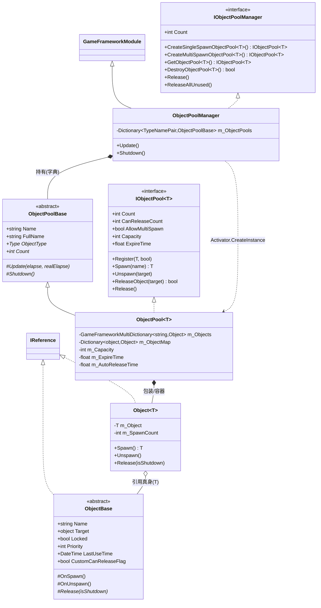
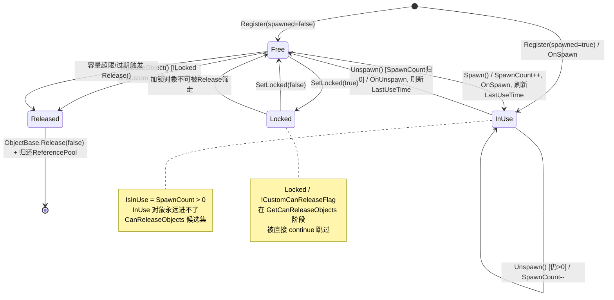
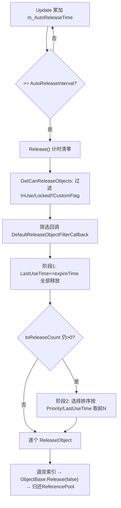

# ObjectPool 对象池模块 · 架构解析报告

> 适用层级：纯 C# 核心层 `GameFramework.ObjectPool`
> 工作区现状：本仓库**只包含纯 C# 核心层**，未包含 `UnityGameFramework` 包装层。第 3 节的桥接映射基于框架公开的标准实现描述，并显式标注「未在本工作区验证」。

---

## 1. 契约定义 (Interface & Contract)

### 1.1 核心类型清单

| 类型 | 文件 | 角色 | 可见性 |
|------|------|------|--------|
| `IObjectPoolManager` | `IObjectPoolManager.cs` | 管理器对外契约：创建/获取/销毁对象池 | public |
| `IObjectPool<T>` | `IObjectPool.cs` | 单个对象池的泛型契约：Spawn/Unspawn/Release | public |
| `ObjectPoolBase` | `ObjectPoolBase.cs` | 对象池抽象基类，**非泛型**，供管理器统一持有 | public abstract |
| `ObjectBase` | `ObjectBase.cs` | 业务对象基类，实现 `IReference`，承载 `Target` 真身 | public abstract |
| `ObjectInfo` | `ObjectInfo.cs` | 只读快照结构体（Debugger 用），`StructLayout(Auto)` | public struct |
| `ReleaseObjectFilterCallback<T>` | `ReleaseObjectFilterCallback.cs` | 释放筛选委托，策略注入点 | delegate |
| `ObjectPoolManager` | `ObjectPoolManager.cs` | 管理器实现，`internal sealed partial` | internal |
| `ObjectPoolManager.ObjectPool<T>` | `ObjectPoolManager.ObjectPool.cs` | 真正的池实现，私有嵌套类 | private nested |
| `ObjectPoolManager.Object<T>` | `ObjectPoolManager.Object.cs` | 内部包装器，持 SpawnCount 引用计数 | private nested |

### 1.2 关键设计约束（穿透语法层）

- **泛型与非泛型的双面契约**：`ObjectPool<T>` 同时继承 `ObjectPoolBase`（非泛型，给管理器用 `Dictionary<TypeNamePair, ObjectPoolBase>` 统一存储）并实现 `IObjectPool<T>`（泛型，给业务方做强类型 Spawn）。这是"管理层要统一、使用层要类型安全"的经典双契约拆分。
- **三层对象嵌套**：`ObjectBase`（业务对象，含真身 `Target`）→ `Object<T>`（内部包装器，加引用计数 `SpawnCount`）→ `ObjectPool<T>`（容器）。业务方永远只接触 `ObjectBase`，`Object<T>` 对外完全不可见。
- **实现类全 `internal`/`private`**：外部只能通过 `GameFrameworkEntry` 拿到 `IObjectPoolManager` 接口，无法 `new`，强制依赖注入式访问。

### 1.3 Mermaid 类图



---

## 2. 内存与生命周期流转 (Lifecycle & Memory)

### 2.1 三个动词的精确语义

| 动词 | 入口 | 计数变化 | 内存动作 | 是否回引用池 |
|------|------|----------|----------|--------------|
| **Register** | `IObjectPool.Register(obj, spawned)` | `SpawnCount = spawned?1:0` | `Object<T>.Create` 从引用池取包装器，双索引登记 | 不涉及 |
| **Spawn** | `IObjectPool.Spawn(name)` | `SpawnCount++` | 仅状态翻转，无分配 | 否 |
| **Unspawn** | `IObjectPool.Unspawn(target)` | `SpawnCount--` | 仅状态翻转，刷新 `LastUseTime` | 否 |
| **ReleaseObject** | `IObjectPool.ReleaseObject` / 自动轮询 | 移出池 | 退出双索引 → `ObjectBase.Release()` → 包装器与真身**双双归还 ReferencePool** | 是 |

关键内存洞察：**Spawn/Unspawn 是零分配的纯状态切换**，对象始终驻留在池中；只有 `ReleaseObject` 才真正把对象逐出并归还给 `ReferencePool`（GC 友好的二级缓存），这就是对象池"复用"省 GC 的本质。

### 2.2 双索引数据结构

`ObjectPool<T>` 内部维护两套索引，指向同一批 `Object<T>` 包装器：

- `m_Objects : GameFrameworkMultiDictionary<string, Object<T>>` —— 按**名称**分组，支撑 `Spawn(name)` 的按名取用（一名多对象，链表区间）。
- `m_ObjectMap : Dictionary<object, Object<T>>` —— 按**真身引用 `Target`** 索引，支撑 `Unspawn(target)`/`SetLocked`/`ReleaseObject` 的 O(1) 反查。

`Count` 取自 `m_ObjectMap.Count`（真身唯一），而非 `m_Objects`。

### 2.3 完整状态机（单个对象视角）



### 2.4 容量超限 (Capacity 超限) 处理

容量检查并非"拒绝入池"，而是"**入池后立即尝试瘦身**"。触发点有三处：

1. `Register()` 末尾：`if (Count > m_Capacity) Release();`
2. `Unspawn()` 末尾：`if (Count > m_Capacity && internalObject.SpawnCount <= 0) Release();`（只有刚变回 Free 才有意义瘦身）
3. `Capacity` setter：容量被调小时立即 `Release()`。

`Release()` 无参版本的核心一行：

```csharp
public override void Release()
{
    Release(Count - m_Capacity, m_DefaultReleaseObjectFilterCallback);
}
```

即"尝试释放 = 当前总数 − 容量"个对象。注意 **`toReleaseCount` 只是目标值，实际能释放多少受候选集约束**：正在使用(`IsInUse`)、加锁(`Locked`)、自定义不可释放(`!CustomCanReleaseFlag`)的对象都进不了候选集。所以**池可以稳定地超过 Capacity**——当超出部分全在使用中时，Capacity 是软上限而非硬上限。

### 2.5 过期清理 (Expire) 与自动释放

两条时间线协同：

- **自动轮询节拍**：`ObjectPoolManager.Update` 逐个调用每个池的 `Update(elapse, realElapse)`；池内累加 `m_AutoReleaseTime += realElapseSeconds`，达到 `m_AutoReleaseInterval` 即触发一次 `Release()`，并把计时清零。
- **过期判定**：`Release` 内计算 `expireTime = DateTime.UtcNow.AddSeconds(-m_ExpireTime)`，交给筛选回调。`DefaultReleaseObjectFilterCallback` 分两阶段：
  1. **过期优先**：凡 `LastUseTime <= expireTime` 的候选**无条件加入释放集**（不受 toReleaseCount 限制），并从候选集移除、相应扣减 toReleaseCount。
  2. **配额补足**：若仍需释放（toReleaseCount > 0），对剩余候选做**选择排序**——按 `Priority` 升序、同优先级按 `LastUseTime` 升序（最旧、最低优先级先走），取前 N 个。



### 2.6 跨层数据流向（核心层内部）

```
业务对象真身(object Target)
  └─ 封装入 ObjectBase 派生类(可复用，自身来自 ReferencePool)
       └─ Register 时被 Object<T> 包装(包装器也来自 ReferencePool)
            └─ 登记进 ObjectPool<T> 双索引
                 └─ 由 ObjectPoolManager(GameFrameworkModule) 统一轮询调度
                      └─ GameFrameworkEntry 注册所有 Module，按 Priority(=6) 排序轮询
```

`Shutdown` 时逆向：管理器遍历所有池 `Shutdown()` → 池遍历 `m_ObjectMap`，对每个 `Object<T>.Release(true)`（`isShutdown=true` 透传给业务 `Release`，便于区分"正常释放"与"框架退出"）→ 包装器与真身均归还 ReferencePool。

---

## 3. Unity 层的桥接映射 (Unity Layer Bridging)

> ⚠️ 本工作区不含 `UnityGameFramework`，以下为框架标准实现的描述性还原，**未在本仓库验证**。

标准 Game Framework 在 Unity 层提供 `ObjectPoolComponent : GameFrameworkComponent`，桥接套路：

1. **持有而非继承**：`ObjectPoolComponent` 在 `Awake`/`OnInit` 阶段通过 `GameFrameworkEntry.GetModule<IObjectPoolManager>()` 拿到核心层管理器实例，存为私有字段 `m_ObjectPoolManager`。Component 只做**转发**（Facade over MonoBehaviour），不重复实现池逻辑。
2. **Inspector 暴露**：纯 C# 层的 `Capacity`/`ExpireTime`/`Priority`/`AutoReleaseInterval` 这些运行期字段，无法直接被 Unity 序列化。包装层做法是——Component 提供 `CreateXxxObjectPool(...)` 的转发方法；而调试可视化通过 `ObjectPoolComponent` 上的 Debugger 窗口读取 `GetAllObjectInfos()` 返回的 `ObjectInfo[]` 快照，渲染到检视/调试面板。
3. **`ObjectInfo` 的存在意义**：核心层不引用 UnityEngine，无法直接画 GUI。于是用只读结构体 `ObjectInfo`（含 Name/Locked/Priority/LastUseTime/SpawnCount/IsInUse）作为**跨层 DTO**，Unity 层只读取这个快照来渲染 Inspector/Debugger，避免暴露内部 `Object<T>`。这是"核心层产出数据、包装层负责呈现"的标准切分。
4. **生命周期对接**：Unity 的 `Update()` 帧驱动并不直接打到 ObjectPoolManager，而是由 `BaseComponent` 统一调用 `GameFrameworkEntry.Update(elapseSeconds, realElapseSeconds)`，再分发给各 Module 的 `Update`。Component 只是把 MonoBehaviour 生命周期转译成框架节拍。

---

## 4. 落地吸收建议 (Actionable Learning)

若要脱离框架仿写精简版，三个核心技术难点：

### 难点 ①：引用计数与"软容量"的解耦
新手最容易把 Capacity 当硬上限做成"满了就拒绝/阻塞"。本框架的精髓是 **SpawnCount 引用计数 + 释放候选集过滤**：容量只决定"是否触发瘦身尝试"，真正能否瘦下来取决于有多少对象处于 Free 且未锁定。要复刻就必须先建立 `IsInUse = SpawnCount > 0` 这条不变量，并在 Spawn/Unspawn/Release 三处一致维护。`AllowMultiSpawn` 还允许同一对象被多次 Spawn（计数 > 1），回收要对称扣减。

### 难点 ②：双索引一致性
`m_Objects`(按 name) 与 `m_ObjectMap`(按 target 引用) 必须**原子地同增同减**。任何一处 Register/ReleaseObject 漏改都会导致内存泄漏或重复释放。尤其 `ReleaseObject` 里 `m_ObjectMap.Remove(internalObject.Peek().Target)` 用的是真身引用做 key——仿写时要想清楚用"真身"还是"包装器"做字典键，混用即 bug。

### 难点 ③：可插拔的释放策略 + 二级对象池
释放筛选被抽象成 `ReleaseObjectFilterCallback` 委托（过期优先 + 优先级/LRU 排序），这是策略模式的注入点；同时 `Object<T>` 包装器自己也是 `IReference`，走 `ReferencePool.Acquire/Release` 复用——**池中有池**。仿写时要意识到：对象池省的是业务对象的 GC，而包装器对象的 GC 由更底层的 ReferencePool 兜底，否则高频 Register/Release 会让包装器本身成为新的 GC 热点。

---

## 附：本模块在框架中的坐标

- 模块优先级 `Priority = 6`（数值越大越先轮询、越后关闭）。
- 依赖：`ReferencePool`（包装器与对象复用）、`GameFrameworkMultiDictionary`（一键多值链表）、`TypeNamePair`（类型+名称复合键）、`GameFrameworkModule`（生命周期基类）。
- 被依赖：上层资源/实体/界面等模块普遍用对象池承载可复用实例。
