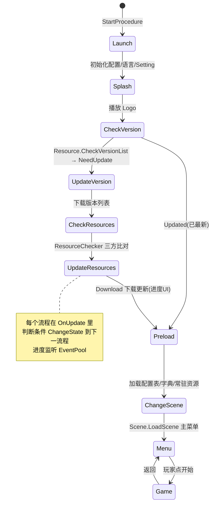
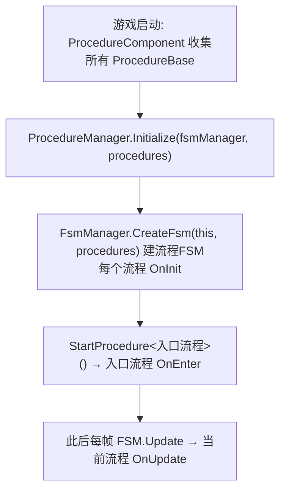

# Procedure 流程模块 · 架构解析报告

> 层级：纯 C# 核心层 `GameFramework.Procedure`
> 定位：**游戏整体流程的状态机**（启动→检查更新→下载→预加载→主菜单→游戏中...）。它是 Fsm 模块最直接、最薄的应用——`ProcedureBase` 就是 `FsmState<IProcedureManager>`，整个游戏流程 = 一台以流程管理器为 Owner 的 FSM。理解它 = Fsm 的实战落地。

---

## 1. 契约定义 (Interface & Contract)

| 类型 | 文件 | 角色 | 可见性 |
|------|------|------|--------|
| `IProcedureManager` | `IProcedureManager.cs` | 管理器：Initialize/StartProcedure/Get | public |
| `ProcedureBase` | `ProcedureBase.cs` | 流程基类 = `FsmState<IProcedureManager>` | public abstract |
| `ProcedureManager` | `ProcedureManager.cs` | 实现，`GameFrameworkModule`，内嵌一台 FSM | internal sealed |

### 设计要点（穿透语法）

- **Procedure = Fsm 的类型别名化封装**：`ProcedureBase : FsmState<IProcedureManager>`，文件顶部 `using ProcedureOwner = IFsm<IProcedureManager>`。**流程模块本身几乎没有新逻辑**，只是把 Fsm 的概念用"流程"术语重新包装：State→Procedure、ChangeState→流程切换、FSM→流程容器。
- **整个游戏只有一台流程 FSM**：`ProcedureManager` 内 `m_ProcedureFsm` 是单台 FSM（不像 FsmManager 管多台）。`Initialize(fsmManager, procedures)` 用传入的 FsmManager 创建这台 FSM，把所有流程作为状态注册进去。
- **Priority = -2（最低）**：流程管理器优先级最低 → **最先关闭、最后轮询**。因为它依赖所有其他模块，必须等它们都就绪后才跑、在它们关闭前先停。
- **流程切换 = FsmState.ChangeState**：业务流程在 `OnUpdate` 里满足条件时调 `ChangeState<NextProcedure>(procedureOwner)`，复用 Fsm 的封闭式切换（见 Fsm 文档难点①）。

### Mermaid 类图

```mermaid
classDiagram
    class IProcedureManager {
        <<interface>>
        +ProcedureBase CurrentProcedure
        +float CurrentProcedureTime
        +Initialize(fsmManager, procedures)
        +StartProcedure~T~()
        +HasProcedure~T~() bool
        +GetProcedure~T~() ProcedureBase
    }
    class FsmState~IProcedureManager~ {
        <<abstract>>
        +OnInit/OnEnter/OnUpdate/OnLeave/OnDestroy
        #ChangeState~T~(fsm)
    }
    class ProcedureBase {
        <<abstract>>
        (= FsmState<IProcedureManager>)
    }
    class ProcedureManager {
        -IFsmManager m_FsmManager
        -IFsm~IProcedureManager~ m_ProcedureFsm
        +Priority = -2
    }

    FsmState~IProcedureManager~ <|-- ProcedureBase
    GameFrameworkModule <|-- ProcedureManager
    IProcedureManager <|.. ProcedureManager
    ProcedureManager o-- "IFsm" ProcedureBase : 单台流程FSM
    ProcedureManager ..> IFsmManager : 借其创建FSM
```

---

## 2. 内存与生命周期流转 (Lifecycle & Memory)

### 2.1 流程即状态机（直接映射 Fsm）

| Procedure 概念 | Fsm 对应 | 说明 |
|----------------|----------|------|
| `ProcedureBase` | `FsmState<T>` | 一个流程 = 一个状态 |
| `IProcedureManager` | FSM 的 Owner(T) | 持有者 |
| `m_ProcedureFsm` | `IFsm<T>` | 容器 |
| `StartProcedure<T>` | `IFsm.Start<T>` | 启动入口流程 |
| `CurrentProcedure` | `CurrentState` | 当前流程 |
| 流程切换 | `ChangeState` | 流程间迁移 |

所有生命周期（OnInit/Enter/Update/Leave/Destroy）、切换封闭性、黑板数据共享，全部**直接复用 Fsm 的实现**（见 Fsm 解析文档）。Procedure 不重写任何机制。

### 2.2 典型游戏流程链（热更新启动）



这正是 Resource 文档里"热更新流程是一台 FSM"的具体落地——**每个热更新阶段是一个 ProcedureBase**。

### 2.3 初始化与启动顺序



### 2.4 内存关注点

- Procedure 自身无内存管理——全在 Fsm（FSM 走 ReferencePool、黑板 Variable 释放等，见 Fsm 文档）。
- `Shutdown` 时 `DestroyFsm` 销毁流程 FSM → 触发所有流程 OnDestroy + FSM 归还 ReferencePool。
- 流程对象（ProcedureBase 实例）通常是单例长生命周期（整局就这些流程），不频繁创建。

---

## 3. Unity 层的桥接映射 (Unity Layer Bridging)

> ⚠️ 本工作区不含 `UnityGameFramework`，以下为标准实现描述，**未在本仓库验证**。

- `ProcedureComponent : GameFrameworkComponent` 是**游戏的总入口流程驱动器**。Inspector 里配置"可用流程列表"（反射收集所有 ProcedureBase 子类）和"入口流程"。
- `Start` 时 `ProcedureManager.Initialize(...)` + `StartProcedure(入口流程)`，游戏正式开跑。
- 各业务流程（`ProcedureLaunch`/`ProcedureCheckVersion`/`ProcedureMenu` 等）继承 `ProcedureBase`，在 OnUpdate 里驱动流程推进、调 UI/Resource/Scene 等模块。
- 流程是连接所有模块的"总指挥"——它在合适的时机调用 Resource 更新、Scene 切换、UI 打开。

---

## 4. 落地吸收建议 (Actionable Learning)

### 难点 ①：把"流程"建模成状态机的思维
最大的认知点是：**游戏的宏观流程本质就是一台状态机**。启动、更新、菜单、战斗是状态，状态间有明确迁移条件。仿写时若用一堆 bool flag + if 管理流程（`isUpdating`/`isInMenu`...），会迅速失控；用 FSM 建模则每个流程职责单一、迁移清晰。识别"这是个状态机问题"是关键——很多看似复杂的流程控制都该用 FSM。

### 难点 ②：Priority=-2 的依赖时序
流程管理器优先级最低，保证它最后轮询（其他模块先更新好）、最先关闭（它依赖的模块还在）。仿写时要理解模块间的"启动/关闭时序依赖"——总指挥必须在所有下属就绪后才发令、在下属撤离前先收工。把流程管理器设成高优先级会导致它在依赖模块未就绪时就跑。

### 难点 ③：薄封装的价值——术语映射而非重新发明
Procedure 几乎不写代码，只是把 Fsm 用"流程"术语重新包装。这是好的封装：给通用机制（FSM）一个领域专用的接口（Procedure），让业务用"流程"而非"状态"思考，降低心智负担，同时复用全部 FSM 能力。仿写时不要为了"显得有工作量"在薄封装里塞重复逻辑——清晰的术语映射本身就是价值。

---

## 附：坐标
- `ProcedureManager` 是 Module，Priority=-2（最低，总指挥）。
- 依赖：**Fsm**（完全基于它）、`GameFrameworkException`。
- 被依赖：游戏主循环——它是连接 Resource/Scene/UI/Sound 等所有模块的总编排者。
