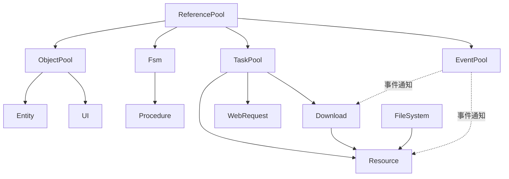

# GameFramework 架构反向工程 · 解析文档总索引

> 工作区现状：本仓库**仅含纯 C# 核心层 `GameFramework`**，无 `UnityGameFramework` 包装层。各模块第 3 节"Unity 桥接"为框架标准实现的描述性还原，已显式标注「未在本仓库验证」。

## 文档约定

每个模块产出三件套：
- `01_xxx_解析.md`：契约类图(Mermaid) + 生命周期状态机 + 内存/数据流 + Unity 桥接 + 3 大落地难点
- `02_xxx_Facade仿写.md`：独立可编译的精简版 + 设计映射表 + 取舍自检
- `03_xxx_考题.md`：分档考题(概念/机制/陷阱/实操) + 折叠参考答案

解析风格：跳过基础语法，直穿生命周期、内存管理（对象复用机制）、跨层数据流向。

## 模块进度

| # | 模块 | 层级/坐标 | 状态 | 一句话定位 |
|---|------|-----------|:----:|-----------|
| 0 | [ObjectPool](./ObjectPool) | Module, Priority=6 | ✅ | 有策略的受控对象复用（容量/过期/锁） |
| 1 | [ReferencePool](./ReferencePool) | 静态, 进程级 | ✅ | 无策略的纯队列复用，GC 第一闸门 |
| 2 | [EventPool](./EventPool) | 被 EventManager 持有 | ✅ | 事件驱动内核：延迟/立即分发 + 迭代安全 |
| 3 | [Fsm](./Fsm) | Module, Priority=1 | ✅ | 状态机引擎，Procedure 的底座 |
| 4 | [TaskPool](./TaskPool) | 被 Download/Resource 持有 | ✅ | 异步任务调度：代理复用 + 优先级队列 + 续传 |
| 5 | [DataNode](./DataNode) | Module | ✅ | 树形数据节点（黑板/全局数据树） |
| 6 | [DataTable](./DataTable) | Module | ✅ | 配置表数据行管理（+ DataProvider 管线） |
| 7 | [Config](./Config) | Module | ✅ | 全局配置项（一项四值，复用 DataProvider） |
| 8 | [Setting](./Setting) | Module | ✅ | 持久化设置（纯 Facade + 注入 Helper 范本） |
| 9 | [Localization](./Localization) | Module | ✅ | 本地化字典（永不抛 GetString + 16 泛型重载） |
| 10 | [Download](./Download) | Module | ✅ | 下载（TaskPool + .download 断点续传 + 测速） |
| 11 | [WebRequest](./WebRequest) | Module | ✅ | Web 请求（TaskPool 应用，Download 对照样本） |
| 12 | [FileSystem](./FileSystem) | Module | ✅ | 虚拟文件系统（单文件归档 + 簇/块分配器） |
| 13 | [Resource](./Resource) | Module | ✅ | 资源/热更新（底座总集成者，框架最复杂） |
| 14 | [Network](./Network) | Module | ✅ | 长连接 socket（两阶段拆包 + 心跳保活） |
| 15 | [Entity](./Entity) | Module | ✅ | 实体（ObjectPool 实例复用 + 七钩子） |
| 16 | [Scene](./Scene) | Module | ✅ | 场景（Resource 薄封装 + 三态名单防并发） |
| 17 | [Sound](./Sound) | Module | ✅ | 声音（组+声道代理，优先级抢占+淡变） |
| 18 | [UI](./UI) | Module | ✅ | 界面（Entity 同构 + 深度/暂停/遮挡栈） |
| 19 | [Procedure](./Procedure) | Module | ✅ | 流程（Fsm 薄封装，游戏流程即状态机） |
| 20 | [Debugger](./Debugger) | Module | ✅ | 调试器（组合模式窗口树 + 快照消费终点） |
| - | DataProvider / Variable / TypeNamePair / MultiDictionary | Base 基础设施 | 📎 | 已在 DataTable/Fsm/各模块解析中穿插说明 |

## 依赖关系速览

> 推进顺序：底座(0-4 已完成) → 数据类(5-9) → 网络/IO(10-14) → 业务承载(15-19) → 工具(20)。

---

## ✅ 解析完成总结（21 个模块全部落地）

全部模块已产出三件套（解析 + Facade 仿写 + 考题）。按"它在框架里扮演的角色"重新归类：

### 底座层（被反复复用的机制）
- **ReferencePool**：纯队列复用，GC 第一闸门。
- **ObjectPool**：有策略的受控复用（容量/过期/锁/优先级筛选）。
- **EventPool**：事件驱动内核（延迟/立即分发 + 迭代安全）。
- **Fsm**：状态机引擎。
- **TaskPool**：异步任务调度（代理复用 + 优先级队列 + 续传）。

### 数据/配置层（共用 DataProvider 管线）
- **DataNode**（路径树黑板）、**DataTable**（id 配置表）、**Config**（KV 配置）、**Setting**（持久化设置）、**Localization**（多语言）。

### 网络/IO 层
- **Download**（TaskPool + .download 续传）、**WebRequest**（TaskPool 短请求）、**FileSystem**（单文件归档分配器）、**Network**（两阶段拆包 + 心跳）。

### 资源中枢
- **Resource**：底座总集成者（ObjectPool + TaskPool + Download + FileSystem + EventPool）。

### 业务承载层（建立在底座/资源之上）
- **Entity**（ObjectPool 实例复用）、**UI**（Entity 同构 + 栈层级）、**Sound**（组+声道抢占）、**Scene**（Resource 薄封装状态追踪）、**Procedure**（Fsm 薄封装，游戏流程）、**Debugger**（组合模式，快照消费终点）。

### 贯穿全框架的设计主线（跨模块复现的"母题"）

1. **复用而非释放**：ReferencePool/ObjectPool/TaskPool 代理/Entity 实例/Sound 声道/FileSystem 块——都是"用完归还待复用"而非销毁。
2. **Helper 注入 + 薄管理器**：核心层定义契约 + 校验，平台相关实现外置给 Helper（Setting 是极致范本，DataProvider/Network/Sound 皆然）。
3. **迭代中安全增删**：EventPool 的重入游标、Fsm/Entity/UI 的 m_CachedNode 快照——回调中改集合不崩。
4. **快照 DTO 可观测**：ObjectInfo/ReferencePoolInfo/TaskInfo/FileInfo——核心层产出只读快照，Debugger 统一呈现（数据与呈现分离）。
5. **组合底座派生业务**：Download/WebRequest 派生自 TaskPool、Entity/UI 派生自 ObjectPool、Procedure 派生自 Fsm、Scene/Sound 派生自 Resource——识别"调度复用、业务自写"的边界。
6. **TypeNamePair 复合键 + 双契约**：管理器用"类型+名称"复合键存实现，实现类同时继承非泛型基类（统一存储）+ 泛型接口（类型安全）。

> 如需对任一模块补充 Unity 包装层实证，提供 `UnityGameFramework` 目录路径即可（当前工作区不含该层，相关章节均已标注「未在本仓库验证」）。
