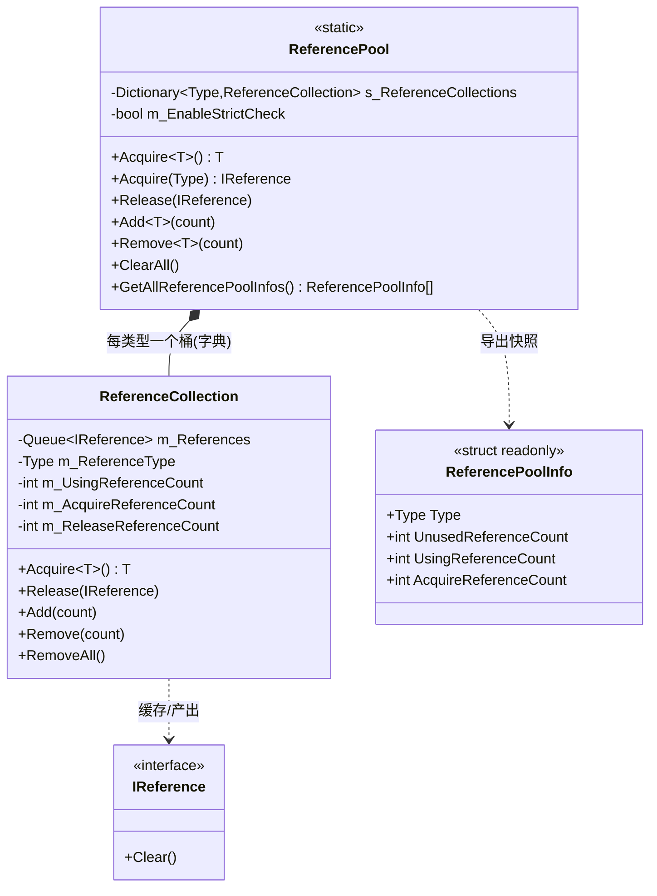
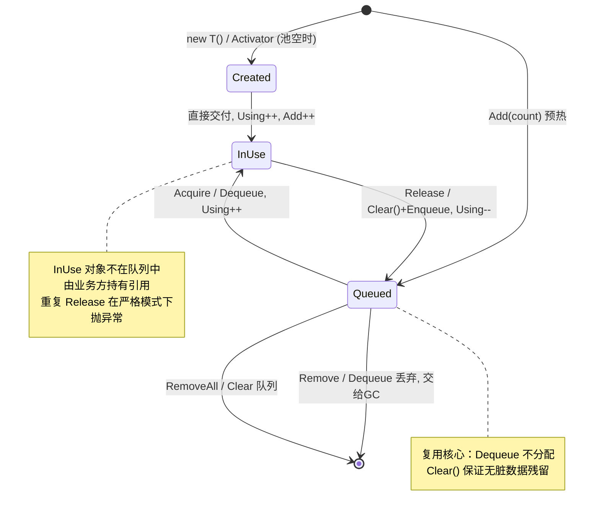

# ReferencePool 引用池模块 · 架构解析报告

> 层级：纯 C# 核心层 `GameFramework`（命名空间根，非子命名空间）
> 定位：整个框架的**内存复用底座**。ObjectPool 的包装器、EventArgs、FSM 数据、Task 等几乎所有"短命高频"对象都靠它复用，是 GC 优化的第一道闸门。

---

## 1. 契约定义 (Interface & Contract)

### 1.1 类型清单

| 类型 | 文件 | 角色 | 可见性 |
|------|------|------|--------|
| `IReference` | `IReference.cs` | 可复用对象的唯一契约：只有一个 `Clear()` | public interface |
| `ReferencePool` | `ReferencePool.cs` | **静态门面**，全局唯一入口（Acquire/Release/Add/Remove） | public static partial |
| `ReferencePool.ReferenceCollection` | `ReferencePool.ReferenceCollection.cs` | 单一类型的引用集合，真正的缓存队列 | private nested sealed |
| `ReferencePoolInfo` | `ReferencePoolInfo.cs` | 只读统计快照（Debugger 用 DTO） | public struct |

### 1.2 设计要点（穿透语法）

- **静态门面 + 按类型分桶**：`ReferencePool` 本身是 `static`，内部用 `Dictionary<Type, ReferenceCollection>` 给**每个类型一个独立的缓存桶**。这意味着引用池没有生命周期、不是 `GameFrameworkModule`，进程级常驻。
- **`IReference` 极简到只有 `Clear()`**：契约不关心如何 new、如何回收，只要求"归还前能自清理"。复用的前提是对象能把自己的字段重置干净，否则会带着脏数据被下一个使用者拿到。
- **双 Acquire 路径**：泛型 `Acquire<T>()`（`new T()`，无反射，快）与非泛型 `Acquire(Type)`（`Activator.CreateInstance`，有反射，灵活）。前者给编译期已知类型，后者给运行时才确定类型（如 ObjectPool 的非泛型创建路径）。

### 1.3 Mermaid 类图



---

## 2. 内存与生命周期流转 (Lifecycle & Memory)

### 2.1 一个引用的完整流转

```
Acquire<T>()
  ├─ 桶里有空闲 → Dequeue 复用(不 new)      UsingCount++, AcquireCount++
  └─ 桶里没有   → new T()/Activator         UsingCount++, AcquireCount++, AddCount++
        ↓ 业务使用中（脱离队列，由调用方持有）
Release(obj)
  ├─ obj.Clear()  ← 关键：归还前先自清理
  ├─ (严格模式)检查是否重复归还
  └─ Enqueue 回桶                            ReleaseCount++, UsingCount--
```

核心不变量：**对象只有两种位置**——要么在 `m_References` 队列里（空闲），要么被业务持有（使用中）。`UsingReferenceCount = AcquireCount - ReleaseCount`，且 `UnusedReferenceCount = m_References.Count`。

### 2.2 状态机



### 2.3 内存复用的本质 vs ObjectPool 的区别

| 维度 | ReferencePool | ObjectPool |
|------|---------------|------------|
| 复用对象 | 任意 `IReference`（轻量数据/EventArgs/包装器） | `ObjectBase`（含外部真身 Target，如 GameObject） |
| 索引 | 按 `Type` 单桶队列 (FIFO) | 双索引（按 name + 按 target） |
| 计数 | Using/Acquire/Release 统计 | SpawnCount 引用计数 |
| 容量/过期 | **无**容量上限、无自动过期 | 有 Capacity/ExpireTime/自动释放 |
| 回收时机 | 业务显式 Release | Unspawn + 容量/过期驱动 |
| 生命周期 | 进程级静态常驻 | GameFrameworkModule，随框架轮询/关闭 |

一句话：**ReferencePool 是"无策略的纯队列复用"，ObjectPool 是"有策略的受控复用"**。ObjectPool 的 `Object<T>` 包装器恰恰存进 ReferencePool——两级缓存叠加。

### 2.4 线程安全策略

- `s_ReferenceCollections`（字典）与每个 `m_References`（队列）分别加 `lock`。
- 注意计数字段 `m_UsingReferenceCount++` 等**在锁外自增**，所以统计数字在高并发下并非严格精确（Debugger 展示用，可接受）。真正保护数据完整性的是队列的 Enqueue/Dequeue 在锁内。

### 2.5 严格检查 (EnableStrictCheck)

- 关闭时（默认）：零开销，最大性能。
- 开启时：
  1. `Acquire(Type)`/`Release` 会校验类型是非抽象类且实现 `IReference`。
  2. `Release` 时检查队列是否已包含该引用 → **捕获"重复归还"这一最致命的对象池 bug**（重复归还会导致两个使用者拿到同一实例）。
- 建议：开发期开、发布期关。

---

## 3. Unity 层的桥接映射 (Unity Layer Bridging)

> ⚠️ 本工作区不含 `UnityGameFramework`，以下为框架标准实现描述，**未在本仓库验证**。

- ReferencePool 是**纯静态、跨层共享**的，Unity 层不需要为它建 Component 转发——任意层直接 `ReferencePool.Acquire/Release` 即可。
- Unity 层通常提供一个 **ReferencePool 调试窗口**（Debugger），调用 `GetAllReferencePoolInfos()` 拿到 `ReferencePoolInfo[]`，在 Inspector/调试面板按类型列出 Unused/Using/Acquire/Release/Add/Remove 六个计数，用来定位"哪种对象在疯狂 new"或"Acquire 与 Release 不配平导致泄漏"。
- `EnableStrictCheck` 一般由 Unity 层的 BaseComponent 在初始化时根据"是否开发模式"统一设置。

---

## 4. 落地吸收建议 (Actionable Learning)

### 难点 ①：Clear() 的彻底性决定复用的正确性
复用最隐蔽的 bug 是 `Clear()` 漏清字段——对象带着上次的残留状态被下一个使用者拿到。仿写时必须把"归还即清理"做成强约束（在 Release 内调用，而非依赖业务自觉），并对集合/字典类字段做 `.Clear()` 而非置 null（避免反复分配）。

### 难点 ②：Acquire/Release 必须严格配平
ReferencePool 不做引用计数、不做容量限制，全靠业务"取一次还一次"。漏 Release → 队列永远空、退化成纯 new（内存泄漏式增长，因 Using 只增不减）；重复 Release → 同一实例被多个使用者共享（数据错乱）。仿写时务必内置"重复归还检测"（即严格模式），这是最高性价比的防护。

### 难点 ③：按类型分桶 + 双构造路径
要支持"编译期已知类型"和"运行时才知道类型"两条路径。前者 `new T()`（约束 `where T : new()`，零反射）；后者 `Activator.CreateInstance(Type)`（反射，慢但通用）。仿写若只做泛型版会无法服务 ObjectPool 那种"`MakeGenericType` 后才构造"的场景；只做反射版又损失热路径性能。两条都留，是工程权衡。

---

## 附：坐标

- 不是 Module，无 Priority，进程级静态。
- 被依赖：ObjectPool（包装器）、EventPool（EventArgs）、Fsm、TaskPool、几乎所有产生临时对象的模块。
- 依赖：仅 `GameFrameworkException` / `Utility.Text`。
