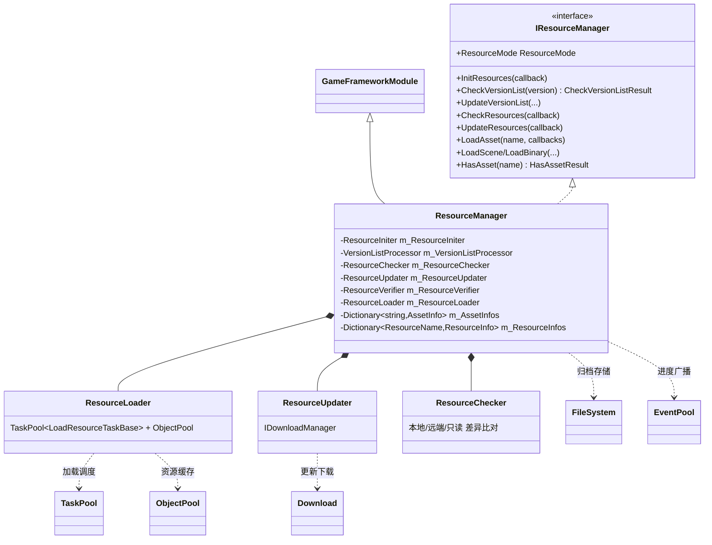
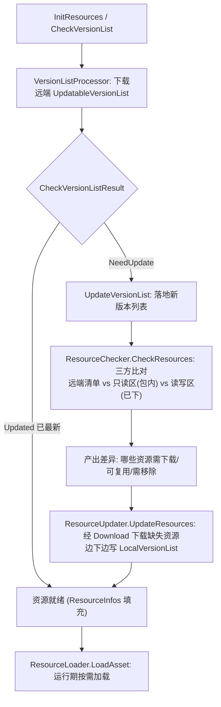
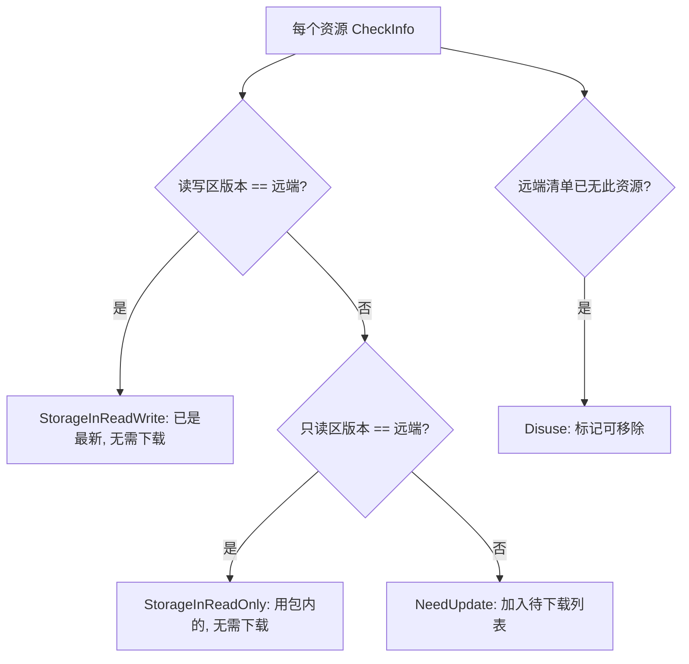
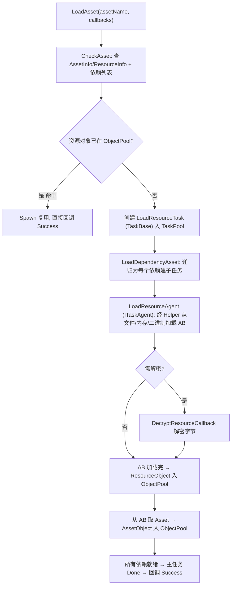

# Resource 资源/热更新模块 · 架构解析报告

> 层级：纯 C# 核心层 `GameFramework.Resource`（~90 文件，全框架最复杂模块）
> 定位：**资源加载 + 热更新的总集成者**。它不是底座，而是把前面所有底座编排起来的"总装车间"——用 ObjectPool 缓存已加载资源、用 TaskPool 调度加载、用 Download 下载更新包、用 FileSystem 存归档、用 EventPool 广播进度。理解它 = 验证前 13 个模块是否真懂。

---

## 1. 契约定义 (Interface & Contract)

### 1.1 三大资源模式 (ResourceMode)

| 模式 | 含义 | 典型场景 |
|------|------|----------|
| `Package` | 单机模式：资源随包发布，不更新 | 单机游戏、demo |
| `Updatable` | 预下载可更新：进游戏前下完所有更新 | 强更新型手游 |
| `UpdatableWhilePlaying` | 边玩边下：用到才下 | 大型开放世界、分包 |

### 1.2 四阶段子系统（ResourceManager 的 partial 切分）

| 子系统 | 文件 | 职责 | 复用的底座 |
|--------|------|------|-----------|
| `ResourceIniter` | `.ResourceIniter.cs` | 单机模式初始化（读包内版本列表） | — |
| `VersionListProcessor` | `.VersionListProcessor.cs` | 下载/检查远端版本列表 | Download |
| `ResourceChecker` | `.ResourceChecker.cs` | **差异比对**（本地 vs 远端 vs 只读区） | — |
| `ResourceUpdater` | `.ResourceUpdater.cs` | **下载更新资源** + 应用资源包 | **Download** |
| `ResourceVerifier` | `.ResourceVerifier.cs` | 校验本地资源完整性（CRC） | — |
| `ResourceLoader` | `.ResourceLoader.cs` | **加载资源/场景/二进制** | **TaskPool + ObjectPool** |
| `ResourceGroup` | `.ResourceGroup.cs` | 资源分组（按组更新/查询） | — |

### 1.3 版本列表家族（数据契约）

| 版本列表 | 用途 | 序列化器 |
|----------|------|----------|
| `PackageVersionList` | 单机包的资源清单 | PackageVersionListSerializer |
| `UpdatableVersionList` | 可更新模式的远端清单（含 CRC/大小/压缩信息） | UpdatableVersionListSerializer |
| `LocalVersionList` | 本地读写区已有资源清单 | ReadWriteVersionListSerializer |
| `ResourcePackVersionList` | 资源包（离线更新包）清单 | ResourcePackVersionListSerializer |

### 1.4 关键数据结构

- `ResourceName`（struct）：`name.variant.extension` 三元组，带**全名缓存**（`s_ResourceFullNames` 静态字典缓存拼接结果，避免重复 Format）。
- `HasAssetResult`：资源定位结果（NotExist/NotReady/AssetOnDisk/AssetOnFileSystem/BinaryOnDisk/BinaryOnFileSystem）——这正是 DataProvider 读取时分支判断的来源。
- `LoadType`（7 值）：LoadFromFile / LoadFromMemory(+QuickDecrypt/Decrypt) / LoadFromBinary(+...)——决定资源如何从存储载入及是否解密。

### Mermaid 类图（顶层编排）



---

## 2. 内存与生命周期流转 (Lifecycle & Memory)

### 2.1 热更新总流程（Updatable 模式）



### 2.2 ResourceChecker 的三方比对（热更新核心）

`RefreshCheckInfoStatus` 对每个资源比对三处信息：
- **RemoteVersionInfo**：远端清单声明的（期望的）版本/CRC/大小。
- **ReadOnlyInfo**：只读区（随包 StreamingAssets）已有的。
- **ReadWriteInfo**：读写区（持久化目录，已下载的）已有的。



**精髓**：优先用读写区（最新下载）→ 退而用只读区（随包）→ 都不匹配才下载。这让"包内已有的资源不重复下载"，最小化更新流量。

### 2.3 ResourceLoader：集成 TaskPool + ObjectPool（加载核心）



两层对象池：
- `ResourceObject`（ObjectPool）：缓存已加载的 **AssetBundle**（一个 AB 含多个 asset）。
- `AssetObject`（ObjectPool）：缓存从 AB 取出的 **具体 asset**，并记录依赖关系。

**引用计数卸载**：`UnloadAsset` 不立即销毁，而是 Unspawn 回 ObjectPool。由 ObjectPool 的容量/过期策略（见 ObjectPool 文档）决定何时真正 Release（卸载 AB、释放内存）。这就是为什么 ObjectPool 是 Resource 的底座——**资源复用 = 对象池复用**。

### 2.4 ResourceUpdater：集成 Download（更新核心）

- `UpdateResources(group)` 对待下载资源逐个 `AddResourceUpdate` → 经 `DownloadManager` 下载。
- `OnDownloadSuccess` 里：校验 CRC/大小 → 写入读写区（可能存进 FileSystem 归档）→ 更新 `LocalVersionList`（`GenerateReadWriteVersionList`）→ 广播 `ResourceUpdateSuccess` 事件。
- **断点与增量**：依赖 Download 的 `.download` 续传；版本列表记录已下进度，中途退出可续。
- `ApplyResources`：应用离线资源包（ResourcePackVersionList），从一个大包里提取资源到读写区——免流量更新。

### 2.5 三方存储区与数据流

```
只读区 (StreamingAssets, 随包)  ─┐
                                  ├→ ResourceChecker 比对 → ResourceLoader 加载
读写区 (持久化目录, 已下载)    ─┤        ↑
                                  │   ResourceUpdater 下载写入
远端服务器 (CDN, 最新版本)     ─┘
```

`GetBinaryPath`/`HasAsset` 判定资源在只读区还是读写区、是裸文件还是 FileSystem 归档——返回 `HasAssetResult` 的六个值，DataProvider 据此选加载路径。

---

## 3. Unity 层的桥接映射 (Unity Layer Bridging)

> ⚠️ 本工作区不含 `UnityGameFramework`，以下为标准实现描述，**未在本仓库验证**。

- `ResourceComponent : GameFrameworkComponent` 是最重的 Component，Inspector 暴露 ResourceMode、只读/读写路径、加载器数量、对象池容量/过期、是否 FileSystem 等海量配置。
- `IResourceHelper`（资源 Helper）与 `ILoadResourceAgentHelper`（加载代理 Helper）的 Unity 实现用 `AssetBundle.LoadFromFileAsync`/`LoadFromMemoryAsync` 实际加载 AB，并把 `UnityEngine.Object` 资源回吐。**AB API 的平台差异全封在 helper**，核心层只见 `object dataAsset`。
- 热更新流程通常是一台 FSM（Procedure 模块）：CheckVersion 流程 → UpdateVersion 流程 → CheckResources 流程 → UpdateResources 流程（监听 Download 进度事件刷新 UI）→ Preload 流程 → 进入游戏。
- DataTable/Config/Localization 的 `ReadData` 最终都落到 `ResourceManager.LoadAsset/LoadBinary`，这就是 DataProvider 那六个 `HasAssetResult` 分支的来源。

---

## 4. 落地吸收建议 (Actionable Learning)

### 难点 ①：四阶段编排与底座集成
Resource 的真正难点不在某个算法，而在**编排**：Init/Check/Update/Load 四阶段，每阶段复用不同底座（Check 无底座纯比对、Update 用 Download、Load 用 TaskPool+ObjectPool）。仿写时要先画清楚"哪个阶段干什么、用哪个底座"，再分子系统实现。把它揉成一个大类是灾难——本框架用 partial + 内部子系统类（Checker/Updater/Loader）切分，每个子系统单一职责。这是大模块的拆分范式。

### 难点 ②：三方存储比对与最小更新
只读区/读写区/远端三方比对，按"读写 > 只读 > 下载"优先级选源，是热更新省流量的核心。仿写时最易错的是漏掉"只读区（包内）已有就别下载"——直接拿远端清单对比本地下载区，会把随包资源也当成缺失重下，浪费用户流量。**三方比对缺一不可**。

### 难点 ③：资源加载 = 对象池复用 + 引用计数 + 依赖图
LoadAsset 不是"读文件"那么简单：要查对象池命中（复用）、要递归加载依赖（依赖图）、要引用计数管理卸载（UnloadAsset 是 Unspawn 而非 Destroy）。这把 ObjectPool（复用/容量/过期）、依赖递归（类似 DataNode 树遍历）、TaskPool（异步调度）全用上了。仿写时要意识到"加载一个 asset"牵动整条依赖链与缓存策略，绝非单次 IO。

---

## 附：坐标
- `ResourceManager` 是 Module，框架最重；内部 7 个子系统协作。
- 依赖：**几乎所有底座**——ObjectPool（资源缓存）、TaskPool（加载调度）、Download（更新下载）、FileSystem（归档）、EventPool（进度广播）、ReferencePool（EventArgs/Task）。
- 被依赖：DataTable/Config/Localization（ReadData）、Scene/UI/Entity/Sound（加载预制体与资源）——几乎所有业务模块的资源入口。
- **这是验证前 13 个模块理解的总考点**：看懂 Resource = 看懂整个框架如何用底座搭业务。
