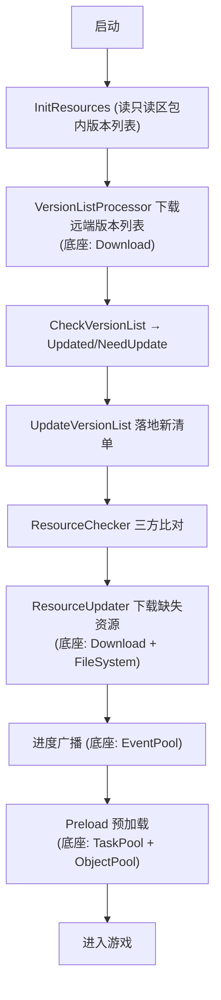

# Resource 资源/热更新 · 考题（输出倒逼输入）

> 全框架总考点。先合上文档独立作答。🟢概念 🟡机制 🔴架构/陷阱（重点考"如何集成底座"）

---

## 一、概念题 🟢

1. `ResourceMode` 的三个模式分别是什么？各适用什么场景？
2. Resource 的四个生命周期阶段是什么？分别由哪个子系统负责？
3. 三方存储区（只读区/读写区/远端）各代表什么？
4. `HasAssetResult` 的六个值大致分两类（Asset / Binary）× 两处（Disk / FileSystem），它服务于哪个模块的分支判断？
5. `ResourceName` 是什么三元组？为什么要缓存 FullName？

---

## 二、机制题 🟡

6. ResourceChecker 比对一个资源时，"读写区 > 只读区 > 下载"的优先级逻辑是什么？
7. 为什么"只读区（包内）已有就不下载"对用户很重要？
8. 远端清单已无、但读写区还有的资源，会被标记成什么？
9. ResourceLoader.LoadAsset 命中对象池时做什么？未命中时做什么？
10. UnloadAsset 是立即销毁资源吗？它实际做了什么？真正释放由谁决定？
11. 加载一个有依赖的资源时，依赖是如何处理的？

---

## 三、架构 / 陷阱题 🔴（集成思想）

12. **总集成题**：列出 Resource 各阶段分别复用了哪个底座模块（Init/Check/Update/Load）。
13. 为什么 ResourceLoader 要用 ObjectPool 缓存已加载的 AssetBundle/Asset？这与"资源复用"如何对应到 ObjectPool 的容量/过期机制？
14. ResourceUpdater 复用 Download 的 `.download` 续传带来什么好处？中途退出再进能续吗？
15. 为什么 `UnloadAsset` 必须用引用计数而非直接销毁？举一个 shared 依赖被误删的场景。
16. ResourceManager 用 partial + 内部子系统类（Checker/Updater/Loader）切分，而不是一个大类。这种拆分解决了什么问题？
17. DataTable/Config/Localization 的 `ReadData` 最终如何落到 Resource？`HasAssetResult` 在其中起什么作用？
18. 三方比对若漏掉只读区直接比"读写区 vs 远端"，会有什么后果？
19. 循环依赖（A 依赖 B、B 依赖 A）在加载时如何被检测？不检测会怎样？
20. `LoadType` 的 7 个值里有 QuickDecrypt/Decrypt，资源加密在加载链路的哪一步发生？

---

## 四、实操题 ✍️

21. 给精简版加"按资源组（ResourceGroup）批量更新"：只下载某 tag 标记的资源。
22. 实现"应用离线资源包（ApplyResources）"：从一个大包里提取资源到读写区，免流量更新（描述步骤）。
23. 画出 Updatable 模式从启动到进游戏的完整流程图，标注每步用到的底座模块。

---

## 参考答案要点

<details>
<summary>点开核对</summary>

- **1**：Package(单机不更新)/Updatable(预下载更新)/UpdatableWhilePlaying(边玩边下)。
- **2**：Init(ResourceIniter)、Check(VersionListProcessor+ResourceChecker)、Update(ResourceUpdater)、Load(ResourceLoader)。
- **6**：读写区版本==远端→UpToDate；否则只读区==远端→UseReadOnly；都不匹配→NeedDownload。
- **8**：Disuse（可移除）。
- **9**：命中→Spawn 复用 + 引用计数++ + 直接回调；未命中→建 LoadResourceTask 入 TaskPool，递归加载依赖，加载 AB 入 ObjectPool。
- **10**：不立即销毁；Unspawn 回 ObjectPool（计数--）；真正 Release(卸载 AB) 由 ObjectPool 容量/过期策略决定。
- **12**：Init=无底座(读包内清单)；Check=Download(下版本列表)；Update=Download(下资源)；Load=TaskPool(调度)+ObjectPool(缓存)；全程 EventPool 广播、FileSystem 归档。
- **13**：AB 加载昂贵，复用避免重复加载/解析；对应 ObjectPool 的 Spawn(复用)/Unspawn(回收)/容量过期(自动卸载)。
- **15**：必须引用计数——shared.ab 被 hero 和 enemy 同时依赖，若 hero 卸载就 Destroy shared，enemy 还在用就崩。计数归零才可回收。
- **16**：把超大类按职责拆成单一职责子系统，降低复杂度、便于维护，partial 让它们共享 ResourceManager 私有状态又物理分文件。
- **17**：ReadData → DataProvider → ResourceManager.LoadAsset/LoadBinary；HasAssetResult 决定走异步 LoadAsset、异步 LoadBinary 还是同步读 FileSystem。
- **18**：随包(只读区)资源会被当成缺失重新下载，浪费用户流量与时间。
- **19**：用 visiting 集合(HashSet)记录正在加载的资源，重复进入即报循环依赖；不检测会无限递归栈溢出。
- **20**：AB 字节加载完、构造成对象前，由 DecryptResourceCallback 解密(Quick=异或快解/全解密)。

</details>
```

</details>
