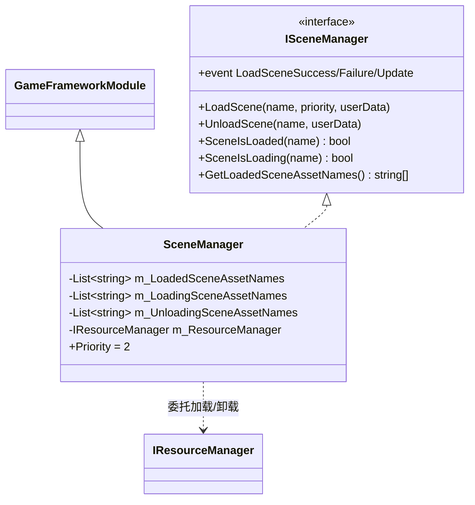
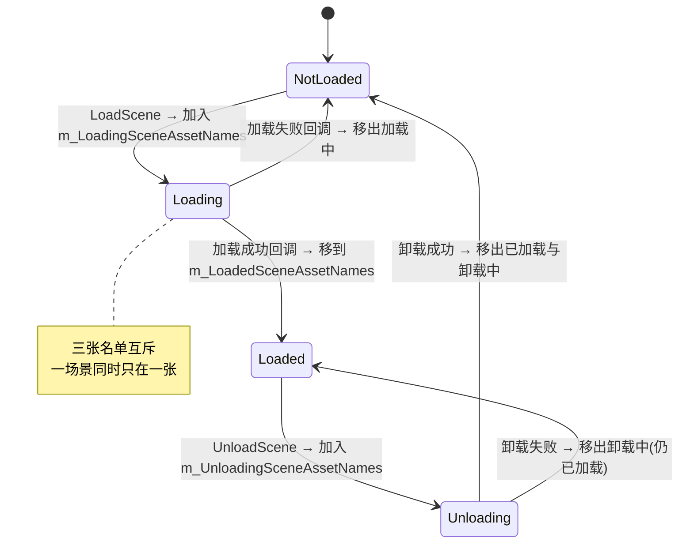
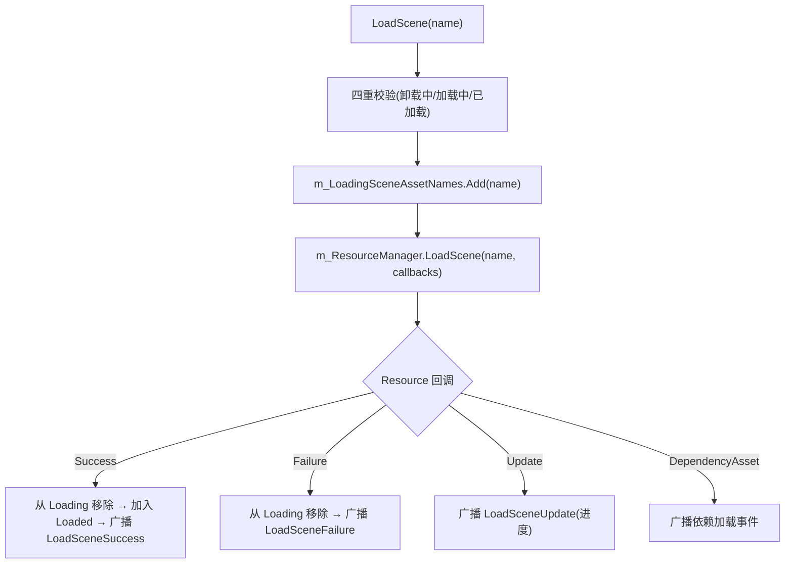

# Scene 场景模块 · 架构解析报告

> 层级：纯 C# 核心层 `GameFramework.Scene`
> 定位：**场景加载/卸载的状态追踪器**。本身是 Resource 模块的薄封装——加载/卸载委托给 `ResourceManager.LoadScene/UnloadScene`，自己只维护"已加载/加载中/卸载中"三张名单 + 防重入校验 + 事件转发。理解它 = 看清"薄管理器如何用三态名单防并发冲突"。

---

## 1. 契约定义 (Interface & Contract)

| 类型 | 文件 | 角色 | 可见性 |
|------|------|------|--------|
| `ISceneManager` | `ISceneManager.cs` | 管理器：LoadScene/UnloadScene + 状态查询 | public |
| `SceneManager` | `SceneManager.cs` | 实现，`GameFrameworkModule`，三态名单 | internal sealed |

### 设计要点（穿透语法）

- **三张状态名单**：`m_LoadedSceneAssetNames`（已加载）、`m_LoadingSceneAssetNames`（加载中）、`m_UnloadingSceneAssetNames`（卸载中）。一个场景同一时刻只能在其中一张名单（或都不在=未加载）。这是**用名单显式建模场景的并发状态**。
- **完全委托 Resource**：`LoadScene` = 校验状态 → 加入加载中名单 → `m_ResourceManager.LoadScene(...)`；卸载同理。场景资源的实际加载（AB、依赖）全在 Resource，Scene 只追踪状态。
- **回调驱动名单迁移**：Resource 加载成功/失败回调里，把场景名从"加载中"移到"已加载"（或移除）。卸载回调同理。**名单迁移 = 状态转移**。
- **支持多场景叠加**：用 List 而非单值，支持同时加载多个场景（主场景 + 子场景叠加，Unity 的 Additive 加载）。Priority=2。

### Mermaid 类图



---

## 2. 内存与生命周期流转 (Lifecycle & Memory)

### 2.1 场景三态状态机



### 2.2 防重入校验（薄管理器的核心价值）

`LoadScene` 前做四重校验，防止状态冲突：

```csharp
if (SceneIsUnloading(name)) throw ...;   // 正在卸载，不能加载
if (SceneIsLoading(name))   throw ...;   // 已在加载，不能重复
if (SceneIsLoaded(name))    throw ...;   // 已加载，不能再加载
m_LoadingSceneAssetNames.Add(name);      // 通过校验 → 进加载中名单
m_ResourceManager.LoadScene(name, priority, m_LoadSceneCallbacks, userData);
```

**这正是 Scene 模块存在的意义**：Resource 只管"加载这个资源"，不管"这个场景是不是已经在加载/卸载中"。Scene 用三态名单拦住非法操作（重复加载、加载卸载冲突），把"状态一致性"这层职责从 Resource 剥离出来。

### 2.3 加载/卸载流转（委托 + 回调迁移名单）



### 2.4 Shutdown 的安全卸载

`Shutdown` 遍历所有已加载场景逐个 `UnloadScene`，但跳过"正在卸载中"的（避免重复卸载）。最后清空三张名单。

### 2.5 内存关注点

- Scene 本身不持有场景对象——只存场景资源名（string）。实际场景对象由 Unity 的 SceneManager/Resource 管理。
- 6 个事件（Load 成功/失败/更新/依赖 + Unload 成功/失败）的 EventArgs 走 ReferencePool。
- 三张名单是轻量 List<string>，开销极小。

---

## 3. Unity 层的桥接映射 (Unity Layer Bridging)

> ⚠️ 本工作区不含 `UnityGameFramework`，以下为标准实现描述，**未在本仓库验证**。

- `SceneComponent : GameFrameworkComponent` 转发 `ISceneManager`，注入 ResourceManager。
- Resource 的 `LoadScene` 底层用 Unity 的 `SceneManager.LoadSceneAsync(name, LoadSceneMode.Additive)` 异步加载场景，进度回调映射到 Scene 的 Update 事件。
- 场景切换通常由 Procedure 的 `ChangeScene` 流程驱动：卸载旧场景 → 加载新场景 → 监听加载完成事件进入下一流程。
- 6 个事件转接 EventPool，供 UI（加载进度条）和流程监听。

---

## 4. 落地吸收建议 (Actionable Learning)

### 难点 ①：用状态名单防并发冲突
Scene 的精华是"三态名单 + 防重入校验"。异步加载/卸载是有时延的操作，期间用户可能重复请求或发起冲突操作（边加载边卸载）。用三张互斥名单显式追踪状态，在操作入口校验，是防止状态紊乱的标准手段。仿写时要意识到：**任何异步资源操作都需要状态追踪层**，否则并发请求会导致"加载两次""卸载正在加载的"等竞态 bug。

### 难点 ②：职责剥离——状态一致性 vs 资源加载
Resource 管"怎么加载"，Scene 管"能不能加载（状态合法性）"。这种职责剥离让 Resource 保持通用（不关心场景特有的并发规则），Scene 专注场景的状态机。仿写时不要把"防重复加载"塞进通用的资源加载器——那会让加载器被特定场景的业务规则污染。在加载器之上加一层薄状态管理器。

### 难点 ③：回调驱动的名单迁移
加载是异步的，状态迁移发生在回调里（成功才从"加载中"进"已加载"）。仿写时要保证每个回调路径都正确迁移名单——失败回调必须从"加载中"移除（否则该场景永远卡在加载中，再也无法加载）。异步操作的每个结束分支（成功/失败/取消）都要清理状态。

---

## 附：坐标
- `SceneManager` 是 Module，Priority=2。
- 依赖：**Resource**（实际加载/卸载，核心）、EventPool、ReferencePool。
- 被依赖：Procedure（场景切换流程）；是 Resource 之上的薄状态管理层，与 Sound 同为"委托 + 状态追踪"模式。
