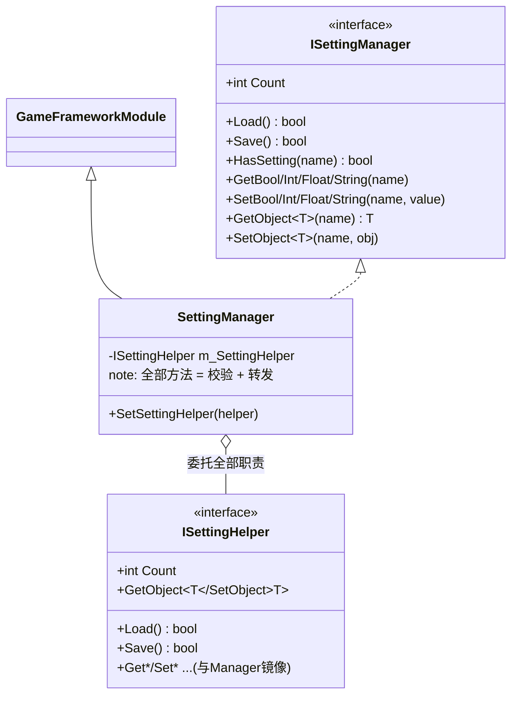
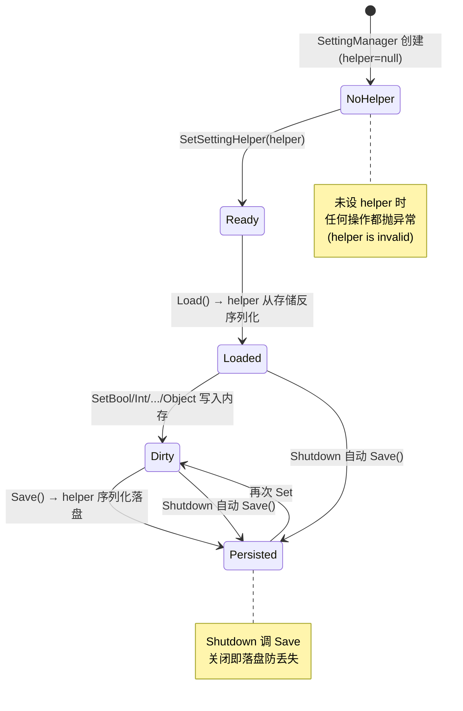

# Setting 游戏配置（持久化设置）模块 · 架构解析报告

> 层级：纯 C# 核心层 `GameFramework.Setting`
> 定位：用户**可持久化设置**（音量、画质、语言偏好、存档键值等）。与 Config（只读全局配置）相对：Setting 可写、可存盘、可读对象。核心看点：这是框架里**最纯粹的"空壳管理器 + 注入辅助器"模式**——manager 几乎不含逻辑，全部转发给 `ISettingHelper`。

---

## 1. 契约定义 (Interface & Contract)

| 类型 | 文件 | 角色 | 可见性 |
|------|------|------|--------|
| `ISettingManager` | `ISettingManager.cs` | 管理器契约：Load/Save + Get/Set 五类型 | public |
| `ISettingHelper` | `ISettingHelper.cs` | 辅助器契约，**与 Manager 接口几乎镜像** | public |
| `SettingManager` | `SettingManager.cs` | 实现，`GameFrameworkModule`，纯转发 | internal sealed |

### 设计要点（穿透语法）

- **Manager 与 Helper 接口高度镜像**：`ISettingManager` 与 `ISettingHelper` 的方法集几乎一一对应（Load/Save/HasSetting/Get/Set 全套）。`SettingManager` 每个方法做两件事：**校验参数（helper 非空、name 非空）→ 原样转发给 helper**。这是 Facade 模式的极致——manager 是"带参数校验的转发器"，零业务逻辑。
- **存储完全外置**：核心层不知道设置存哪、用什么格式。`SettingManager` 连一个数据字典都没有，`Count` 都转发给 helper。真正的存储（PlayerPrefs / 文件 / 加密存档）由 Unity 层的 helper 实现。这让纯 C# 层与平台存储 API 彻底解耦。
- **五类型 + 对象序列化**：bool/int/float/string 四基础类型 + `GetObject<T>/SetObject<T>`（任意对象，靠 helper 序列化，通常用框架的 `Utility.Json` 或二进制）。比 Config 多了"写"和"存对象"能力。
- **Shutdown 即 Save**：`SettingManager.Shutdown()` 调 `Save()`——框架关闭时自动落盘，防止设置丢失。这是少有的"关闭时主动持久化"的模块。

### Mermaid 类图



---

## 2. 内存与生命周期流转 (Lifecycle & Memory)

### 2.1 转发模式的统一骨架

每个公开方法都是同一套模板：

```csharp
public int GetInt(string settingName)
{
    if (m_SettingHelper == null) throw new GameFrameworkException("Setting helper is invalid.");
    if (string.IsNullOrEmpty(settingName)) throw new GameFrameworkException("Setting name is invalid.");
    return m_SettingHelper.GetInt(settingName);   // 转发
}
```

**校验前置、转发收尾**。Manager 的价值在于：① 统一的空值/参数校验（helper 实现不必各自重复）；② 给上层一个稳定的 `ISettingManager` 契约，屏蔽 helper 的具体实现与替换。

### 2.2 加载/保存生命周期



### 2.3 内存关注点

- **Manager 无状态**：不持有任何设置数据，只持一个 helper 引用。内存占用恒定，全部数据在 helper 内。
- **Save 时机由业务+框架共管**：业务可主动 `Save()`（如改完设置点确定），框架在 `Shutdown` 兜底 Save。中途崩溃未 Save 的更改会丢失——这是"内存写、显式存"模型的固有代价。
- **GetObject/SetObject 的序列化成本**：对象读写要经 helper 序列化/反序列化（JSON/二进制），比基础类型重。频繁存大对象会有性能/分配开销，应控制频率。

---

## 3. Unity 层的桥接映射 (Unity Layer Bridging)

> ⚠️ 本工作区不含 `UnityGameFramework`，以下为标准实现描述，**未在本仓库验证**。

- `SettingComponent : GameFrameworkComponent` 转发 `ISettingManager`，初始化时注入 `SetSettingHelper`。
- **典型 helper 实现 `DefaultSettingHelper`** 基于 Unity `PlayerPrefs`：`SetInt`→`PlayerPrefs.SetInt`，`Save`→`PlayerPrefs.Save`，`GetObject`→把 JSON 字符串存进 `PlayerPrefs.SetString` 再反序列化。这把"跨平台持久化存储"封装在 helper 里，核心层零依赖。
- Inspector 通常可选 helper 类型（PlayerPrefs / 文件 / 自定义加密），体现"存储实现可热插拔"。
- 与 Config 的分工：Config 是开发期固化的只读全局配置（随包发布）；Setting 是运行期用户产生的可变设置（存本地）。两者接口相似但语义相反（只读 vs 可写、随包 vs 存盘）。

---

## 4. 落地吸收建议 (Actionable Learning)

### 难点 ①：纯 Facade 模式的价值边界
Setting 是"manager 几乎零逻辑、全部转发 helper"的标准范本。它教的是：**当真正的实现高度平台相关（存储 API）时，核心层只保留契约 + 参数校验，把实现踢给可注入的 helper**。仿写时要识别"哪些逻辑该留在 manager（校验、契约稳定性），哪些必须外置（平台存储）"。过度外置会让 manager 沦为无意义的样板，过度内置会绑死平台。Setting 的边界划在"校验留内、存储踢外"。

### 难点 ②：Manager 与 Helper 接口镜像的取舍
两个接口几乎一模一样，看似冗余。但这层"镜像"换来了：上层只依赖 `ISettingManager`（稳定），helper 可任意替换（PlayerPrefs→文件→云存档）而上层无感。仿写时要权衡——若确定永不替换存储，这层镜像是过度设计；若需多平台/可测试（mock helper），它是必要的解耦。

### 难点 ③：持久化时机与崩溃安全
"内存写、显式/关闭时存"模型下，未 Save 的更改在崩溃时丢失。Setting 用 `Shutdown→Save` 兜底，但崩溃跳过 Shutdown 仍会丢。仿写时要根据数据重要性决定策略：关键设置可"每次 Set 即 Save"（牺牲性能换安全），非关键设置可"批量延迟 Save"（本框架的默认取向）。没有银弹，取决于数据价值。

---

## 附：坐标
- `SettingManager` 是 Module（Update 空实现，Shutdown=Save）。
- 依赖：仅 `ISettingHelper`（注入）、`GameFrameworkException`。是耦合最低的模块之一。
- 与 Config/DataNode 构成数据三角：Config(只读全局)、Setting(可写持久)、DataNode(运行期黑板树)。
