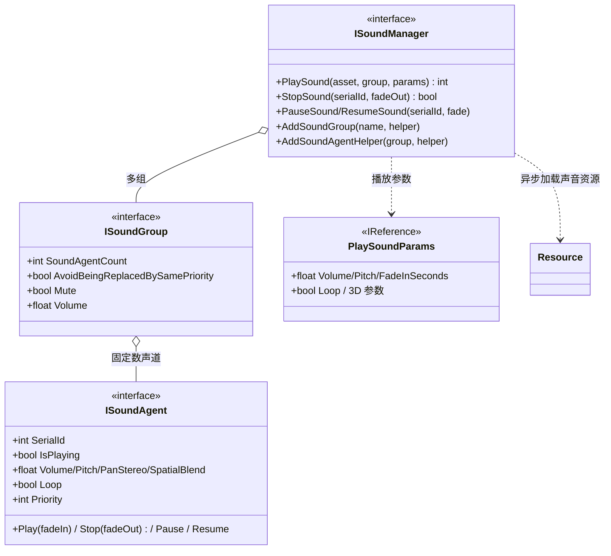
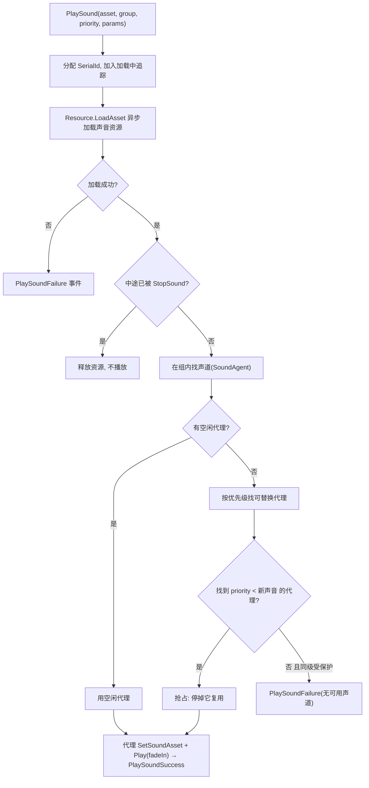
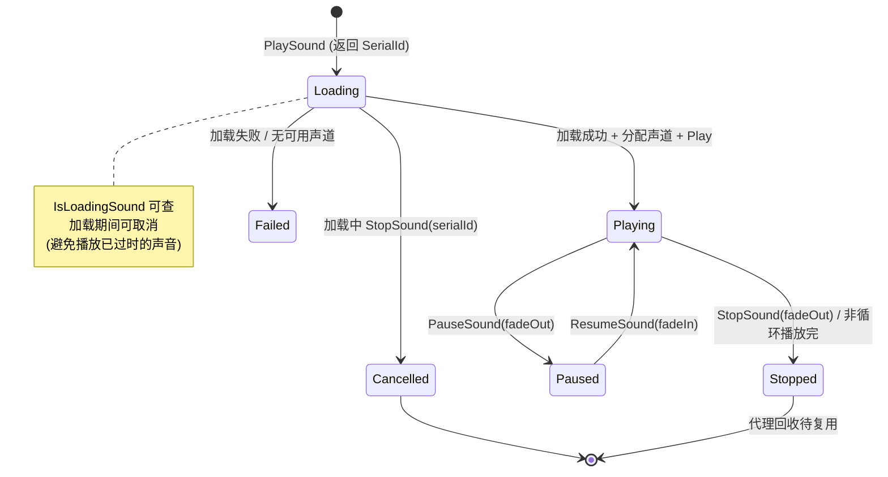

# Sound 声音模块 · 架构解析报告

> 层级：纯 C# 核心层 `GameFramework.Sound`
> 定位：**声音播放管理**（BGM/音效/语音分组、并发声道、优先级抢占、淡入淡出）。结构上是"组 + 代理"模型（类似 TaskPool 的代理复用，但代理是声道 AudioSource），声音资源经 Resource 异步加载。核心看点：**有限声道的优先级抢占分配**、淡入淡出、组级音量/静音控制。

---

## 1. 契约定义 (Interface & Contract)

| 类型 | 文件 | 角色 | 可见性 |
|------|------|------|--------|
| `ISoundManager` | `ISoundManager.cs` | 管理器：PlaySound/Stop/Pause/Resume + 组管理 | public |
| `ISoundGroup` | `ISoundGroup.cs` | 声音组：音量/静音/优先级替换策略 | public |
| `ISoundAgent` | `ISoundAgent.cs` | 声音代理 = 一个声道（音量/音调/3D/循环...） | public |
| `ISoundHelper` / `ISoundGroupHelper` / `ISoundAgentHelper` | | 三级辅助器（创建声音对象/组/声道） | public |
| `PlaySoundParams` | `PlaySoundParams.cs` | 播放参数（音量/音调/循环/淡入/3D 等，IReference） | public |
| `PlaySoundErrorCode` | `PlaySoundErrorCode.cs` | 播放失败码 | public enum |

### 设计要点（穿透语法）

- **三级结构**：Manager → SoundGroup（按用途分组：BGM/SFX/Voice）→ SoundAgent（声道，一个 agent 同时只放一个声音）。每组有固定数量代理 = 该组最大并发声道数。
- **代理 = 声道复用**：和 TaskPool 的 agent 一样，声道数量固定。PlaySound 时从组里找空闲代理；无空闲则按优先级抢占（停掉低优先级的）。
- **优先级抢占 + 同级保护**：`AvoidBeingReplacedBySamePriority` 控制"同优先级是否可被新声音抢占"。播放新声音找不到空闲代理时，按优先级挑一个可替换的停掉复用。
- **异步加载 + SerialId 追踪**：PlaySound 返回 SerialId，声音资源经 Resource 异步加载，加载期间用 SerialId 追踪（可中途 StopSound 取消）。`IsLoadingSound` 查是否在加载。
- **淡入淡出**：Play/Stop/Pause/Resume 都有 `fadeInSeconds`/`fadeOutSeconds` 重载——声音渐变避免突兀。

### Mermaid 类图

---

## 2. 内存与生命周期流转 (Lifecycle & Memory)

### 2.1 PlaySound 的声道分配（优先级抢占核心）

**优先级抢占**：声道有限（如 BGM 组 1 个、SFX 组 8 个）。放新音效时若都在用，找一个优先级低于新声音的停掉复用；同优先级是否可抢由 `AvoidBeingReplacedBySamePriority` 决定。这是有限资源竞争的经典策略——和 ObjectPool 的释放筛选（按优先级/LRU）同源。

### 2.2 异步加载与取消

**关键**：声音加载是异步的，但游戏状态变化快（如切场景）。加载完成时要检查"这个声音是否还该播"（中途可能已被 StopSound 取消）——否则会播放已经过时的声音（场景都切了 BGM 才加载完）。

### 2.3 组级控制与淡变

- **组级音量/静音**：`SoundGroup.Volume`/`Mute` 影响组内所有代理。代理有 `VolumeInSoundGroup`（组内相对音量），最终音量 = 组音量 × 组内音量。两级音量控制（总线 + 单声道）。
- **淡入淡出**：Play/Stop/Pause/Resume 的 fade 参数让音量在 N 秒内渐变，由 SoundAgentHelper（AudioSource）逐帧插值实现。避免声音突然出现/消失的突兀感。

### 2.4 内存关注点

- `PlaySoundParams` 是 IReference，播放参数用完归还 ReferencePool。
- 声道（AudioSource）固定数量复用，不频繁创建——同 TaskPool 代理、Entity 实例的复用哲学。
- 声音资源（AudioClip）经 Resource 加载，可能走 ObjectPool 缓存（取决于 Resource 配置）。

---

## 3. Unity 层的桥接映射 (Unity Layer Bridging)

> ⚠️ 本工作区不含 `UnityGameFramework`，以下为标准实现描述，**未在本仓库验证**。

- `SoundComponent : GameFrameworkComponent` 转发 `ISoundManager`，Inspector 配置声音组（名称 + 代理数 + 音量 + 静音 + 抢占策略）。
- `ISoundAgentHelper` 的 Unity 实现包裹一个 `AudioSource`：`Play`/`Stop`/`Pause` 映射到 AudioSource API，fade 用协程/Update 插值 `volume`，3D 参数（SpatialBlend/MaxDistance/Doppler）直接设 AudioSource。
- `ISoundGroupHelper` 通常对应一个 AudioMixerGroup（总线），组音量/静音映射到 mixer。
- PlaySound 经 Resource 异步加载 AudioClip，事件转接 EventPool。

---

## 4. 落地吸收建议 (Actionable Learning)

### 难点 ①：有限声道的优先级抢占
声道数量有限（硬件/性能限制），但播放请求可能超量。优先级抢占（停低优先级让位高优先级）+ 同级保护策略是核心。这与 ObjectPool 的释放筛选、TaskPool 的代理分配同源——**有限资源的竞争分配**。仿写时要设计清楚"满了怎么办"：拒绝？抢占？排队？Sound 选了优先级抢占，适合"重要声音必须播"的场景。

### 难点 ②：异步加载的"过时取消"
声音异步加载完成时，游戏状态可能已变（场景切了、声音被 Stop 了）。必须在加载回调里检查"这个声音现在还该播吗"，否则会播放过时声音。仿写时凡是"发起异步操作 + 期间状态可能变化"的场景，都要在回调里做有效性检查（用 SerialId 追踪是否被取消）。这是异步编程的通用陷阱。

### 难点 ③：两级音量与淡变
组音量 × 组内音量的两级控制，让"调 BGM 总音量"和"调单个音效音量"互不干扰。淡入淡出避免声音突兀。仿写时要把"总线音量"与"单元音量"分离（别只有一级），并把渐变做成可配置时长——这些是声音体验的关键细节，硬切会显得廉价。

---

## 附：坐标
- `SoundManager` 是 Module；每组持固定数 SoundAgent（声道）。
- 依赖：**Resource**（异步加载 AudioClip）、EventPool、ReferencePool（PlaySoundParams）。
- 与 Entity/UI 同为"组 + 代理/实例 + 异步加载"模式；抢占策略与 ObjectPool 释放筛选同源。
