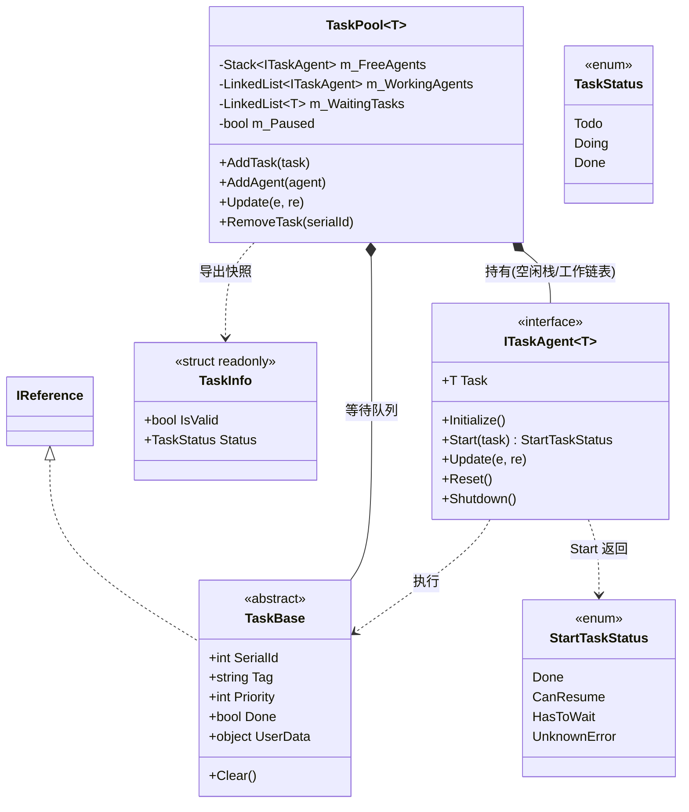
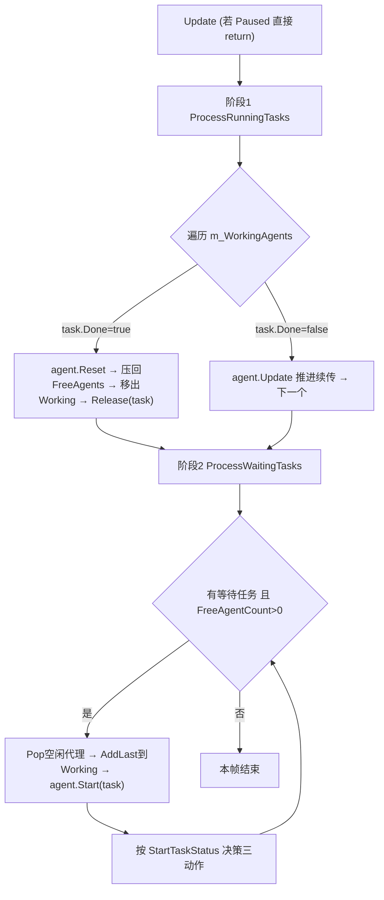
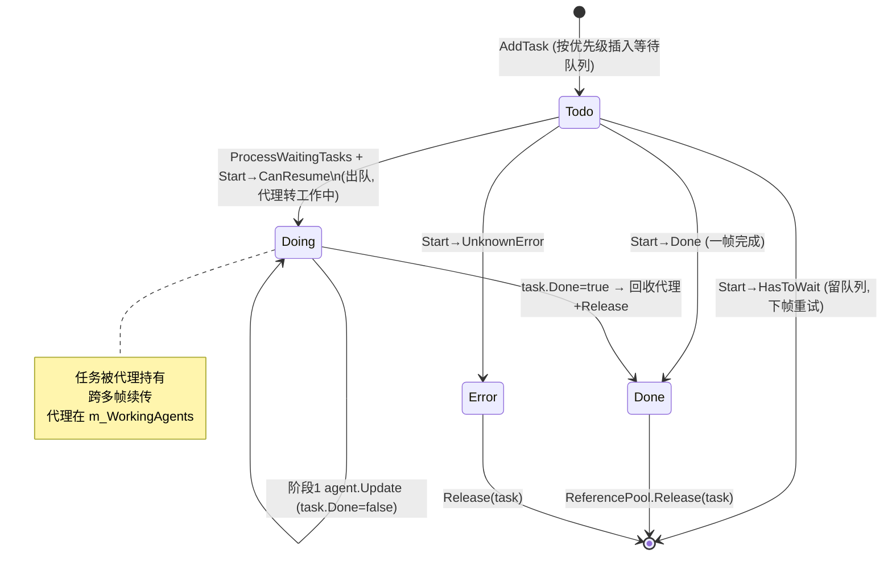

# TaskPool 任务池模块 · 架构解析报告

> 层级：纯 C# 核心层 `GameFramework`
> 定位：框架的**异步任务调度引擎**。`Download`（下载）、`Resource`（资源加载）等模块都构建在它之上——多个下载/加载代理并行处理排队任务，靠它做"代理复用 + 优先级队列 + 分帧推进"。核心解决：有限代理资源的分配、任务按优先级排队、单任务跨多帧续传。

---

## 1. 契约定义 (Interface & Contract)

| 类型 | 文件 | 角色 | 可见性 |
|------|------|------|--------|
| `TaskBase` | `TaskBase.cs` | 任务基类，`IReference`，含 SerialId/Tag/Priority/Done | internal abstract |
| `ITaskAgent<T>` | `ITaskAgent.cs` | 任务代理契约：真正干活的执行单元 | internal interface |
| `TaskPool<T>` | `TaskPool.cs` | 任务池调度核心（代理+任务的撮合） | internal sealed |
| `StartTaskStatus` | `StartTaskStatus.cs` | 代理开始处理任务的返回状态（4 值，调度命脉） | public enum |
| `TaskStatus` | `TaskStatus.cs` | 任务状态：Todo/Doing/Done（快照用） | public enum |
| `TaskInfo` | `TaskInfo.cs` | 只读快照 DTO，带 `IsValid` 标志 | public struct |

### 设计要点（穿透语法）

- **任务与代理分离（生产者-工人模型）**：`TaskBase` 是"待办事项"（数据），`ITaskAgent<T>` 是"工人"（执行器）。任务无限增长、代理数量固定，池负责把空闲工人派给排队任务。这正是 Download 能"N 个并发下载线程跑无限下载队列"的结构基础。
- **三大容器**：`Stack<ITaskAgent<T>> m_FreeAgents`（空闲工人，栈=后进先出，最近归还的优先复用，缓存友好）、`LinkedList m_WorkingAgents`（工作中工人）、`LinkedList m_WaitingTasks`（待办队列，**按优先级有序插入**）。
- **`StartTaskStatus` 是调度命脉**：代理 `Start(task)` 的返回值（Done/CanResume/HasToWait/UnknownError）决定"代理是否归队、任务是否出队、任务是否释放"三个独立动作的组合。

### Mermaid 类图



---

## 2. 内存与生命周期流转 (Lifecycle & Memory)

### 2.1 优先级队列的插入算法

`AddTask` 从队尾向前找插入点，把高优先级排到前面：

```csharp
LinkedListNode<T> current = m_WaitingTasks.Last;
while (current != null)
{
    if (task.Priority <= current.Value.Priority) break;  // 找到第一个不低于自己的，插其后
    current = current.Previous;
}
if (current != null) m_WaitingTasks.AddAfter(current, task);
else m_WaitingTasks.AddFirst(task);
```

效果：**优先级降序排列，同优先级 FIFO**（新任务排在同级末尾）。从队尾往前扫，保证相同优先级时新任务在后，先来先服务。

### 2.2 双阶段轮询 Update

`Update`（未暂停时）依次跑两个阶段：



- **阶段1**：推进所有在跑的任务；已完成的回收代理、释放任务。
- **阶段2**：只要还有空闲代理且有等待任务，就不断派工。

### 2.3 StartTaskStatus 决策矩阵（本模块最精妙处）

`ProcessWaitingTasks` 里，`agent.Start(task)` 返回后做三个**独立**判断：

| StartTaskStatus | 含义 | 代理归还空闲? | 任务出等待队列? | 任务 Release? | 净效果 |
|-----------------|------|:---:|:---:|:---:|--------|
| `Done` | 一帧即完成（如缓存命中） | ✅ | ✅ | ✅ | 瞬时完成，代理立即可复用 |
| `CanResume` | 可继续处理（开始续传） | ❌（留工作中） | ✅ | ❌ | 任务转入"在跑"，后续由阶段1推进 |
| `HasToWait` | 暂时不能处理（如同 host 并发上限） | ✅ | ❌（留队列） | ❌ | 代理还回去，任务下帧再试 |
| `UnknownError` | 出错 | ✅ | ✅ | ✅ | 丢弃任务，代理回收 |

源码用三个 if 拆出这三个动作维度：

```csharp
// 代理归还：Done / HasToWait / UnknownError （即"非 CanResume"）
if (status == Done || status == HasToWait || status == UnknownError) { agent.Reset(); push回free; 移出working; }
// 任务出队：Done / CanResume / UnknownError （即"非 HasToWait"）
if (status == Done || status == CanResume || status == UnknownError) m_WaitingTasks.Remove(current);
// 任务释放：Done / UnknownError （即"已彻底结束"）
if (status == Done || status == UnknownError) ReferencePool.Release(task);
```

理解钥匙：**CanResume = 任务交给代理长期持有（出队但不释放、代理不归还）；HasToWait = 啥也没发生，原样退回（任务留队、代理归还）**。

### 2.4 任务生命周期状态机



### 2.5 代理的复用与移除路径

- **正常完成**：阶段1 检测 `task.Done` → `agent.Reset()` → `m_FreeAgents.Push` → 移出 Working → `Release(task)`。
- **主动移除** `RemoveTask(serialId)`：先扫等待队列（直接 Remove+Release）；再扫工作中代理（`Reset()` 代理归还 + 移出 + Release 任务）。
- **Shutdown**：`RemoveAllTasks()` 把所有等待/工作任务清掉并归还代理，再把所有空闲代理 `Pop().Shutdown()`。
- 代理始终在 `Free`（栈）↔ `Working`（链表）之间往返，**数量恒定**，从不销毁直到 Shutdown。

---

## 3. Unity 层的桥接映射 (Unity Layer Bridging)

> ⚠️ 本工作区不含 `UnityGameFramework`，以下为标准实现描述，**未在本仓库验证**。

- TaskPool 自身不是 Module，而是被 `DownloadManager`/`ResourceManager` 等**内嵌持有**。这些管理器才是 Module，在其 `Update` 里转调 `TaskPool.Update`。
- Unity 层通过 Component 暴露"并发代理数量"配置（如 `DownloadComponent` 的"下载器数量"）：初始化时 new 出 N 个实现了 `ITaskAgent<DownloadTask>` 的代理（内部包 UnityWebRequest/线程下载），逐个 `AddAgent`。这是把"软件层固定工人数"映射到 Inspector 可调参数的桥接点。
- `TaskInfo` 作为跨层 DTO，Debugger 窗口用它列出每个下载/加载任务的 SerialId/Tag/Status/优先级。`IsValid=false` 的 default(TaskInfo) 表示"查无此任务"。
- 续传的 `CanResume` 正对应"下载开始、后续分帧推进字节流"；`HasToWait` 对应"同域名并发数已满，等空位"。

---

## 4. 落地吸收建议 (Actionable Learning)

### 难点 ①：StartTaskStatus 的三维正交分解
最难的不是写四个 enum，而是想清楚"代理归还/任务出队/任务释放"是**三个正交动作**，四种状态是它们的不同组合。新手常把它们耦合（以为"出队就一定释放"），导致 CanResume 的任务被错误释放（代理还指着已回收的任务，崩溃）。仿写时务必先画那张 4×3 矩阵，再写代码。

### 难点 ②：单任务跨帧续传 vs 单帧完成
`CanResume` 让一个任务被代理长期持有、由阶段1逐帧 `Update` 推进到 `Done`；而 `Done`/`HasToWait` 是"这一帧就有结论"。这套机制让 TaskPool 既能调度"秒完成"的任务，也能调度"下载几分钟"的任务，用同一套代码。仿写时要让代理的 `Update` 与 `Start` 协同：Start 只负责"能不能开工"，Update 负责"持续推进"。

### 难点 ③：代理复用栈 + 任务复用引用池的双复用
代理用 `Stack` 复用（不销毁，Reset 后压回），任务用 `ReferencePool` 复用（Done 后 Release）。两套复用生命周期不同：代理与池同寿，任务与单次请求同寿。仿写时不要把任务也做成"不销毁缓存"——任务是一次性的，代理才是常驻的。混淆会导致任务数据串用。

---

## 附：坐标
- 不是 Module，被 Download/Resource 等管理器内嵌持有并驱动。
- 依赖：`ReferencePool`、`GameFrameworkLinkedList`、`TaskBase`。
- 被依赖：`DownloadManager`、`ResourceManager`（加载/更新任务）等。
