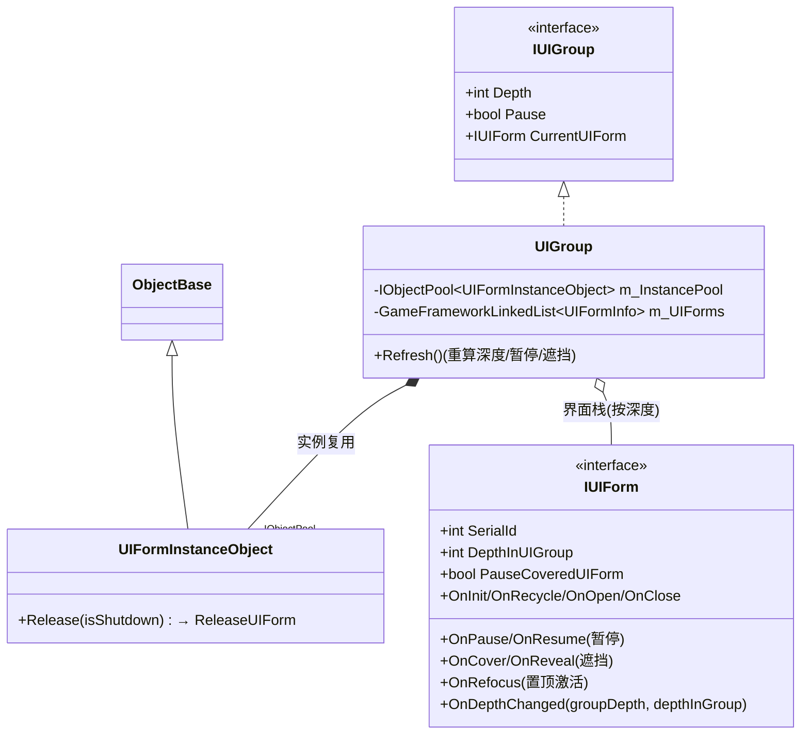
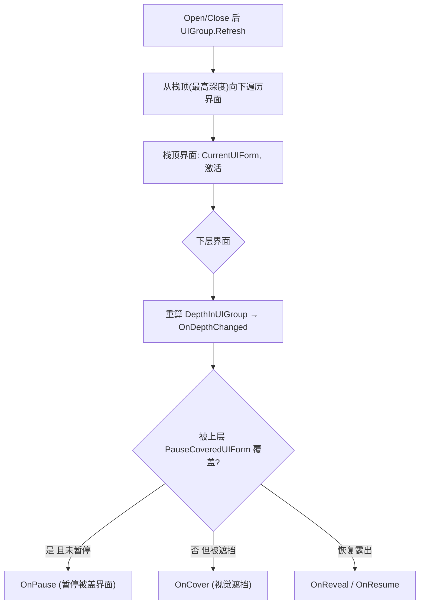
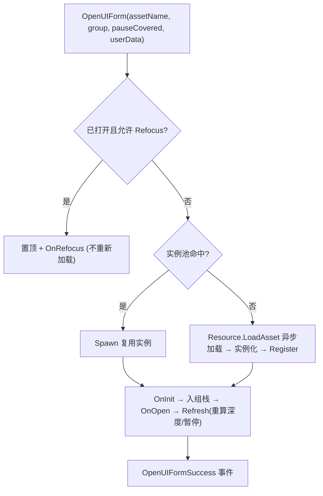
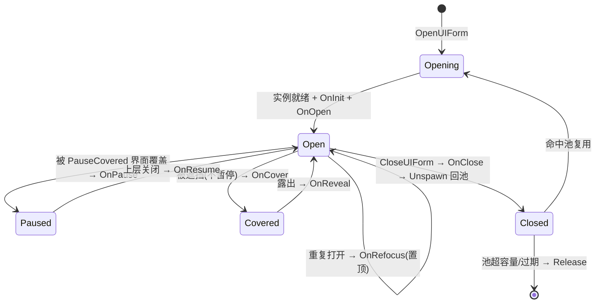

# UI 界面模块 · 架构解析报告

> 层级：纯 C# 核心层 `GameFramework.UI`
> 定位：**界面（UIForm）的打开/关闭/层级/复用管理**。与 Entity 结构同构（组 + ObjectPool + 异步加载 + 生命周期钩子），但多了 UI 特有的**深度(Depth)层级、暂停遮挡(Pause/Cover)、栈式焦点(Refocus)** 语义。理解它 = Entity + UI 栈管理。

---

## 1. 契约定义 (Interface & Contract)

| 类型 | 文件 | 角色 | 可见性 |
|------|------|------|--------|
| `IUIManager` | `IUIManager.cs` | 管理器：OpenUIForm/CloseUIForm + 组/深度 | public |
| `IUIForm` | `IUIForm.cs` | 界面契约：**11 个生命周期钩子**（比 Entity 多 UI 态） | public |
| `IUIGroup` | `IUIGroup.cs` | 界面组：Depth/Pause/CurrentUIForm | public |
| `IUIFormHelper` / `IUIGroupHelper` | | 界面/组辅助器（实例化、深度设置） | public |
| `UIManager.UIGroup` | `.UIGroup.cs` | 组实现，持 ObjectPool + 界面链表 | private nested |
| `UIManager.UIFormInstanceObject` | `.UIFormInstanceObject.cs` | 实例包装，`: ObjectBase` | private nested |
| `UIManager.UIGroup.UIFormInfo` | `.UIGroup.UIFormInfo.cs` | 界面运行期信息（暂停/遮挡标志） | private nested |
| `UIManager.OpenUIFormInfo` | `.OpenUIFormInfo.cs` | 异步打开中转数据 | private nested |

### 与 Entity 的同构 + 差异

| 维度 | Entity | UI |
|------|--------|-----|
| 组 + ObjectPool 实例复用 | ✅ | ✅（完全相同） |
| 异步加载 + Show/Hide 双路径 | ✅ | ✅（OpenUIForm 对应 ShowEntity） |
| 实例包装 : ObjectBase | EntityInstanceObject | UIFormInstanceObject（相同结构） |
| 迭代安全轮询 | ✅ | ✅ |
| **层级深度** | 无（实体无 Z 序概念） | **Depth + DepthInUIGroup**（界面有层叠顺序） |
| **暂停/遮挡** | 无 | **OnPause/OnResume/OnCover/OnReveal** |
| **栈式焦点** | 无 | **OnRefocus**（重复打开置顶激活） |
| **PauseCoveredUIForm** | 无 | 打开新界面时是否暂停被它盖住的界面 |

**结论**：UI = Entity 的复用骨架 + UI 栈层级语义。前者已在 Entity 文档详解，本文聚焦后者。

### Mermaid 类图

---

## 2. 内存与生命周期流转 (Lifecycle & Memory)

### 2.1 11 个生命周期钩子（UI 态机）

| 钩子 | 触发 | UI 特有 |
|------|------|---------|
| OnInit / OnRecycle | 创建复用 / 回收 | 同 Entity |
| OnOpen / OnClose | 打开 / 关闭 | 同 Entity（Show/Hide） |
| **OnPause / OnResume** | 被暂停 / 恢复 | 被上层界面暂停（如弹窗盖住主界面） |
| **OnCover / OnReveal** | 被遮挡 / 露出 | 视觉遮挡但未暂停 |
| **OnRefocus** | 重复打开已存在界面 | 置顶 + 重新激活 |
| OnDepthChanged | 深度变化 | 调整渲染层级 |
| OnUpdate | 每帧 | 同 Entity |

### 2.2 界面栈与深度刷新（UI 核心）

界面组是一个按深度排序的栈。每次 Open/Close 后 `Refresh` 重算每个界面的状态：

- **深度（Depth）**：界面组有组深度，组内界面有 `DepthInUIGroup`。新开界面深度最高（在最上层）。深度变化触发 `OnDepthChanged` 让 Unity 层调整 Canvas/SortingOrder。
- **PauseCoveredUIForm**：打开一个"会暂停下层"的界面（如全屏弹窗）时，被它盖住的界面收 `OnPause`（停逻辑）；若只是部分遮挡则 `OnCover`（停渲染不停逻辑）。关闭后下层 `OnResume`/`OnReveal`。
- **Refocus**：重复 OpenUIForm 一个已打开的界面，不重新实例化，而是置顶 + `OnRefocus`（类似浏览器重复打开同 URL 切到该标签页）。

### 2.3 OpenUIForm 异步流转（同 Entity 双路径）

### 2.4 CloseUIForm 与回收

`CloseUIForm` → `OnClose` → 出组栈 → `Unspawn` 实例回池（不销毁）→ `Refresh`（下层界面 OnResume/OnReveal/置顶）。实例的真正销毁由 ObjectPool 容量/过期决定，与 Entity 一致。

### 2.5 状态机

---

## 3. Unity 层的桥接映射 (Unity Layer Bridging)

> ⚠️ 本工作区不含 `UnityGameFramework`，以下为标准实现描述，**未在本仓库验证**。

- `UIComponent : GameFrameworkComponent` 转发 `IUIManager`，Inspector 配置界面组（名称 + 组深度 + 实例池参数）。
- `IUIGroupHelper` 的 Unity 实现通常是一个挂 Canvas 的 GameObject，`SetDepth` 设 Canvas 的 sortingOrder。`IUIFormHelper` 负责 Instantiate UI 预制体、设置父节点、`ReleaseUIForm` 销毁。
- `OnDepthChanged` 让界面调整自身 Canvas/RectTransform 的渲染顺序。`OnPause` 可停 UI 动画/输入，`OnCover` 可关射线遮挡。
- 与 Entity 一样经 Resource 异步加载预制体，事件转接 EventPool。

---

## 4. 落地吸收建议 (Actionable Learning)

### 难点 ①：界面栈的深度刷新与状态联动
UI 比 Entity 难在"界面间相互影响"：开一个界面会暂停/遮挡下层，关一个界面要恢复下层。`Refresh` 必须在每次增删后重算整个栈的深度与暂停/遮挡状态，并精确触发 OnPause/OnResume/OnCover/OnReveal。仿写时最易错的是状态不对称（暂停了没恢复、遮挡了没露出），导致界面卡在错误态。**每次栈变化必须全量刷新一遍状态**。

### 难点 ②：Refocus 复用 vs 新建的判断
重复打开同一界面应 Refocus（置顶激活）而非新建第二个实例——否则会有两个相同界面叠着。但有些界面允许多开（如多个物品详情）。仿写时要区分"单例界面"（Refocus）与"可多开界面"（每次新建）。这个策略由界面自身或打开参数决定，别一刀切。

### 难点 ③：复用 Entity 的骨架，只加 UI 语义
UI 和 Entity 的"组 + 对象池 + 异步加载 + 生命周期"骨架完全相同。聪明的做法是抽出公共骨架，UI 只补充深度/暂停/遮挡层。仿写时若已实现 Entity，UI 应复用其复用机制，只新增栈层级管理——而非从头再写一遍 ObjectPool 集成。识别同构、复用骨架是架构能力。

---

## 附：坐标
- `UIManager` 是 Module；每个 UIGroup 持一个 ObjectPool。
- 依赖：**ObjectPool**（实例复用）、**Resource**（异步加载）、EventPool、ReferencePool。
- 与 Entity 同构——两者是"对象池 + 生命周期"模式的两个并列应用，UI 多了栈层级语义。
