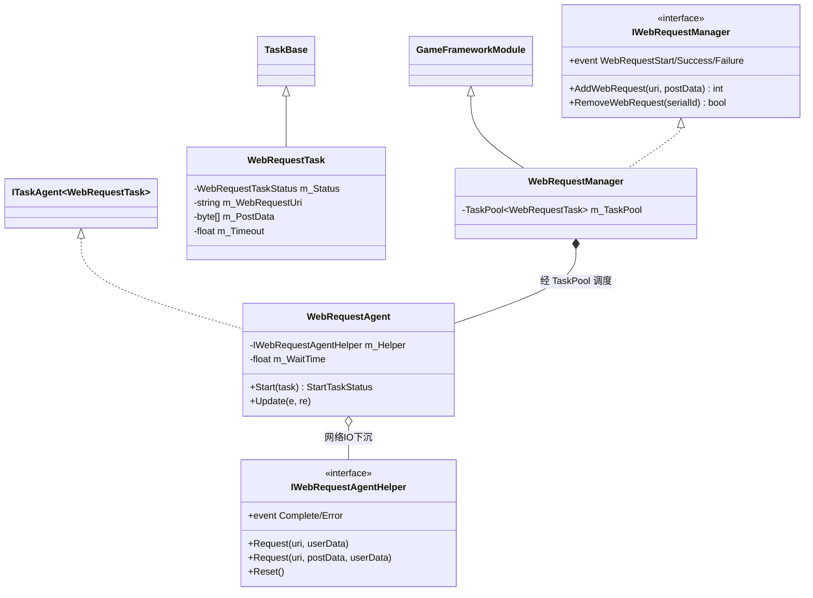
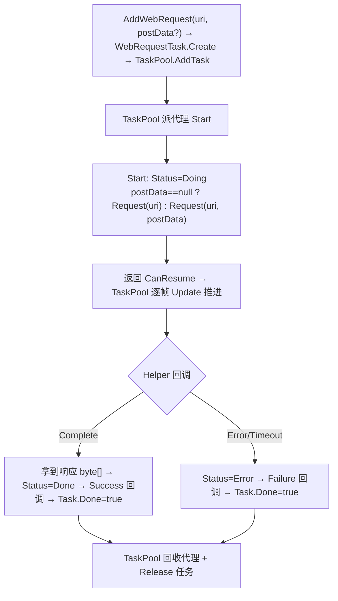
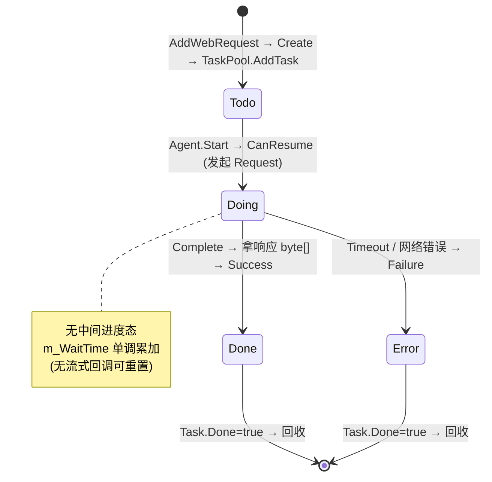

# WebRequest Web 请求模块 · 架构解析报告

> 层级：纯 C# 核心层 `GameFramework.WebRequest`
> 定位：**短连接 HTTP 请求**（GET/POST，一次请求一次响应）。与 Download 同为 `TaskPool` 的应用，是 Download 的"瘦身版"——去掉了文件流、断点续传、分块刷盘、测速，只保留"发请求、等响应、回字节"。最适合用来对照理解"同一底座如何派生不同业务"。

---

## 1. 契约定义 (Interface & Contract)

| 类型 | 文件 | 角色 | 可见性 |
|------|------|------|--------|
| `IWebRequestManager` | `IWebRequestManager.cs` | 管理器契约：AddWebRequest(可带 postData) + 3 事件 | public |
| `IWebRequestAgentHelper` | `IWebRequestAgentHelper.cs` | 网络 IO 注入点（2 事件 + Request/Reset） | public |
| `WebRequestManager` | `WebRequestManager.cs` | 实现，`GameFrameworkModule`，内嵌 `TaskPool<WebRequestTask>` | internal sealed partial |
| `WebRequestManager.WebRequestAgent` | `.WebRequestAgent.cs` | 请求代理，`: ITaskAgent<WebRequestTask>` | private nested |
| `WebRequestManager.WebRequestTask` | `.WebRequestTask.cs` | 请求任务，`: TaskBase`，持 URI/postData/超时 | private nested |
| `WebRequestTaskStatus` | `.WebRequestTaskStatus.cs` | Todo/Doing/Done/Error | private enum |

### 与 Download 的结构对照（核心理解点）

| 维度 | Download | WebRequest |
|------|----------|------------|
| 底座 | `TaskPool<DownloadTask>` | `TaskPool<WebRequestTask>`（**同**） |
| Agent | 管 FileStream + 续传 + 刷盘 + 超时 | **只管超时**，无文件流 |
| Helper 事件 | 4 个（UpdateBytes/UpdateLength/Complete/Error） | **2 个**（Complete/Error），无进度 |
| 数据流向 | 流式分块落盘 | **一次性**拿整个响应字节 |
| 断点续传 | 有（.download + Range） | **无**（短请求不需要） |
| Start 返回 | CanResume | CanResume（**同**） |
| 结果 | 文件 | `byte[]` 响应体 |

**结论**：WebRequest 把 Download 的"持续接收 + 落盘"压缩成"等一个 Complete 事件拿整包字节"。两者共享 TaskPool 的调度/并发/优先级，差异只在 Agent 与 Helper 的"干活方式"。

### Mermaid 类图



---

## 2. 内存与生命周期流转 (Lifecycle & Memory)

### 2.1 请求流转（比 Download 简洁得多）



- **GET vs POST 的唯一分叉**：`GetPostData() == null` 走 `Request(uri)`（GET），否则走 `Request(uri, postData)`（POST）。Task 携带 postData，Agent 据此选方法。
- **无中间状态**：不像 Download 有 UpdateBytes/UpdateLength 的流式回调，WebRequest 只在 `Complete` 一次性拿到整个 `GetWebResponseBytes()`。响应体作为整块 `byte[]` 通过 Success 回调上抛。

### 2.2 超时检测（与 Download 一致但更简单）

```csharp
public void Update(float elapseSeconds, float realElapseSeconds)
{
    if (m_Task.Status == WebRequestTaskStatus.Doing)
    {
        m_WaitTime += realElapseSeconds;
        if (m_WaitTime >= m_Task.Timeout) { /* Timeout 错误 */ }
    }
}
```

因为没有流式数据回调，WebRequest 的 `m_WaitTime` 只在 `Start` 时置 0，之后单调累加直到 Complete/Error/Timeout——它检测的是"整个请求的耗时上限"（而 Download 检测的是"无数据流入的停顿"，因为 Download 会在每次 UpdateBytes 重置）。**这是两者超时语义的微妙差异，源于有无流式回调**。

### 2.3 任务状态机



### 2.4 内存关注点

- **WebRequestTask 走 ReferencePool**（同 DownloadTask），`Create` 时 Acquire、Done 后 Release。
- **postData 与响应 byte[] 不池化**：业务传入的 postData 和 helper 返回的响应体都是普通数组，由 GC 管理。响应体可能较大（JSON/二进制），频繁请求要注意 GC 压力——但短请求通常不持有，用完即弃。
- **EventArgs 走 ReferencePool**：Start/Success/Failure 及 helper 的 Complete/Error EventArgs 全部池化。

---

## 3. Unity 层的桥接映射 (Unity Layer Bridging)

> ⚠️ 本工作区不含 `UnityGameFramework`，以下为标准实现描述，**未在本仓库验证**。

- `WebRequestComponent : GameFrameworkComponent` 转发 `IWebRequestManager`，Inspector 暴露代理数量与 Timeout，初始化时按数量 `AddWebRequestAgentHelper`。
- `IWebRequestAgentHelper` 的 Unity 实现用 `UnityWebRequest`（GET/POST）发请求，在协程或回调里把响应体通过 `WebRequestAgentHelperComplete` 事件回吐（`GetWebResponseBytes()`）。
- 典型用途：登录验证、排行榜上报、SDK 接口调用等"一问一答"式 HTTP 交互。3 个事件常转接 EventPool，让业务逻辑监听请求结果。

---

## 4. 落地吸收建议 (Actionable Learning)

### 难点 ①：识别"同底座异业务"的复用边界
Download 和 WebRequest 是绝佳对照——同一个 TaskPool，派生出"流式落盘续传"和"一问一答取字节"两种业务。仿写时要学会问："调度（并发/优先级/续传推进）能不能复用？业务（怎么干活）是不是不同？" 若答案是"调度同、业务异"，就该共享 TaskPool，各写各的 Agent/Task。盲目为每个网络功能重写一套调度是最常见的过度劳动。

### 难点 ②：超时语义随回调粒度而变
Download 因有流式回调，超时 = "无数据停顿"（每次 UpdateBytes 重置）；WebRequest 无中间回调，超时 = "整个请求耗时"（只在 Start 重置）。**同一个 `m_WaitTime` 字段，因重置时机不同而语义不同**。仿写时要根据"业务有没有中间进度信号"决定超时计时器的重置点，否则会出现"明明在下载却被判超时"或"明明卡死却不超时"的 bug。

### 难点 ③：GET/POST 的最小分叉
整个 GET/POST 差异被压缩成"Task 是否携带 postData"一个判断。仿写时要抵制为 GET/POST 各建一套类的冲动——它们 99% 相同，差异只在"带不带请求体"。用一个可空字段表达可选差异，比类型爆炸优雅得多。

---

## 附：坐标
- `WebRequestManager` 是 Module；内嵌 `TaskPool<WebRequestTask>`。
- 依赖：`TaskPool`、`ReferencePool`、`GameFrameworkAction`。
- 与 Download 并列为 TaskPool 两大应用；是理解"组合底座派生业务"的最佳对照样本。
